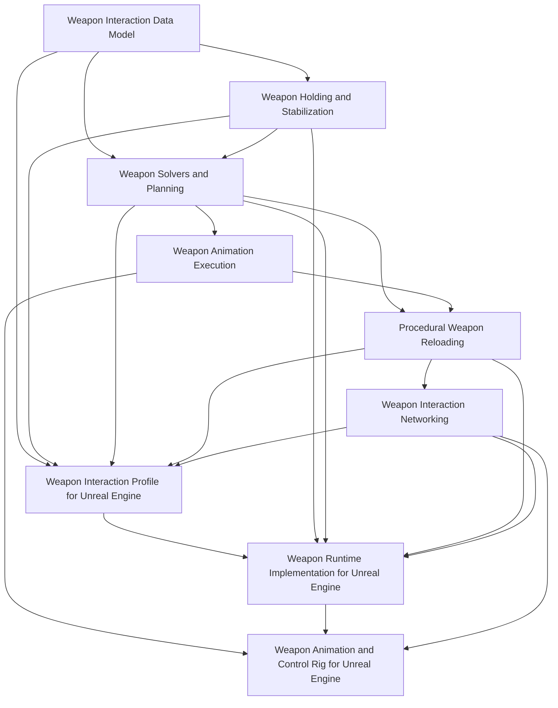

# Weapon Interaction

## Purpose

This section defines the weapon interaction layer of the Human Locomotion System.

Weapon interaction covers:

```text
holding weapons
stabilizing weapons with hands/shoulder/support contacts
procedural reloads
magazine and ammo object manipulation
bolt/slide/pump/charging-handle operation
hand assignment and reachability solving
animation execution for reaching/gripping/manipulation
multiplayer-safe gameplay state
Unreal Engine implementation mapping
near-implementation UE runtime architecture
```

The section is split into two levels:

```text
engine-agnostic design documents
engine-specific Unreal Engine implementation documents
```

The engine-agnostic documents define the source of truth. The Unreal Engine documents show how to implement that source of truth in UE 5.7.

---

## Document Structure

### Engine-Agnostic Documents

[Weapon Holding and Stabilization](./weapon-holding.md)

Defines the current weapon hold pose, active contacts, shoulder side, stability requirements, temporary hand roles, reachability, stance constraints, and the rule that the weapon must never become an unsupported prop.

[Weapon Interaction Data Model](./weapon-interaction-data-model.md)

Defines weapon interaction points, access regions, hand policies, axes, feature flags, moving parts, ammo objects, body slots, and mechanical state in an engine-independent way.

[Weapon Solvers and Planning](./weapon-solvers-and-planning.md)

Defines the hand assignment solver, reachability solver, stability solver, reload planner, action plan, dependency rules, fallback rules, and interruption recovery.

[Weapon Animation Execution](./weapon-animation-execution.md)

Defines how validated action plans become visible upper-body animation: reach trajectories, pre-grip, grip/contact phases, object visual attachment, weapon pose offsets, spine/shoulder assistance, elbow control, moving part following, animation LOD, and recovery animation.

[Procedural Weapon Reloading](./procedural-reload.md)

Defines procedural reload as an action sequence built on weapon holding, interaction points, object attachment states, socket-axis directed movement, mechanical state commits, and multiplayer state.

[Weapon Interaction Networking](./weapon-networking.md)

Defines the multiplayer model: server authority, client prediction, remote-client reconstruction, replicated reload phase, mechanical state, visual object state, and commit points.

### Unreal Engine Implementation Documents

[Weapon Interaction Profile for Unreal Engine](./weapon-interaction-profile-ue.md)

Maps the engine-agnostic data model into UE 5.7 DataAssets, components, C++ structs, editor validation, preview tools, replication structs, and Mermaid implementation diagrams.

[Weapon Runtime Implementation for Unreal Engine](./weapon-runtime-implementation-ue.md)

Defines the near-implementation-level UE 5.7 runtime architecture: source layout, concrete enums and structs, `UWeaponInteractionComponent`, `UWeaponReloadComponent`, replicated state, RPCs, `OnRep` handlers, server executor loop, commit points, prediction, interruption, tick order, object visual attachment, and implementation checklist.

[Weapon Animation and Control Rig for Unreal Engine](./weapon-animation-control-rig-ue.md)

Maps the animation execution model into UE 5.7 AnimInstance state, Control Rig inputs, hand IK targets, elbow poles, weapon pose offsets, moving part animation, visual object attachment, animation LOD, and remote-client playback.

Future UE implementation documents may be added for:

```text
Editor preview tooling
Gameplay Ability System integration
network prediction details
weapon component source layout
```

---

## Recommended Reading Order

```text
1. Weapon Interaction Data Model
2. Weapon Holding and Stabilization
3. Weapon Solvers and Planning
4. Weapon Animation Execution
5. Procedural Weapon Reloading
6. Weapon Interaction Networking
7. Weapon Interaction Profile for Unreal Engine
8. Weapon Runtime Implementation for Unreal Engine
9. Weapon Animation and Control Rig for Unreal Engine
```

---

## System Layers



---

## Implementation Principle

A correct implementation must follow this ownership model:

```text
Data model:
  defines what exists and how it can be used.

Holding system:
  defines current contacts and weapon stability.

Solvers/planner:
  decide what should happen.

Animation execution:
  turns a validated plan into hand/object/weapon targets.

Reload executor:
  performs steps over time and applies commit points.

Networking layer:
  replicates gameplay state and phase, not IK every frame.

UE runtime implementation:
  owns concrete components, replicated structs, RPCs, OnRep handlers, executor loop, prediction, and tick/update order.

UE animation implementation:
  maps runtime targets into AnimInstance and Control Rig.
```

---

## Final Formula

```text
Weapon interaction =
  weapon data
  + current hold state
  + solver decisions
  + action plans
  + animation execution targets
  + gameplay mechanical state
  + network-safe replication
  + UE runtime implementation
  + UE animation implementation.
```

The documents in this section should be detailed enough for an AI or engineer to implement the system directly, while still separating core logic from Unreal Engine details.
