# Weapon Interaction

## Purpose

This section defines the weapon interaction layer of the Human Locomotion System.

Weapon interaction covers the physical/procedural relationship between a character and a held weapon:

```text
holding weapons
stabilizing weapons with hands/shoulder/support contacts
numeric visual pose acceptance for hands, joints, grips, objects, and reloads
hand-to-hand support for two-handed handgun poses
cheek/sight alignment quality for stocked ADS presentation
contact quality and hold pose lifecycle
constraint priority and recovery when interaction goals conflict
weapon interaction archetypes and grip pose library
weapon-facing pose states such as relaxed carry, low ready, NonADSFire/HipFire, point aim, and aim down sights
interaction-facing fire readiness and fire visual response, without owning the fire backend
compatibility with global full-body presentation mirroring
explicit transform-space contract for sockets, axes, objects, mirroring, and network reconstruction
procedural reloads as hand/object/weapon interaction
draw and holster as visual/procedural interaction, without owning inventory selection
object insertion quality for magazines, shells, batteries, and similar interaction objects
magazine and ammo-object visual manipulation as interaction objects
bolt/slide/pump/charging-handle operation as mechanism interaction
moving part operation profiles for bolt, slide, pump, lever, hinge, latch, and button controls
hand assignment and reachability solving for weapon interaction points
animation execution for reaching/gripping/manipulation
procedural-first animation ownership policy
authored assets only as optional support, not as interaction authority
obstruction response from external obstruction results
first/third-person interaction presentation from one canonical state
multiplayer-safe interaction state reconstruction and correction smoothing
Unreal Engine implementation mapping for interaction state and animation targets
editor validation, authoring guidance, debugging, LOD, and acceptance testing
reference implementation flow
implementation roadmap
MVP implementation checklist
```

Weapon interaction does not own every system affected by a weapon. It does not own locomotion speed, body yaw, turn-in-place, camera behavior, inventory economy, projectile simulation, damage, AI decisions, or the whole cover system.

---

## Document Structure

### Scope and Core Concepts

[Weapon Interaction Boundaries](./weapon-interaction-boundaries.md)

Defines the ownership boundary of this section: what weapon interaction owns, what it only requests from external systems, what it may read from external systems, and what it must never expand into.

[Weapon Interaction Terminology](./weapon-interaction-terminology.md)

Defines shared terms used across the weapon interaction section: action step, step definition, interaction phase, step alpha, visual attachment, gameplay attachment, gameplay object, visual object, commit point, reload revision, and mechanical state revision.

[Weapon Transform Space Contract](./weapon-transform-space-contract.md)

Defines the transform-space contract for weapon local space, object local space, hand socket space, character component space, world space, canonical interaction space, mirrored presentation space, and network-reconstructed state.

[Weapon Visual Pose Numeric Contract](./weapon-visual-pose-numeric-contract.md)

Defines numeric visual acceptance metrics for contact frame error, joint limits, elbow pole stability, reach/stretch, rifle/handgun holds, magazine insertion, object ownership, penetration/floating thresholds, frame-to-frame stability, and debug output.

[Weapon Pose State Model](./weapon-pose-state-model.md)

Defines weapon-in-hands pose states such as RelaxedCarry, LowReady, HighReady, HipFire/NonADSFire, PointAim, AimDownSights, SprintingWithWeapon, Reloading, and ManipulatingMechanism as weapon/hand/contact states. It clarifies that sprint/cover variants are driven by external systems and do not own locomotion or cover logic.

[Weapon Interaction Mirroring](./weapon-interaction-mirroring.md)

Defines how one canonical authored weapon interaction can support global full-body mirrored presentation without creating a real left-handed gameplay model, dynamic hand transfer, or duplicate mirrored interaction plans.

[Weapon Interaction Phase Taxonomy](./weapon-interaction-phase-taxonomy.md)

Defines shared phase names such as Approach, PreGrip, Grip, Align, Insert, Extract, Operate, Commit, Settle, Recover, Release, and Failed.

[Weapon Aim and Fire Control](./weapon-aim-and-fire-control.md)

Defines external aim intent consumption, HipFire/NonADSFire, point aim, ADS, interaction fire readiness, muzzle/sight alignment, hand-to-hand handgun support, stocked ADS sight/cheek quality, client prediction boundaries, and remote fire visual reconstruction from the interaction perspective. It does not own projectile simulation, damage, ammo economy, camera implementation, or the full fire backend.

### Engine-Agnostic Interaction Documents

[Weapon Interaction Archetypes](./weapon-interaction-archetypes.md)

Defines interaction archetypes such as one-handed pistol, two-handed handgun, stocked rifle, bullpup rifle, pump shotgun, bolt-action rifle, break-action weapon, heavy weapon, and sci-fi launcher/core weapons.

[Weapon Grip Pose Library](./weapon-grip-pose-library.md)

Defines common GripPoseId values and hand-shape policies for pistol grips, rifle grips, support grips, magazines, shells, rounds, bolts, pumps, levers, buttons, latches, batteries, cores, and two-handed handgun support.

[Weapon Holding and Stabilization](./weapon-holding.md)

Defines the current weapon hold pose, active contacts, presentation side, stability requirements, temporary hand roles, archetype-specific support contacts, reachability, external stance constraints, and the rule that the weapon must never become an unsupported prop.

[Weapon Contact Quality](./weapon-contact-quality.md)

Defines procedural contact quality/confidence for hand, support, hand-to-hand, shoulder, cheek/sight, object, and moving-part contacts, including hold stability score, degradation, recovery, and animation use. It is not an exact physical grip simulation.

[Weapon Hold Pose Lifecycle](./weapon-hold-pose-lifecycle.md)

Defines how weapon hold poses are entered, stabilized, maintained, temporarily disrupted, recovered, exited, and failed cleanly.

[Weapon Interaction Constraint Priority](./weapon-interaction-constraint-priority.md)

Defines never-break, hard, temporary-break, and soft interaction constraints, plus default conflict resolution and fallback order.

[Weapon Interaction Data Model](./weapon-interaction-data-model.md)

Defines weapon interaction points, access regions, hand policies, axes, feature flags, moving parts, ammo/reload visual objects, body slots as interaction references, and mechanical interaction state in an engine-independent way.

[Weapon Object Insertion Quality](./weapon-object-insertion-quality.md)

Defines pre-align, approach, axis alignment, insert travel, seat, lock commit, post-lock settle, and recovery for magazines, shells, batteries, cells, cores, and similar interaction objects.

[Weapon Moving Part Operation Profiles](./weapon-moving-part-operation-profiles.md)

Defines operation profiles for linear pull/push, pull-and-release, reciprocating slide, pump cycle, bolt cycle, rotating lever, break-action hinge, toggle, button, latch, and cover operations.

[Weapon Solvers and Planning](./weapon-solvers-and-planning.md)

Defines the hand assignment solver, reachability solver, stability solver, reload planner, action plan, dependency rules, fallback rules, and interruption recovery.

[Weapon Animation Execution](./weapon-animation-execution.md)

Defines how validated procedural action plans become visible upper-body interaction animation: reach trajectories, pre-grip, grip/contact phases, object visual attachment, weapon pose offsets, spine/shoulder assistance requests, elbow control, moving part following, animation LOD, and recovery animation.

[Weapon Procedural Animation Ownership Policy](./weapon-authored-vs-procedural-animation.md)

Defines the procedural-first animation ownership rule: procedural interaction targets, constraints, phases, contact quality, object paths, moving part states, and numeric pose validation are the source of truth; authored assets are optional support only.

[Weapon Interaction Interruptions](./weapon-interaction-interruptions.md)

Defines soft interrupts, hard interrupts, authority corrections, prediction rejection, pose invalidation, object invalidation, commit boundaries, and recovery targets for weapon interaction.

[Weapon Draw and Holster Interaction](./weapon-draw-holster-interaction.md)

Defines draw/holster as procedural interaction: body-attached visual weapon, hand reach/grip, attach/detach commit, support hand join/release, hold pose transition, interruption, and network reconstruction.

[Procedural Weapon Reloading](./procedural-reload.md)

Defines procedural reload as an action sequence built on weapon holding, interaction points, object attachment states, socket-axis directed movement, interaction commit points, and multiplayer interaction state.

[Weapon Obstruction Interaction Response](./weapon-obstruction-interaction-response.md)

Defines how weapon interaction responds to external obstruction results by degrading pose, blocking ADS/pose entry, compacting the weapon, delaying steps, choosing alternate paths, or recovering objects.

[Weapon First and Third Person Interaction Presentation](./weapon-first-third-person-interaction-presentation.md)

Defines how one canonical interaction state can drive owner first-person, owner third-person, remote third-person, cinematic, and low-LOD presentation rigs without duplicating gameplay logic.

[Weapon Interaction Networking](./weapon-networking.md)

Defines the multiplayer model for interaction reconstruction: server authority for interaction state, client prediction, remote-client reconstruction, replicated reload phase, mechanical interaction state concept, visual object state concept, and commit points.

[Weapon Interaction Correction Smoothing](./weapon-interaction-correction-smoothing.md)

Defines how hand targets, object visuals, moving parts, pose state, mirror state, prediction rejection, and late relevancy corrections are visually smoothed without delaying authoritative state.

[Weapon Interaction LOD](./weapon-interaction-lod.md)

Defines interaction LOD levels and what can be simplified without losing semantic readability of the interaction.

[Weapon Interaction Failure States](./weapon-interaction-failure-states.md)

Defines authoring, runtime reach, contact, stability, object alignment, moving part, mirroring, prediction, recovery, and external dependency failures.

### Unreal Engine Implementation Documents

[Weapon Gameplay Tags for Unreal Engine](./weapon-gameplay-tags-ue.md)

Defines the Gameplay Tag naming convention for reload sequences, step ids, commit points, rejection reasons, recovery policies, mechanical events, contact states, grip poses, and weapon interaction policies.

[Weapon Interaction Profile for Unreal Engine](./weapon-interaction-profile-ue.md)

Maps the engine-agnostic data model into UE 5.7 DataAssets, profile structs, socket/bone authoring, editor validation, preview-facing authored data, and authoring workflow.

[Weapon Reload Sequence Profile for Unreal Engine](./weapon-reload-sequence-profile-ue.md)

Defines the authored reload sequence DataAsset: step definitions, phase timing, visual policy, commit policy, recovery policy, and validation rules.

[Weapon Reload Planner for Unreal Engine](./weapon-reload-planner-ue.md)

Defines the UE reload planner implementation contract: build context, build result, planner class, common validation, rejection tags, reload variant builders, fallback behavior, and debug output.

[Weapon Runtime Implementation for Unreal Engine](./weapon-runtime-implementation-ue.md)

Defines the near-implementation-level UE 5.7 runtime architecture for reload/manipulation: source layout, concrete enums and structs, `UWeaponInteractionComponent`, `UWeaponReloadComponent`, replicated state, RPCs, `OnRep` handlers, server executor loop, commit points, prediction, interruption, tick order, object visual attachment, and implementation checklist.

[Weapon Holding and Aiming Implementation for Unreal Engine](./weapon-holding-aiming-ue.md)

Defines UE implementation for normal weapon-in-hands interaction behavior: `UWeaponPoseComponent`, `UWeaponAimComponent`, `UWeaponFireVisualComponent`, replicated pose state, replicated fire visual state, local aim interaction state, pose transitions, external fire readiness requests, fire visual responses, and AnimInstance/Control Rig integration for low ready, HipFire/NonADSFire, ADS, and reload overlay.

[Weapon Reload Object Lifecycle for Unreal Engine](./weapon-object-lifecycle-ue.md)

Defines gameplay object vs visual object handling from the interaction perspective, magazine/round/shell visual actors, body slot visuals, weapon/hand attachment, predicted object reconciliation, dropped object visual handling, and duplicate visual cleanup. It does not own inventory economy.

[Weapon Animation and Control Rig for Unreal Engine](./weapon-animation-control-rig-ue.md)

Maps the animation execution model into UE 5.7 AnimInstance state, Control Rig inputs, reachability, contact quality, hand-to-hand support, shoulder/cheek/sight quality, hand IK targets, elbow poles, weapon pose offsets, moving part animation, visual object attachment, animation LOD, mirroring compatibility, and remote-client playback.

[Weapon Editor Preview and Validation for Unreal Engine](./weapon-editor-preview-ue.md)

Defines preview actor/component, validation reports, socket axis debug, hand assignment preview, mirrored presentation preview, magazine alignment preview, reload sequence preview, automated validation, and common authoring error detection.

### Authoring, Debugging, and Validation Documents

[Weapon Interaction Authoring Guidelines](./weapon-authoring-guidelines.md)

Defines practical authoring rules for sockets, local axes, grip points, hand-to-hand handgun support, stock/cheek/sight references, magazine/object alignment, moving parts, naming, mirror-safe data, and preview checklist.

[Weapon Interaction Debugging](./weapon-interaction-debugging.md)

Defines a unified debug vocabulary and debug views for pose, contacts, constraints, hands, objects, moving parts, mirroring, networking, prediction, authoring, and LOD.

[Weapon Reference Implementation Flow for Unreal Engine](./weapon-reference-flow-ue.md)

Provides one complete detachable magazine reload reference scenario: weapon profile, reload object, sequence profile, planner context, runtime plan, replicated interaction state, object visual lifecycle, animation state, Control Rig visualization, and acceptance tests.

[Weapon MVP Task Checklist for Unreal Engine](./weapon-mvp-task-checklist-ue.md)

Defines the compact MVP implementation checklist: files to create, types/tags, profile asset, sequence asset, planner, runtime replication, object lifecycle, manipulation component, AnimInstance/Control Rig, networking, editor validation, and MVP tests.

[Weapon Holding Aiming and Fire Tests](./weapon-holding-aiming-tests.md)

Defines tests for low ready, HipFire/NonADSFire, ADS, sprint pose interaction, interaction fire readiness, reload overlay entry/exit, fire visual response, remote fire visual reconstruction, late relevancy, shoulder switching, and weapon switch cleanup.

[Weapon Interaction Archetype Test Matrix](./weapon-interaction-archetype-test-matrix.md)

Defines archetype coverage tests for one-handed pistol, two-handed handgun, stocked rifle, bullpup rifle, pump shotgun, bolt-action rifle, break-action weapon, heavy weapon, and launcher/sci-fi heavy weapon.

[Weapon Interaction Tests and Acceptance Criteria](./weapon-interaction-tests.md)

Defines implementation tests for profile validation, solver behavior, reload scenarios, object lifecycle, networking, prediction rejection, editor preview, mirroring safety, and LOD/gameplay separation.

[Weapon Interaction Implementation Roadmap](./weapon-implementation-roadmap.md)

Defines implementation stages: foundations, MVP detachable magazine reload, tooling, object lifecycle hardening, additional weapon interaction patterns, networking edge cases, animation quality, and production hardening.

---

## Recommended Reading Order

```text
1. Weapon Interaction Boundaries
2. Weapon Interaction Terminology
3. Weapon Transform Space Contract
4. Weapon Visual Pose Numeric Contract
5. Weapon Pose State Model
6. Weapon Interaction Mirroring
7. Weapon Interaction Phase Taxonomy
8. Weapon Aim and Fire Control
9. Weapon Interaction Archetypes
10. Weapon Grip Pose Library
11. Weapon Contact Quality
12. Weapon Hold Pose Lifecycle
13. Weapon Interaction Constraint Priority
14. Weapon Interaction Data Model
15. Weapon Holding and Stabilization
16. Weapon Object Insertion Quality
17. Weapon Moving Part Operation Profiles
18. Weapon Solvers and Planning
19. Weapon Animation Execution
20. Weapon Procedural Animation Ownership Policy
21. Weapon Interaction Interruptions
22. Weapon Draw and Holster Interaction
23. Procedural Weapon Reloading
24. Weapon Obstruction Interaction Response
25. Weapon First and Third Person Interaction Presentation
26. Weapon Interaction Networking
27. Weapon Interaction Correction Smoothing
28. Weapon Interaction LOD
29. Weapon Interaction Failure States
30. Weapon Gameplay Tags for Unreal Engine
31. Weapon Interaction Profile for Unreal Engine
32. Weapon Reload Sequence Profile for Unreal Engine
33. Weapon Reload Planner for Unreal Engine
34. Weapon Runtime Implementation for Unreal Engine
35. Weapon Holding and Aiming Implementation for Unreal Engine
36. Weapon Reload Object Lifecycle for Unreal Engine
37. Weapon Animation and Control Rig for Unreal Engine
38. Weapon Editor Preview and Validation for Unreal Engine
39. Weapon Interaction Authoring Guidelines
40. Weapon Interaction Debugging
41. Weapon Reference Implementation Flow for Unreal Engine
42. Weapon MVP Task Checklist for Unreal Engine
43. Weapon Holding Aiming and Fire Tests
44. Weapon Interaction Archetype Test Matrix
45. Weapon Interaction Tests and Acceptance Criteria
46. Weapon Interaction Implementation Roadmap
```

---

## System Layers

```mermaid
flowchart TD
    Boundaries[Weapon Interaction Boundaries]
    Terms[Weapon Interaction Terminology]
    Spaces[Weapon Transform Space Contract]
    VisualNumeric[Weapon Visual Pose Numeric Contract]
    Pose[Weapon Pose State Model]
    Mirror[Weapon Interaction Mirroring]
    Phases[Weapon Interaction Phase Taxonomy]
    AimFire[Weapon Aim and Fire Control]
    Archetypes[Weapon Interaction Archetypes]
    Grips[Weapon Grip Pose Library]
    ContactQ[Weapon Contact Quality]
    Lifecycle[Weapon Hold Pose Lifecycle]
    Priority[Weapon Interaction Constraint Priority]
    Data[Weapon Interaction Data Model]
    Holding[Weapon Holding and Stabilization]
    Insertion[Weapon Object Insertion Quality]
    MovingOps[Weapon Moving Part Operation Profiles]
    Solvers[Weapon Solvers and Planning]
    AnimExec[Weapon Animation Execution]
    ProceduralPolicy[Weapon Procedural Animation Ownership Policy]
    Interrupts[Weapon Interaction Interruptions]
    DrawHolster[Weapon Draw and Holster Interaction]
    Reload[Procedural Weapon Reloading]
    Obstruction[Weapon Obstruction Interaction Response]
    Presentation[Weapon First and Third Person Interaction Presentation]
    Net[Weapon Interaction Networking]
    Smooth[Weapon Interaction Correction Smoothing]
    LOD[Weapon Interaction LOD]
    Failures[Weapon Interaction Failure States]
    Tags[Weapon Gameplay Tags for Unreal Engine]
    UEProfile[Weapon Interaction Profile for Unreal Engine]
    UESeq[Weapon Reload Sequence Profile for Unreal Engine]
    UEPlanner[Weapon Reload Planner for Unreal Engine]
    UERuntime[Weapon Runtime Implementation for Unreal Engine]
    UEAim[Weapon Holding and Aiming Implementation for Unreal Engine]
    UEObjects[Weapon Reload Object Lifecycle for Unreal Engine]
    UERig[Weapon Animation and Control Rig for Unreal Engine]
    UEPreview[Weapon Editor Preview and Validation for Unreal Engine]
    Authoring[Weapon Interaction Authoring Guidelines]
    Debug[Weapon Interaction Debugging]
    Ref[Weapon Reference Implementation Flow for Unreal Engine]
    Checklist[Weapon MVP Task Checklist for Unreal Engine]
    AimTests[Weapon Holding Aiming and Fire Tests]
    ArchetypeTests[Weapon Interaction Archetype Test Matrix]
    Tests[Weapon Interaction Tests and Acceptance Criteria]
    Roadmap[Weapon Interaction Implementation Roadmap]

    Boundaries --> Terms
    Boundaries --> Spaces
    Boundaries --> VisualNumeric
    Boundaries --> Pose
    Boundaries --> Mirror
    Boundaries --> AimFire
    Boundaries --> Data
    Boundaries --> Holding
    Boundaries --> Reload
    Boundaries --> Net

    Terms --> Phases
    Terms --> Pose
    Terms --> Mirror
    Terms --> AimFire
    Terms --> ContactQ
    Terms --> Lifecycle
    Terms --> Priority
    Terms --> Data
    Terms --> Holding
    Terms --> Solvers
    Terms --> AnimExec
    Terms --> Reload
    Terms --> Net

    Spaces --> VisualNumeric
    Spaces --> Data
    Spaces --> Mirror
    Spaces --> Insertion
    Spaces --> MovingOps
    Spaces --> UERig
    VisualNumeric --> ContactQ
    VisualNumeric --> Holding
    VisualNumeric --> AnimExec
    VisualNumeric --> UERig
    VisualNumeric --> Tests
    Archetypes --> Holding
    Archetypes --> ContactQ
    Archetypes --> ArchetypeTests
    Grips --> AnimExec
    Grips --> UERig
    Phases --> Reload
    Phases --> DrawHolster
    Phases --> MovingOps
    Pose --> Lifecycle
    Pose --> Mirror
    Pose --> AimFire
    Pose --> Holding
    Mirror --> AnimExec
    Mirror --> UERig
    Mirror --> UEPreview
    ContactQ --> Lifecycle
    ContactQ --> Holding
    Priority --> Solvers
    Priority --> Interrupts
    Lifecycle --> Interrupts
    AimFire --> Net
    AimFire --> UEAim
    Data --> Holding
    Data --> Solvers
    Data --> Insertion
    Data --> MovingOps
    Holding --> Solvers
    Insertion --> Reload
    MovingOps --> Reload
    MovingOps --> AnimExec
    Solvers --> AnimExec
    Solvers --> Reload
    Solvers --> DrawHolster
    AnimExec --> ProceduralPolicy
    AnimExec --> Reload
    AnimExec --> DrawHolster
    ProceduralPolicy --> UERig
    Interrupts --> Reload
    Interrupts --> DrawHolster
    Obstruction --> Holding
    Obstruction --> Interrupts
    Presentation --> UERig
    Presentation --> LOD
    Reload --> Net
    DrawHolster --> Net
    Net --> Smooth
    Smooth --> UERig
    LOD --> UERig
    Failures --> Debug

    Tags --> UEProfile
    Tags --> UESeq
    Tags --> UEPlanner
    Tags --> UERuntime
    Tags --> UEAim
    Data --> UEProfile
    Authoring --> UEProfile
    Authoring --> UEPreview
    UEProfile --> UESeq
    UEProfile --> UEPlanner
    UESeq --> UEPlanner
    Holding --> UEPlanner
    Solvers --> UEPlanner
    Reload --> UEPlanner
    Net --> UERuntime
    Net --> UEAim
    UEPlanner --> UERuntime
    UEObjects --> UERuntime
    Pose --> UEAim
    UEAim --> UERig
    AnimExec --> UERig
    UERuntime --> UERig
    UEObjects --> UERig
    UEProfile --> UEPreview
    UESeq --> UEPreview

    UEProfile --> Ref
    UESeq --> Ref
    UEPlanner --> Ref
    UERuntime --> Ref
    UEObjects --> Ref
    UERig --> Ref

    Ref --> Checklist
    UEAim --> AimTests
    AimTests --> Tests
    ArchetypeTests --> Tests
    Checklist --> Tests
    UEProfile --> Tests
    UEPlanner --> Tests
    UERuntime --> Tests
    UEObjects --> Tests
    UERig --> Tests
    UEPreview --> Tests
    Debug --> Tests
    Tests --> Roadmap
```



---

## Implementation Principle

A correct implementation must follow this ownership model:

```text
Boundaries:
  define what weapon interaction owns and what it must not expand into.

Terminology:
  defines shared names and prevents ambiguous state names.

Transform space contract:
  prevents socket/axis/world/canonical/mirrored/network transform ambiguity.

Visual pose numeric contract:
  defines measurable pose validity for contacts, joints, elbow poles, reach, object insertion, ownership, floating/penetration, and frame-to-frame stability.

Pose state model:
  defines weapon/hand/contact pose states and how temporary interactions enter/exit them, including external-state-driven sprint/cover variants.

Mirroring:
  defines how canonical weapon interaction supports global full-body mirrored presentation without changing gameplay hand roles.

Phase taxonomy:
  defines shared procedural phase names and separates phases from commit points.

Aim/fire control:
  defines interaction-facing aim and fire readiness state, not the full fire backend.

Archetypes:
  define common contact and manipulation presets for different weapon interaction forms.

Grip pose library:
  defines named hand shapes and contact expectations for grips, objects, and controls.

Contact quality:
  defines procedural confidence/quality for hand, hand-to-hand, shoulder, cheek/sight, object, and moving-part contacts.

Hold pose lifecycle:
  defines enter, stabilize, maintain, disrupt, recover, exit, and fail phases for weapon poses.

Constraint priority:
  defines which interaction constraints win when contacts, reachability, support, object path, and pose quality conflict.

Data model:
  defines what weapon interaction points, contacts, axes, moving parts, and visual reload objects exist.

Holding system:
  defines current contacts, weapon stability, archetype-specific support, and procedural reachability.

Object insertion quality:
  defines alignment, insertion, seating, lock readiness, and recovery for interaction objects.

Moving part operation profiles:
  define grip, motion path, commit, return, and recovery for moving controls and mechanisms.

Solvers/planner:
  decide weapon interaction hand roles, reachability, stability, and manipulation plans.

Animation execution:
  turns a validated procedural interaction plan into hand/object/weapon targets.

Procedural animation ownership policy:
  defines procedural targets, constraints, phases, contact quality, object paths, moving part states, and numeric pose validation as the source of truth; authored assets are optional support only.

Interruptions:
  define commit-aware cancellation and recovery for reload, draw, holster, mechanism manipulation, and prediction correction.

Draw/holster:
  defines weapon movement between body-attached visual state and stable in-hands pose.

Reload semantics:
  define reload-specific interaction scenarios and action meaning.

Obstruction response:
  defines how interaction responds to external obstruction results without owning collision detection.

First/third-person presentation:
  maps one canonical interaction state to multiple presentation rigs without duplicating gameplay logic.

Networking layer:
  replicates interaction state and phase, not IK every frame.

Correction smoothing:
  blends visual interaction state toward authority without delaying authoritative state.

Interaction LOD:
  simplifies visual interaction detail while preserving semantic interaction state.

Failure states:
  classify interaction-owned failures and recovery/fallback behavior.

Gameplay tags:
  provide stable names for sequences, steps, commits, rejection reasons, recovery policies, contacts, grip poses, pose/fire interaction policies, and debug states.

UE profile and sequence assets:
  define authored weapon interaction data and optional support assets, not authored montage authority.

UE planner:
  converts request/context/profile/sequence data into runtime interaction plans.

UE runtime implementation:
  owns reload/manipulation components, replicated structs, RPCs, OnRep handlers, executor loop, prediction, and tick/update order for weapon interaction.

UE holding/aiming implementation:
  owns interaction-facing pose state, aim interaction state, fire readiness requests, fire visual state, and pose/aim animation bridge.

UE object lifecycle:
  separates external gameplay object concepts from visual interaction object state.

UE animation implementation:
  maps runtime interaction targets into AnimInstance and Control Rig, including reachability, contact quality, hand-to-hand support, stocked ADS presentation contacts, and visual pose numeric validity.

UE editor preview:
  validates authored sockets, axes, sequences, hand assignments, numeric pose validity, and mirrored presentation before runtime.

Authoring guidelines:
  define how artists/technical animators should place sockets, axes, interaction points, object sockets, moving parts, hand-to-hand support data, cheek/sight references, and mirror-safe data.

Debugging:
  defines unified debug overlays and vocabulary for interaction state, constraints, contacts, objects, mirroring, networking, prediction, LOD, and numeric pose metrics.

Reference flow:
  shows one complete implementation path from profile to replicated animation.

MVP checklist:
  converts the reference flow into concrete implementation tasks and files.

Tests:
  define acceptance criteria for interaction quality.

Roadmap:
  defines staged implementation order.
```

---

## Final Formula

```text
Weapon interaction =
  clear boundaries
  + shared terminology
  + transform-space contract
  + visual pose numeric contract
  + weapon/hand/contact pose states
  + contact quality
  + interaction archetypes
  + grip pose library
  + phase taxonomy
  + hand-to-hand handgun support
  + shoulder/cheek/sight ADS presentation contacts
  + hold pose lifecycle
  + constraint priority
  + global presentation mirroring compatibility
  + interaction-facing aim/fire readiness
  + weapon interaction data
  + current hold state
  + object insertion quality
  + moving part operation profiles
  + solver decisions
  + procedural action plans
  + procedural animation execution targets
  + procedural-first animation ownership
  + optional authored support assets
  + interruptions and recovery
  + draw/holster interaction
  + reload/manipulation semantics
  + obstruction interaction response
  + first/third-person interaction presentation
  + interaction mechanical state
  + network-safe interaction replication
  + correction smoothing
  + interaction LOD
  + failure states
  + gameplay tags
  + UE authored data assets
  + UE planner/runtime implementation
  + UE holding/aiming implementation
  + UE visual object lifecycle
  + UE animation implementation
  + authoring guidelines
  + debugging
  + editor validation
  + reference flow
  + MVP checklist
  + archetype test matrix
  + acceptance tests
  + roadmap.
```

Weapon interaction is the physical/procedural relationship between the character and weapon. It is not every external system affected by holding a weapon.
