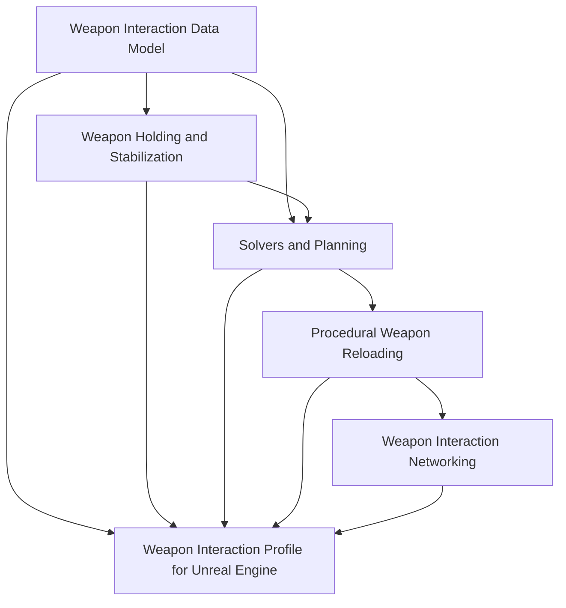

# Weapon Interaction

## Purpose

This section defines the weapon interaction layer of the Human Locomotion System.

Weapon interaction covers:

```text
holding weapons
stabilizing weapons with hands/shoulder/support contacts
procedural reloads
magazine and ammo object manipulation
bolt/slide/pump/charging-handle operation
hand assignment and reachability solving
multiplayer-safe gameplay state
Unreal Engine implementation mapping
```

The section is split into two levels:

```text
engine-agnostic design documents
engine-specific Unreal Engine implementation documents
```

The engine-agnostic documents define the source of truth. The Unreal Engine documents show how to implement that source of truth in UE 5.7.

---

## Document Structure

### Engine-Agnostic Documents

[Weapon Holding and Stabilization](./weapon-holding.md)

Defines the current weapon hold pose, active contacts, shoulder side, stability requirements, temporary hand roles, reachability, stance constraints, and the rule that the weapon must never become an unsupported prop.

[Weapon Interaction Data Model](./weapon-interaction-data-model.md)

Defines weapon interaction points, access regions, hand policies, axes, feature flags, moving parts, ammo objects, body slots, and mechanical state in an engine-independent way.

[Weapon Solvers and Planning](./weapon-solvers-and-planning.md)

Defines the hand assignment solver, reachability solver, stability solver, reload planner, action plan, dependency rules, fallback rules, and interruption recovery.

[Procedural Weapon Reloading](./procedural-reload.md)

Defines procedural reload as an action sequence built on weapon holding, interaction points, object attachment states, socket-axis directed movement, mechanical state commits, and multiplayer state.

[Weapon Interaction Networking](./weapon-networking.md)

Defines the multiplayer model: server authority, client prediction, remote-client reconstruction, replicated reload phase, mechanical state, visual object state, and commit points.

### Unreal Engine Implementation Documents

[Weapon Interaction Profile for Unreal Engine](./weapon-interaction-profile-ue.md)

Maps the engine-agnostic data model into UE 5.7 DataAssets, components, C++ structs, editor validation, preview tools, replication structs, and Mermaid implementation diagrams.

Future UE implementation documents may be added for:

```text
Control Rig setup
AnimInstance integration
Editor preview tooling
Gameplay Ability System integration
network prediction details
```

---

## System Layers



---

## Implementation Principle

A correct implementation must follow this ownership model:

```text
Data model:
  defines what exists and how it can be used.

Holding system:
  defines current contacts and weapon stability.

Solvers/planner:
  decide what should happen.

Reload executor:
  performs steps over time.

Networking layer:
  replicates gameplay state and phase, not IK every frame.

Engine implementation:
  maps these rules to components, assets, animation systems, and editor tools.
```

---

## Final Formula

```text
Weapon interaction =
  weapon data
  + current hold state
  + solver decisions
  + action plans
  + gameplay mechanical state
  + network-safe replication
  + engine-specific animation execution.
```

The documents in this section should be detailed enough for an AI or engineer to implement the system directly, while still separating core logic from Unreal Engine details.
