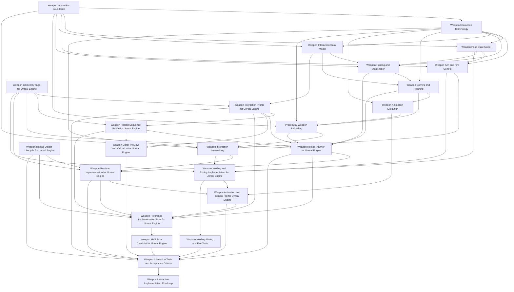

# Weapon Interaction

## Purpose

This section defines the weapon interaction layer of the Human Locomotion System.

Weapon interaction covers the physical/procedural relationship between a character and a held weapon:

```text
holding weapons
stabilizing weapons with hands/shoulder/support contacts
weapon-facing pose states such as relaxed carry, low ready, hip fire, point aim, and aim down sights
weapon interaction readiness for fire, without owning the fire backend
procedural reloads as hand/object/weapon interaction
magazine and ammo-object visual manipulation as interaction objects
bolt/slide/pump/charging-handle operation as mechanism interaction
hand assignment and reachability solving for weapon interaction points
animation execution for reaching/gripping/manipulation
multiplayer-safe interaction state reconstruction
Unreal Engine implementation mapping for interaction state and animation targets
editor validation and acceptance testing for weapon interaction data
reference implementation flow
implementation roadmap
MVP implementation checklist
```

Weapon interaction does not own every system affected by a weapon. It does not own locomotion speed, body yaw, turn-in-place, camera behavior, inventory economy, projectile simulation, damage, AI decisions, or the whole cover system.

---

## Document Structure

### Scope and Core Concepts

[Weapon Interaction Boundaries](./weapon-interaction-boundaries.md)

Defines the ownership boundary of this section: what weapon interaction owns, what it only requests from external systems, what it may read from external systems, and what it must never expand into.

[Weapon Interaction Terminology](./weapon-interaction-terminology.md)

Defines shared terms used across the weapon interaction section: action step, step definition, interaction phase, step alpha, visual attachment, gameplay attachment, gameplay object, visual object, commit point, reload revision, and mechanical state revision.

[Weapon Pose State Model](./weapon-pose-state-model.md)

Defines weapon-in-hands pose states such as RelaxedCarry, LowReady, HighReady, HipFire, PointAim, AimDownSights, SprintingWithWeapon, Reloading, and ManipulatingMechanism as weapon/hand/contact states. It does not own locomotion speed or body orientation.

[Weapon Aim and Fire Control](./weapon-aim-and-fire-control.md)

Defines aim source, aim target, hip fire, point aim, ADS, fire readiness, muzzle-vs-camera relationship, client prediction boundaries, and remote fire visualization from the interaction perspective. It does not own projectile simulation, damage, ammo economy, or the full fire backend.

### Engine-Agnostic Interaction Documents

[Weapon Holding and Stabilization](./weapon-holding.md)

Defines the current weapon hold pose, active contacts, shoulder side, stability requirements, temporary hand roles, reachability, stance constraints, and the rule that the weapon must never become an unsupported prop.

[Weapon Interaction Data Model](./weapon-interaction-data-model.md)

Defines weapon interaction points, access regions, hand policies, axes, feature flags, moving parts, ammo/reload visual objects, body slots as interaction references, and mechanical interaction state in an engine-independent way.

[Weapon Solvers and Planning](./weapon-solvers-and-planning.md)

Defines the hand assignment solver, reachability solver, stability solver, reload planner, action plan, dependency rules, fallback rules, and interruption recovery.

[Weapon Animation Execution](./weapon-animation-execution.md)

Defines how validated action plans become visible upper-body interaction animation: reach trajectories, pre-grip, grip/contact phases, object visual attachment, weapon pose offsets, spine/shoulder assistance requests, elbow control, moving part following, animation LOD, and recovery animation.

[Procedural Weapon Reloading](./procedural-reload.md)

Defines procedural reload as an action sequence built on weapon holding, interaction points, object attachment states, socket-axis directed movement, interaction commit points, and multiplayer interaction state.

[Weapon Interaction Networking](./weapon-networking.md)

Defines the multiplayer model for interaction reconstruction: server authority for interaction state, client prediction, remote-client reconstruction, replicated reload phase, mechanical interaction state concept, visual object state concept, and commit points.

### Unreal Engine Implementation Documents

[Weapon Gameplay Tags for Unreal Engine](./weapon-gameplay-tags-ue.md)

Defines the Gameplay Tag naming convention for reload sequences, step ids, commit points, rejection reasons, recovery policies, mechanical events, contact states, grip poses, and weapon interaction policies.

[Weapon Interaction Profile for Unreal Engine](./weapon-interaction-profile-ue.md)

Maps the engine-agnostic data model into UE 5.7 DataAssets, profile structs, socket/bone authoring, editor validation, preview-facing authored data, and authoring workflow.

[Weapon Reload Sequence Profile for Unreal Engine](./weapon-reload-sequence-profile-ue.md)

Defines the authored reload sequence DataAsset: step definitions, phase timing, visual policy, commit policy, recovery policy, and validation rules.

[Weapon Reload Planner for Unreal Engine](./weapon-reload-planner-ue.md)

Defines the UE reload planner implementation contract: build context, build result, planner class, common validation, rejection tags, reload variant builders, fallback behavior, and debug output.

[Weapon Runtime Implementation for Unreal Engine](./weapon-runtime-implementation-ue.md)

Defines the near-implementation-level UE 5.7 runtime architecture for reload/manipulation: source layout, concrete enums and structs, `UWeaponInteractionComponent`, `UWeaponReloadComponent`, replicated state, RPCs, `OnRep` handlers, server executor loop, commit points, prediction, interruption, tick order, object visual attachment, and implementation checklist.

[Weapon Holding and Aiming Implementation for Unreal Engine](./weapon-holding-aiming-ue.md)

Defines UE implementation for normal weapon-in-hands interaction behavior: `UWeaponPoseComponent`, `UWeaponAimComponent`, `UWeaponFireComponent` as interaction-facing bridges, replicated pose/fire interaction state, local aim state, pose transitions, fire requests, fire visualization replication, and AnimInstance/Control Rig integration for low ready, hip fire, ADS, and reload overlay.

[Weapon Reload Object Lifecycle for Unreal Engine](./weapon-object-lifecycle-ue.md)

Defines gameplay object vs visual object handling from the interaction perspective, magazine/round/shell visual actors, body slot visuals, weapon/hand attachment, predicted object reconciliation, dropped object visual handling, and duplicate visual cleanup. It does not own inventory economy.

[Weapon Animation and Control Rig for Unreal Engine](./weapon-animation-control-rig-ue.md)

Maps the animation execution model into UE 5.7 AnimInstance state, Control Rig inputs, hand IK targets, elbow poles, weapon pose offsets, moving part animation, visual object attachment, animation LOD, and remote-client playback.

[Weapon Editor Preview and Validation for Unreal Engine](./weapon-editor-preview-ue.md)

Defines preview actor/component, validation reports, socket axis debug, hand assignment preview, magazine alignment preview, reload sequence preview, automated validation, and common authoring error detection.

### Reference and Validation Documents

[Weapon Reference Implementation Flow for Unreal Engine](./weapon-reference-flow-ue.md)

Provides one complete detachable magazine reload reference scenario: weapon profile, reload object, sequence profile, planner context, runtime plan, replicated interaction state, object visual lifecycle, animation state, Control Rig visualization, and acceptance tests.

[Weapon MVP Task Checklist for Unreal Engine](./weapon-mvp-task-checklist-ue.md)

Defines the compact MVP implementation checklist: files to create, types/tags, profile asset, sequence asset, planner, runtime replication, object lifecycle, manipulation component, AnimInstance/Control Rig, networking, editor validation, and MVP tests.

[Weapon Holding Aiming and Fire Tests](./weapon-holding-aiming-tests.md)

Defines tests for low ready, hip fire, ADS, sprint pose interaction, fire readiness validation from interaction state, reload overlay entry/exit, server rejection during reload, remote fire visualization reconstruction, late relevancy, shoulder switching, and weapon switch cleanup.

[Weapon Interaction Tests and Acceptance Criteria](./weapon-interaction-tests.md)

Defines implementation tests for profile validation, solver behavior, reload scenarios, object lifecycle, networking, prediction rejection, editor preview, and LOD/gameplay separation.

[Weapon Interaction Implementation Roadmap](./weapon-implementation-roadmap.md)

Defines implementation stages: foundations, MVP detachable magazine reload, tooling, object lifecycle hardening, additional weapon interaction patterns, networking edge cases, animation quality, and production hardening.

---

## Recommended Reading Order

```text
1. Weapon Interaction Boundaries
2. Weapon Interaction Terminology
3. Weapon Pose State Model
4. Weapon Aim and Fire Control
5. Weapon Interaction Data Model
6. Weapon Holding and Stabilization
7. Weapon Solvers and Planning
8. Weapon Animation Execution
9. Procedural Weapon Reloading
10. Weapon Interaction Networking
11. Weapon Gameplay Tags for Unreal Engine
12. Weapon Interaction Profile for Unreal Engine
13. Weapon Reload Sequence Profile for Unreal Engine
14. Weapon Reload Planner for Unreal Engine
15. Weapon Runtime Implementation for Unreal Engine
16. Weapon Holding and Aiming Implementation for Unreal Engine
17. Weapon Reload Object Lifecycle for Unreal Engine
18. Weapon Animation and Control Rig for Unreal Engine
19. Weapon Editor Preview and Validation for Unreal Engine
20. Weapon Reference Implementation Flow for Unreal Engine
21. Weapon MVP Task Checklist for Unreal Engine
22. Weapon Holding Aiming and Fire Tests
23. Weapon Interaction Tests and Acceptance Criteria
24. Weapon Interaction Implementation Roadmap
```

---

## System Layers



---

## Implementation Principle

A correct implementation must follow this ownership model:

```text
Boundaries:
  define what weapon interaction owns and what it must not expand into.

Terminology:
  defines shared names and prevents ambiguous state names.

Pose state model:
  defines weapon/hand/contact pose states and how temporary interactions enter/exit them.

Aim/fire control:
  defines interaction-facing aim and fire readiness state, not the full fire backend.

Data model:
  defines what weapon interaction points, contacts, axes, moving parts, and visual reload objects exist.

Holding system:
  defines current contacts and weapon stability.

Solvers/planner:
  decide weapon interaction hand roles, reachability, stability, and manipulation plans.

Animation execution:
  turns a validated interaction plan into hand/object/weapon targets.

Reload semantics:
  define reload-specific interaction scenarios and action meaning.

Networking layer:
  replicates interaction state and phase, not IK every frame.

Gameplay tags:
  provide stable names for sequences, steps, commits, rejection reasons, recovery policies, contacts, grip poses, pose/fire interaction policies, and debug states.

UE profile and sequence assets:
  define authored weapon interaction data.

UE planner:
  converts request/context/profile/sequence data into runtime interaction plans.

UE runtime implementation:
  owns reload/manipulation components, replicated structs, RPCs, OnRep handlers, executor loop, prediction, and tick/update order for weapon interaction.

UE holding/aiming implementation:
  owns interaction-facing pose state, aim state, fire requests, fire visualization state, and pose/aim animation bridge.

UE object lifecycle:
  separates external gameplay object concepts from visual interaction object state.

UE animation implementation:
  maps runtime interaction targets into AnimInstance and Control Rig.

UE editor preview:
  validates authored sockets, axes, sequences, and hand assignments before runtime.

Reference flow:
  shows one complete implementation path from profile to replicated animation.

MVP checklist:
  converts the reference flow into concrete implementation tasks and files.

Tests:
  define acceptance criteria for interaction quality.

Roadmap:
  defines staged implementation order.
```

---

## Final Formula

```text
Weapon interaction =
  clear boundaries
  + shared terminology
  + weapon/hand/contact pose states
  + interaction-facing aim/fire readiness
  + weapon interaction data
  + current hold state
  + solver decisions
  + action plans
  + animation execution targets
  + reload/manipulation semantics
  + interaction mechanical state
  + network-safe interaction replication
  + gameplay tags
  + UE authored assets
  + UE planner/runtime implementation
  + UE holding/aiming implementation
  + UE visual object lifecycle
  + UE animation implementation
  + editor validation
  + reference flow
  + MVP checklist
  + acceptance tests
  + roadmap.
```

Weapon interaction is the physical/procedural relationship between the character and weapon. It is not every external system affected by holding a weapon.
