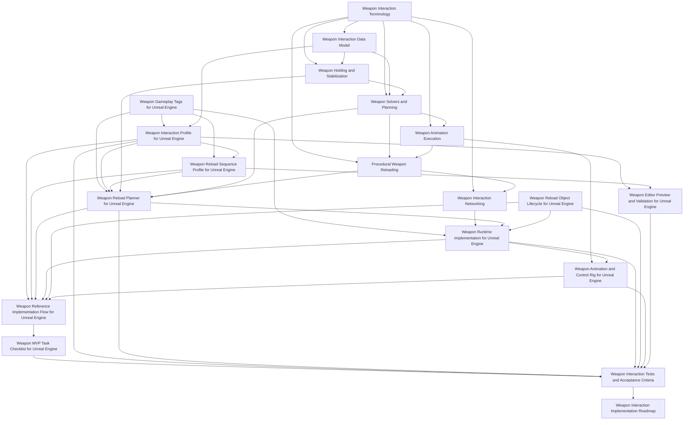

# Weapon Interaction

## Purpose

This section defines the weapon interaction layer of the Human Locomotion System.

Weapon interaction covers:

```text
holding weapons
stabilizing weapons with hands/shoulder/support contacts
procedural reloads
magazine and ammo object manipulation
bolt/slide/pump/charging-handle operation
hand assignment and reachability solving
animation execution for reaching/gripping/manipulation
multiplayer-safe gameplay state
Unreal Engine implementation mapping
near-implementation UE runtime architecture
editor validation and acceptance testing
reference implementation flow
implementation roadmap
MVP implementation checklist
```

The section is split into four levels:

```text
engine-agnostic design documents
engine-specific Unreal Engine implementation documents
validation, terminology, and acceptance documents
reference flow and implementation roadmap documents
```

The engine-agnostic documents define the source of truth. The Unreal Engine documents show how to implement that source of truth in UE 5.7.

---

## Document Structure

### Engine-Agnostic Documents

[Weapon Interaction Terminology](./weapon-interaction-terminology.md)

Defines shared terms used across the weapon interaction section: action step, step definition, interaction phase, step alpha, visual attachment, gameplay attachment, gameplay object, visual object, commit point, reload revision, and mechanical state revision.

[Weapon Holding and Stabilization](./weapon-holding.md)

Defines the current weapon hold pose, active contacts, shoulder side, stability requirements, temporary hand roles, reachability, stance constraints, and the rule that the weapon must never become an unsupported prop.

[Weapon Interaction Data Model](./weapon-interaction-data-model.md)

Defines weapon interaction points, access regions, hand policies, axes, feature flags, moving parts, ammo objects, body slots, and mechanical state in an engine-independent way.

[Weapon Solvers and Planning](./weapon-solvers-and-planning.md)

Defines the hand assignment solver, reachability solver, stability solver, reload planner, action plan, dependency rules, fallback rules, and interruption recovery.

[Weapon Animation Execution](./weapon-animation-execution.md)

Defines how validated action plans become visible upper-body animation: reach trajectories, pre-grip, grip/contact phases, object visual attachment, weapon pose offsets, spine/shoulder assistance, elbow control, moving part following, animation LOD, and recovery animation.

[Procedural Weapon Reloading](./procedural-reload.md)

Defines procedural reload as an action sequence built on weapon holding, interaction points, object attachment states, socket-axis directed movement, mechanical state commits, and multiplayer state.

[Weapon Interaction Networking](./weapon-networking.md)

Defines the multiplayer model: server authority, client prediction, remote-client reconstruction, replicated reload phase, mechanical state concept, visual object state concept, and commit points.

### Unreal Engine Implementation Documents

[Weapon Gameplay Tags for Unreal Engine](./weapon-gameplay-tags-ue.md)

Defines the Gameplay Tag naming convention for reload sequences, step ids, commit points, rejection reasons, recovery policies, mechanical events, contact states, grip poses, and weapon policies.

[Weapon Interaction Profile for Unreal Engine](./weapon-interaction-profile-ue.md)

Maps the engine-agnostic data model into UE 5.7 DataAssets, profile structs, socket/bone authoring, editor validation, preview-facing authored data, and authoring workflow.

[Weapon Reload Sequence Profile for Unreal Engine](./weapon-reload-sequence-profile-ue.md)

Defines the authored reload sequence DataAsset: step definitions, phase timing, visual policy, commit policy, recovery policy, and validation rules.

[Weapon Reload Planner for Unreal Engine](./weapon-reload-planner-ue.md)

Defines the UE reload planner implementation contract: build context, build result, planner class, common validation, rejection tags, reload variant builders, fallback behavior, and debug output.

[Weapon Runtime Implementation for Unreal Engine](./weapon-runtime-implementation-ue.md)

Defines the near-implementation-level UE 5.7 runtime architecture: source layout, concrete enums and structs, `UWeaponInteractionComponent`, `UWeaponReloadComponent`, replicated state, RPCs, `OnRep` handlers, server executor loop, commit points, prediction, interruption, tick order, object visual attachment, and implementation checklist.

[Weapon Reload Object Lifecycle for Unreal Engine](./weapon-object-lifecycle-ue.md)

Defines gameplay object vs visual object handling, magazine/round/shell visual actors, body slot visuals, weapon/hand attachment, predicted object reconciliation, dropped object handling, and duplicate visual cleanup.

[Weapon Animation and Control Rig for Unreal Engine](./weapon-animation-control-rig-ue.md)

Maps the animation execution model into UE 5.7 AnimInstance state, Control Rig inputs, hand IK targets, elbow poles, weapon pose offsets, moving part animation, visual object attachment, animation LOD, and remote-client playback.

[Weapon Editor Preview and Validation for Unreal Engine](./weapon-editor-preview-ue.md)

Defines preview actor/component, validation reports, socket axis debug, hand assignment preview, magazine alignment preview, reload sequence preview, automated validation, and common authoring error detection.

### Reference and Validation Documents

[Weapon Reference Implementation Flow for Unreal Engine](./weapon-reference-flow-ue.md)

Provides one complete detachable magazine reload reference scenario: weapon profile, reload object, sequence profile, planner context, runtime plan, replicated state, object lifecycle, animation state, Control Rig visualization, and acceptance tests.

[Weapon MVP Task Checklist for Unreal Engine](./weapon-mvp-task-checklist-ue.md)

Defines the compact MVP implementation checklist: files to create, types/tags, profile asset, sequence asset, planner, runtime replication, object lifecycle, manipulation component, AnimInstance/Control Rig, networking, editor validation, and MVP tests.

[Weapon Interaction Tests and Acceptance Criteria](./weapon-interaction-tests.md)

Defines implementation tests for profile validation, solver behavior, reload scenarios, object lifecycle, networking, prediction rejection, editor preview, and LOD/gameplay separation.

[Weapon Interaction Implementation Roadmap](./weapon-implementation-roadmap.md)

Defines implementation stages: foundations, MVP detachable magazine reload, tooling, object lifecycle hardening, additional weapon types, networking edge cases, animation quality, and production hardening.

---

## Recommended Reading Order

```text
1. Weapon Interaction Terminology
2. Weapon Interaction Data Model
3. Weapon Holding and Stabilization
4. Weapon Solvers and Planning
5. Weapon Animation Execution
6. Procedural Weapon Reloading
7. Weapon Interaction Networking
8. Weapon Gameplay Tags for Unreal Engine
9. Weapon Interaction Profile for Unreal Engine
10. Weapon Reload Sequence Profile for Unreal Engine
11. Weapon Reload Planner for Unreal Engine
12. Weapon Runtime Implementation for Unreal Engine
13. Weapon Reload Object Lifecycle for Unreal Engine
14. Weapon Animation and Control Rig for Unreal Engine
15. Weapon Editor Preview and Validation for Unreal Engine
16. Weapon Reference Implementation Flow for Unreal Engine
17. Weapon MVP Task Checklist for Unreal Engine
18. Weapon Interaction Tests and Acceptance Criteria
19. Weapon Interaction Implementation Roadmap
```

---

## System Layers



---

## Implementation Principle

A correct implementation must follow this ownership model:

```text
Terminology:
  defines shared names and prevents ambiguous state names.

Data model:
  defines what exists and how it can be used.

Holding system:
  defines current contacts and weapon stability.

Solvers/planner:
  decide what should happen.

Animation execution:
  turns a validated plan into hand/object/weapon targets.

Reload semantics:
  define reload-specific scenarios and action meaning.

Networking layer:
  replicates gameplay state and phase, not IK every frame.

Gameplay tags:
  provide stable names for sequences, steps, commits, rejection reasons, recovery policies, contacts, and grip poses.

UE profile and sequence assets:
  define authored data.

UE planner:
  converts request/context/profile/sequence data into runtime action plans.

UE runtime implementation:
  owns concrete components, replicated structs, RPCs, OnRep handlers, executor loop, prediction, and tick/update order.

UE object lifecycle:
  separates gameplay object state from visual object state.

UE animation implementation:
  maps runtime targets into AnimInstance and Control Rig.

UE editor preview:
  validates authored sockets, axes, sequences, and hand assignments before runtime.

Reference flow:
  shows one complete implementation path from profile to replicated animation.

MVP checklist:
  converts the reference flow into concrete implementation tasks and files.

Tests:
  define acceptance criteria for implementation quality.

Roadmap:
  defines staged implementation order.
```

---

## Final Formula

```text
Weapon interaction =
  shared terminology
  + weapon data
  + current hold state
  + solver decisions
  + action plans
  + animation execution targets
  + reload semantics
  + gameplay mechanical state
  + network-safe replication
  + gameplay tags
  + UE authored assets
  + UE planner/runtime implementation
  + UE object lifecycle
  + UE animation implementation
  + editor validation
  + reference flow
  + MVP checklist
  + acceptance tests
  + roadmap.
```

The documents in this section should be detailed enough for an AI or engineer to implement, validate, debug, and extend the weapon interaction system directly, while still separating core logic from Unreal Engine details.
