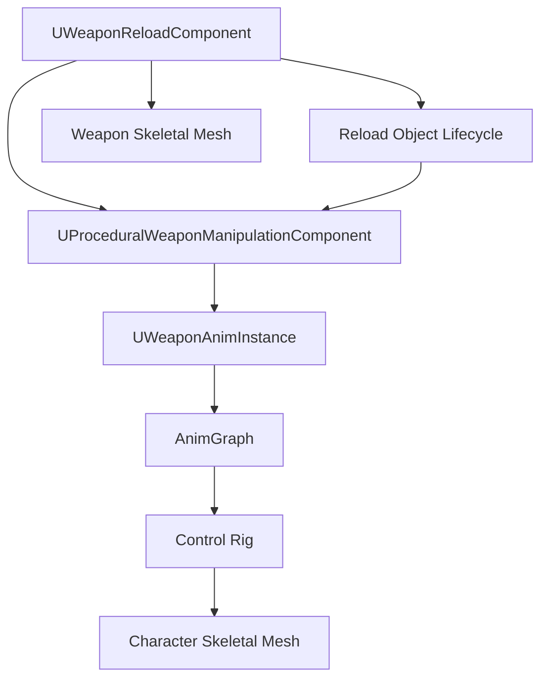

# Weapon Animation and Control Rig for Unreal Engine

## Purpose

This document maps [Weapon Animation Execution](./weapon-animation-execution.md) to an Unreal Engine 5.7 animation implementation.

It defines the implementation contract between:

```text
UProceduralWeaponManipulationComponent
UWeaponAnimInstance
AnimGraph
Control Rig
weapon skeletal mesh moving parts
visual reload objects
```

Runtime planning, replication, and server authority are defined in [Weapon Runtime Implementation for Unreal Engine](./weapon-runtime-implementation-ue.md). Reload object lifecycle is defined in [Weapon Reload Object Lifecycle for Unreal Engine](./weapon-object-lifecycle-ue.md).

---

## UE 5.7 API Basis

This document uses Unreal Engine 5.7 animation patterns:

```text
UAnimInstance
AnimGraph
Control Rig node in Animation Blueprint
Control Rig variables exposed to AnimBP
Two Bone IK / FABRIK / Full Body IK style solving
skeletal mesh sockets
bone-space, component-space, and world-space transforms
animation LOD decisions
```

Project-specific classes and structs such as `UWeaponAnimInstance`, `FWeaponHandIKTarget`, and `UProceduralWeaponManipulationComponent` are implementation classes defined by this weapon interaction system.

---

## Ownership Boundary

Animation implementation owns:

```text
animation-facing target storage
hand target smoothing
Control Rig input transfer
IK solve order
spine/clavicle/shoulder assist requests
finger/grip pose blending
hand-to-hand handgun support pose blending
shoulder/cheek/sight presentation settling
moving part visual following
animation LOD behavior
visual debug drawing
```

Animation implementation does not own:

```text
reload validation
hand assignment decisions
server authority
gameplay commit points
inventory mutation
mechanical interaction state authority
object lifecycle authority
camera behavior
body orientation solver
locomotion speed
```

The AnimBP and Control Rig visualize already resolved state. They must not decide gameplay validity.

---

## Animation Data Flow



---

## Update Order Contract

Recommended frame order on clients:

```text
1. Replicated reload/mechanical interaction state updates through OnRep or local prediction.
2. UProceduralWeaponManipulationComponent computes current visual state and StepAlpha.
3. Manipulation component builds canonical left/right hand targets, elbow poles, grip states, contact quality summary, and weapon pose offset.
4. Presentation/mirroring stage converts canonical targets into presented targets if required.
5. Manipulation component pushes animation-facing data into UWeaponAnimInstance.
6. AnimInstance update reads stored weapon interaction state.
7. AnimGraph evaluates locomotion/weapon base pose.
8. Control Rig node solves weapon interaction hands/spine/clavicle/shoulders.
9. Optional cosmetic additive layers run.
10. Final pose is output.
```

The manipulation component must update before animation evaluation. If the project uses custom tick groups, add tick prerequisites accordingly.

---

## Coordinate Space Contract

Use explicit spaces.

Runtime target generation may work in world space because interaction points and hand sockets are world-resolved at runtime.

Control Rig should receive either:

```text
world-space targets and convert them to component/control space inside the rig
```

or:

```text
component-space targets already converted by the AnimInstance/manipulation component
```

Do not mix spaces silently.

Recommended MVP:

```text
FWeaponHandIKTarget stores world-space target transform.
AnimInstance passes world-space target to Control Rig.
Control Rig converts to rig/component space once at graph start.
```

---

## Reachability Is Not Only Distance

Weapon interaction reachability and animation solving should not be implemented as a simple hand-to-target distance check.

At minimum, reachability/IK quality should consider:

```text
arm length
max extension
elbow pole validity
wrist comfort
shoulder/clavicle assist request
current contact quality
target rotation difficulty
weapon pose offset allowance
simple body/weapon collision avoidance
presentation mirroring state
```

This is still procedural animation reachability, not full anatomical simulation.

The solver may output:

```text
bReachable
ReachCost
bRequiresClavicleAssist
bRequiresShoulderAssist
bViolatesWristComfort
bViolatesElbowPolePreference
SuggestedPoseAdjustment
```

---

## Animation Runtime Structs

### Hand IK Target

```cpp
USTRUCT(BlueprintType)
struct FWeaponHandIKTarget
{
    GENERATED_BODY()

    UPROPERTY(BlueprintReadWrite)
    bool bEnabled = false;

    UPROPERTY(BlueprintReadWrite)
    FTransform TargetWorldTransform;

    UPROPERTY(BlueprintReadWrite)
    FVector ElbowPoleWorldLocation = FVector::ZeroVector;

    UPROPERTY(BlueprintReadWrite)
    float PositionAlpha = 0.f;

    UPROPERTY(BlueprintReadWrite)
    float RotationAlpha = 0.f;

    UPROPERTY(BlueprintReadWrite)
    float FingerGripAlpha = 0.f;

    UPROPERTY(BlueprintReadWrite)
    float ContactQuality = 0.f;

    UPROPERTY(BlueprintReadWrite)
    float ContactConfidence = 0.f;

    UPROPERTY(BlueprintReadWrite)
    FGameplayTag GripPoseId;

    UPROPERTY(BlueprintReadWrite)
    FGameplayTag ContactState;

    UPROPERTY(BlueprintReadWrite)
    bool bIsStabilizingContact = false;

    UPROPERTY(BlueprintReadWrite)
    bool bIsManipulationHand = false;

    UPROPERTY(BlueprintReadWrite)
    bool bIsHandToHandSupport = false;
};
```

### Weapon Pose Offset

```cpp
USTRUCT(BlueprintType)
struct FWeaponPoseOffsetAnimState
{
    GENERATED_BODY()

    UPROPERTY(BlueprintReadWrite)
    bool bEnabled = false;

    UPROPERTY(BlueprintReadWrite)
    FTransform LocalOffset;

    UPROPERTY(BlueprintReadWrite)
    float Alpha = 0.f;

    UPROPERTY(BlueprintReadWrite)
    FGameplayTag MuzzlePolicy;
};
```

### Aim/Stock Presentation State

```cpp
USTRUCT(BlueprintType)
struct FWeaponAimContactAnimState
{
    GENERATED_BODY()

    UPROPERTY(BlueprintReadWrite)
    float ShoulderContactQuality = 0.f;

    UPROPERTY(BlueprintReadWrite)
    float CheekContactQuality = 0.f;

    UPROPERTY(BlueprintReadWrite)
    float SightEyeAlignmentQuality = 0.f;

    UPROPERTY(BlueprintReadWrite)
    float SightAlignmentErrorDegrees = 0.f;
};
```

### Moving Part Anim State

```cpp
USTRUCT(BlueprintType)
struct FWeaponMovingPartAnimState
{
    GENERATED_BODY()

    UPROPERTY(BlueprintReadWrite)
    FName MovingPartName;

    UPROPERTY(BlueprintReadWrite)
    FName BoneName;

    UPROPERTY(BlueprintReadWrite)
    FName FollowSocketName;

    UPROPERTY(BlueprintReadWrite)
    float Alpha = 0.f;

    UPROPERTY(BlueprintReadWrite)
    FVector LocalAxis = FVector::ForwardVector;

    UPROPERTY(BlueprintReadWrite)
    float Distance = 0.f;
};
```

### Weapon Animation State

```cpp
USTRUCT(BlueprintType)
struct FWeaponInteractionAnimState
{
    GENERATED_BODY()

    UPROPERTY(BlueprintReadWrite)
    bool bHasActiveInteraction = false;

    UPROPERTY(BlueprintReadWrite)
    FGameplayTag CurrentStepId;

    UPROPERTY(BlueprintReadWrite)
    EWeaponInteractionPhase CurrentPhase = EWeaponInteractionPhase::None;

    UPROPERTY(BlueprintReadWrite)
    float StepAlpha = 0.f;

    UPROPERTY(BlueprintReadWrite)
    EHand ManipulationHand = EHand::None;

    UPROPERTY(BlueprintReadWrite)
    FWeaponHandIKTarget LeftHand;

    UPROPERTY(BlueprintReadWrite)
    FWeaponHandIKTarget RightHand;

    UPROPERTY(BlueprintReadWrite)
    FWeaponPoseOffsetAnimState WeaponPoseOffset;

    UPROPERTY(BlueprintReadWrite)
    FWeaponAimContactAnimState AimContactState;

    UPROPERTY(BlueprintReadWrite)
    TArray<FWeaponMovingPartAnimState> MovingParts;
};
```

---

## UWeaponAnimInstance

```cpp
UCLASS()
class UWeaponAnimInstance : public UAnimInstance
{
    GENERATED_BODY()

public:
    UPROPERTY(BlueprintReadOnly, Category="Weapon|Interaction")
    FWeaponInteractionAnimState WeaponInteractionState;

    UFUNCTION(BlueprintCallable, Category="Weapon|Interaction")
    void SetWeaponInteractionState(const FWeaponInteractionAnimState& NewState);

    UFUNCTION(BlueprintCallable, Category="Weapon|Interaction")
    void ClearWeaponInteractionState();

    UFUNCTION(BlueprintPure, Category="Weapon|Interaction")
    bool HasActiveWeaponInteraction() const;
};
```

The manipulation component pushes a complete state struct instead of setting unrelated loose variables one by one.

This reduces mismatch bugs where `CurrentStepAlpha` updates but hand target data remains from the previous step.

---

## Manipulation Component Push Contract

`UProceduralWeaponManipulationComponent` should build one coherent `FWeaponInteractionAnimState` per frame.

```cpp
void UProceduralWeaponManipulationComponent::PushToAnimInstance()
{
    ACharacter* Character = Cast<ACharacter>(GetOwner());
    if (!Character)
    {
        return;
    }

    USkeletalMeshComponent* Mesh = Character->GetMesh();
    if (!Mesh)
    {
        return;
    }

    UWeaponAnimInstance* Anim = Cast<UWeaponAnimInstance>(Mesh->GetAnimInstance());
    if (!Anim)
    {
        return;
    }

    Anim->SetWeaponInteractionState(CurrentAnimState);
}
```

Do not let AnimBP pull gameplay state directly from weapon components every frame. Push a resolved animation state.

---

## Target Generation Responsibilities

The manipulation component generates:

```text
left/right hand target transforms
left/right elbow pole positions
finger grip alpha
contact state tags
contact quality/confidence values
hand-to-hand support flag/pose alpha
shoulder/cheek/sight quality values
weapon pose offset anim state
moving part visual states
step alpha
current interaction phase
```

Control Rig consumes these values.

Control Rig should not call the planner or reload component.

---

## AnimGraph Order

Recommended AnimGraph order:

```text
1. Base locomotion pose.
2. Additive or layered weapon carry/aim pose.
3. Reload/manipulation upper-body pose offset layer if needed.
4. Global presentation mirroring stage if implemented before Control Rig.
5. Control Rig node for weapon interaction solve.
6. Recoil/sway/additive aim noise if those do not break hand contacts.
7. Final hand/contact correction.
8. Finger/grip pose layer if not solved inside Control Rig.
9. Output pose.
```

If recoil or additive sway affects weapon hands, it must run before final hand contact correction or be applied to both weapon and hands consistently.

Mirror in one place only. Do not mirror in AnimGraph, Control Rig, and object path independently.

---

## Control Rig Variables

Expose these variables to the Control Rig graph:

```text
bWeaponInteractionActive
CurrentInteractionPhase
StepAlpha
ManipulationHand
LeftHandTargetWorld
RightHandTargetWorld
LeftElbowPoleWorld
RightElbowPoleWorld
LeftHandPositionAlpha
RightHandPositionAlpha
LeftHandRotationAlpha
RightHandRotationAlpha
LeftGripAlpha
RightGripAlpha
LeftContactState
RightContactState
LeftContactQuality
RightContactQuality
LeftContactConfidence
RightContactConfidence
bLeftHandToHandSupport
bRightHandToHandSupport
ShoulderContactQuality
CheekContactQuality
SightEyeAlignmentQuality
WeaponPoseOffsetLocal
WeaponPoseOffsetAlpha
SpineAssistAlpha
ShoulderAssistAlpha
ClavicleAssistAlpha
```

Optional:

```text
MovingPartStates
DebugDrawEnabled
LODLevel
PresentationMirrorState
```

---

## Control Rig Solve Order

Recommended solve order:

```text
1. Read and cache input variables.
2. Convert world-space hand and elbow targets to rig/component space.
3. Apply presentation mirror only if this is the defined mirror stage.
4. Apply weapon pose offset to upper-body/weapon reference if the project uses a character-held weapon control.
5. Apply spine assist request if supplied by external body/animation layer.
6. Apply clavicle/shoulder assist.
7. Solve stabilizing hand first.
8. Solve hand-to-hand support relationship if active.
9. Solve manipulation hand second.
10. Correct wrist orientation.
11. Apply shoulder/cheek/sight presentation settling.
12. Apply finger grip controls or expose grip alpha to AnimGraph layer.
13. Output final upper-body pose.
```

Stabilizing contacts should be solved before manipulation contacts so the weapon does not visually drift while the manipulation hand moves.

---

## Stabilizing Hand Rule

If a hand target is marked `bIsStabilizingContact`, it should preserve the authored contact point unless the current action plan released that contact.

Examples:

```text
main grip + shoulder stabilize while support hand reloads
pistol main grip stabilizes while support hand manipulates slide or magazine
two-handed handgun support stabilizes by hand-to-hand support, not necessarily a weapon socket
```

The rig should not blend stabilizing contact to zero just because the other hand is active.

---

## Hand-To-Hand Support Rule

For two-handed handgun poses, the support hand may be solved relative to the main hand and weapon frame instead of a separate support grip socket.

Inputs:

```text
MainHandTransform
SupportHandToMainHandOffset
SupportHandGripPoseId
HandToHandSupportQuality
```

Rules:

```text
main hand remains primary weapon contact
support hand follows a relative support pose
support hand may also lightly align to weapon frame if authored
finger/grip pose should represent combined two-hand grip
```

---

## IK Method

MVP:

```text
Two Bone IK for each arm
explicit elbow pole target
separate position/rotation alpha
wrist orientation correction
contact quality alpha
```

Advanced:

```text
Full Body IK for upper body assist
FABRIK for longer reach chains
Control Rig constraints for weapon contacts
per-finger Control Rig controls
hand-to-hand support constraints
```

The chosen method may vary by character rig, but the inputs and ownership model should stay the same.

---

## Elbow Pole Generation

Elbow pole positions should be generated by the manipulation component or a small animation helper.

Basic rule:

```text
elbow pole = shoulder position + side direction * elbow side offset + forward/up adjustment
```

Mirroring rule:

```text
presentation mirroring may mirror elbow side preference,
but must not recompute authored weapon socket axes incorrectly.
```

Debug must draw elbow pole targets because wrong poles cause arm flipping.

---

## Grip and Finger Pose Contract

Finger poses are driven by grip/contact phase.

Mapping:

```text
NoContact        → open hand
Approaching      → relaxed open hand
PreGrip          → prepared hand shape
Contact          → closing hand
VisualAttached   → closed grip
Manipulating     → strong grip
Released         → opening hand
```

Implementation options:

```text
scalar FingerGripAlpha
pose assets
Control Rig finger controls
animation curves
```

MVP should use scalar `FingerGripAlpha` per hand. Production may use `GripPoseId` to select hand pose assets or finger control presets.

---

## Moving Weapon Parts

Moving part state is generated by runtime execution and consumed visually.

Rules:

```text
runtime sets MovingPartAlpha
weapon mesh applies moving bone/part offset
a hand target follows the moving part follow socket when required
```

The hand should not physically simulate pulling the weapon part.

For pump/bolt/slide:

```text
moving part pose first
follow socket transform second
hand IK target follows follow socket third
```

If the project applies moving part offsets in the weapon AnimBP, the manipulation component must read the post-offset follow socket transform or compute equivalent transform from moving part state.

---

## Object Visual Attachment

Object visual attachment is controlled by [Weapon Reload Object Lifecycle for Unreal Engine](./weapon-object-lifecycle-ue.md).

Animation layer only needs to know:

```text
object is visually in hand
object is visually in weapon
object is hidden/in body slot
object is dropped
```

Do not use Control Rig to authoritatively attach gameplay objects.

---

## Owner Client vs Remote Client

Owning client:

```text
may use predicted visual state immediately
reconciles with server reload state
may smooth correction over MaxPredictionCorrectionTime
```

Remote client:

```text
uses replicated ReloadInstance only
computes StepAlpha from server time
does not run prediction
seeks visual state to current phase
```

Both should produce the same `FWeaponInteractionAnimState` shape for AnimInstance.

---

## Low LOD Behavior

LOD must not affect gameplay.

Suggested LODs:

```text
LOD0:
  full hand IK, elbow poles, spine/clavicle assist, fingers, moving part follow, hand-to-hand support, cheek/sight settling

LOD1:
  hand IK, elbow poles, moving parts, simplified fingers, simplified contact quality

LOD2:
  upper-body reload/weapon pose, object visual states, moving parts, no detailed fingers

LOD3:
  no detailed procedural hands, only broad reload/weapon pose or no detailed weapon interaction animation
```

Even at LOD3:

```text
server commit points still apply
mechanical interaction state still replicates
interaction fire readiness remains external/backend-bounded
```

---

## Debug View

Debug should draw or print:

```text
CurrentStepId
CurrentInteractionPhase
StepAlpha
ManipulationHand
LeftHand target
RightHand target
LeftElbow pole
RightElbow pole
PositionAlpha / RotationAlpha
FingerGripAlpha
ContactState
ContactQuality
ContactConfidence
HandToHandSupportQuality
ShoulderContactQuality
CheekContactQuality
SightEyeAlignmentQuality
WeaponPoseOffset
MovingPartAlpha
Owner/remote prediction state
PresentationMirrorState
LOD level
```

Debug should compare:

```text
server step alpha
local visual step alpha
phase error
```

---

## Minimal UE MVP

Minimum implementation:

```text
1. UProceduralWeaponManipulationComponent builds FWeaponInteractionAnimState.
2. UWeaponAnimInstance stores one coherent FWeaponInteractionAnimState.
3. AnimGraph evaluates base locomotion and weapon carry pose before weapon interaction Control Rig.
4. Control Rig receives hand targets, elbow poles, grip alphas, contact quality, phase, and step alpha.
5. Control Rig solves stabilizing contact before manipulation contact.
6. Hand-to-hand support is supported for two-handed handgun poses if that archetype is used.
7. Magazine/round visual attachment is handled outside Control Rig by object lifecycle code.
8. Moving parts expose alpha and follow socket information.
9. Remote clients reconstruct StepAlpha from replicated state and push the same anim state shape.
10. LOD can simplify visuals but cannot affect interaction state.
11. Debug draws targets, poles, contacts, phase, alpha, and moving parts.
```

---

## Failure Cases To Handle

Implementation must handle:

```text
AnimInstance missing or wrong class
Control Rig node not active at low LOD
weapon mesh missing follow socket
hand-to-hand support reference missing for handgun pose that requires it
cheek/sight reference missing for stocked ADS pose that requires it
moving part state exists but moving part definition missing
predicted target corrected by server
hand target disabled mid-step due to interruption
weapon switched while reload animation is active
remote client becomes relevant mid-step
mirror stage applied twice
```

All cases should clear or rebuild `FWeaponInteractionAnimState` rather than leaving stale hand targets active.

---

## Final Formula

```text
UE weapon animation implementation =
  coherent animation state struct
  + runtime-generated hand/object/weapon targets
  + contact quality values
  + hand-to-hand support for handgun archetypes
  + shoulder/cheek/sight presentation quality for stocked ADS
  + explicit IK solve order
  + Control Rig consumes resolved state only.
```
