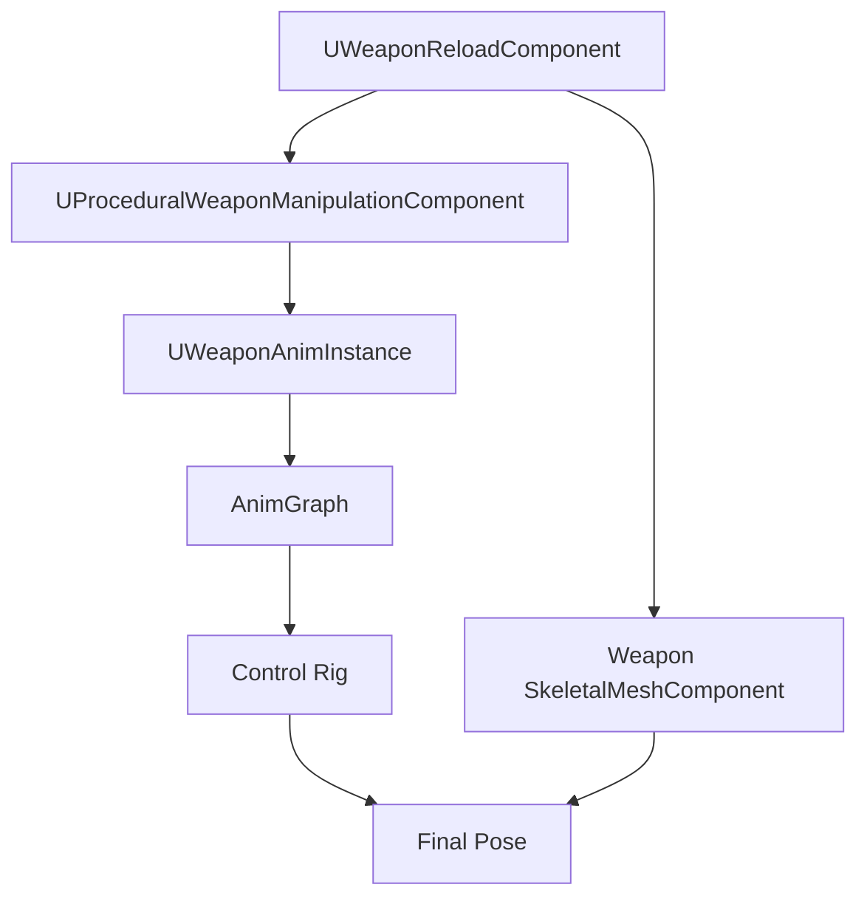

# Weapon Animation and Control Rig for Unreal Engine

## Purpose

This document maps [Weapon Animation Execution](./weapon-animation-execution.md) to an Unreal Engine 5.7 implementation.

It defines how runtime weapon interaction targets are passed from C++ components into AnimInstance and Control Rig, how hands follow targets, how weapon pose offsets are applied, how object attachment is visualized, and how remote clients reconstruct procedural reloads.

---

## Implementation Ownership

```text
Gameplay components:
  decide state, plan actions, replicate state.

AnimInstance:
  stores animation-facing runtime data and exposes it to AnimGraph / Control Rig.

Control Rig / IK Rig:
  solves arms, hands, elbows, spine, and optional fingers from provided targets.

Weapon mesh component:
  applies moving part offsets for bolt, slide, pump, lever, and similar parts.
```

The AnimBP must not decide reload logic.

---

## UE Animation Pipeline



---

## Recommended Runtime Components

Character-owned:

```text
UProceduralWeaponManipulationComponent
```

Weapon-owned:

```text
UWeaponInteractionComponent
UWeaponReloadComponent
```

Animation-owned:

```text
UWeaponAnimInstance
Control Rig asset for upper body / hands
```

---

## Animation Runtime Structs

### Hand IK Target

```cpp
USTRUCT(BlueprintType)
struct FWeaponHandIKTarget
{
    GENERATED_BODY()

    UPROPERTY(BlueprintReadWrite)
    bool bEnabled = false;

    UPROPERTY(BlueprintReadWrite)
    FTransform TargetWorldTransform;

    UPROPERTY(BlueprintReadWrite)
    FVector ElbowPoleWorldLocation = FVector::ZeroVector;

    UPROPERTY(BlueprintReadWrite)
    float PositionAlpha = 0.f;

    UPROPERTY(BlueprintReadWrite)
    float RotationAlpha = 0.f;

    UPROPERTY(BlueprintReadWrite)
    float FingerGripAlpha = 0.f;

    UPROPERTY(BlueprintReadWrite)
    FGameplayTag GripPoseId;

    UPROPERTY(BlueprintReadWrite)
    FGameplayTag ContactState;
};
```

### Weapon Pose Offset

```cpp
USTRUCT(BlueprintType)
struct FWeaponPoseOffsetAnimState
{
    GENERATED_BODY()

    UPROPERTY(BlueprintReadWrite)
    bool bEnabled = false;

    UPROPERTY(BlueprintReadWrite)
    FTransform LocalOffset;

    UPROPERTY(BlueprintReadWrite)
    float Alpha = 0.f;

    UPROPERTY(BlueprintReadWrite)
    FGameplayTag MuzzlePolicy;
};
```

### Moving Part Anim State

```cpp
USTRUCT(BlueprintType)
struct FWeaponMovingPartAnimState
{
    GENERATED_BODY()

    UPROPERTY(BlueprintReadWrite)
    FName MovingPartName;

    UPROPERTY(BlueprintReadWrite)
    float Alpha = 0.f;

    UPROPERTY(BlueprintReadWrite)
    FVector LocalAxis = FVector::ForwardVector;

    UPROPERTY(BlueprintReadWrite)
    float Distance = 0.f;
};
```

---

## UWeaponAnimInstance

```cpp
UCLASS()
class UWeaponAnimInstance : public UAnimInstance
{
    GENERATED_BODY()

public:
    UPROPERTY(BlueprintReadOnly, Category="Weapon|IK")
    FWeaponHandIKTarget LeftHandTarget;

    UPROPERTY(BlueprintReadOnly, Category="Weapon|IK")
    FWeaponHandIKTarget RightHandTarget;

    UPROPERTY(BlueprintReadOnly, Category="Weapon|Pose")
    FWeaponPoseOffsetAnimState WeaponPoseOffset;

    UPROPERTY(BlueprintReadOnly, Category="Weapon|State")
    FGameplayTag CurrentWeaponInteractionPhase;

    UPROPERTY(BlueprintReadOnly, Category="Weapon|State")
    FGameplayTag CurrentReloadStep;

    UPROPERTY(BlueprintReadOnly, Category="Weapon|State")
    float CurrentStepAlpha = 0.f;

    void SetWeaponHandTarget(EHand Hand, const FWeaponHandIKTarget& Target);
    void SetWeaponPoseOffset(const FWeaponPoseOffsetAnimState& Offset);
};
```

`UProceduralWeaponManipulationComponent` should update these fields before animation evaluation.

---

## Control Rig Inputs

Control Rig should receive:

```text
LeftHandTargetTransform
RightHandTargetTransform
LeftElbowPoleTarget
RightElbowPoleTarget
LeftHandAlpha
RightHandAlpha
LeftGripAlpha
RightGripAlpha
WeaponPoseOffset
SpineAssistAlpha
ShoulderAssistAlpha
CurrentInteractionPhase
```

These inputs are animation-facing data only. They do not decide gameplay state.

---

## AnimGraph Order

Recommended order:

```text
1. Base locomotion pose
2. Weapon carry / aim upper-body layer
3. Reload or manipulation pose offset layer
4. Control Rig hand IK / elbow / spine solve
5. Additive recoil / camera sway optional
6. Finger/grip pose optional
```

Important:

```text
weapon interaction IK should run after base locomotion and weapon carry pose
weapon interaction IK should run before final additive cosmetic layers if those layers affect weapon hands
```

---

## Control Rig Solve Order

Recommended Control Rig order:

```text
1. Read current hand, elbow, spine, and weapon targets.
2. Apply weapon pose offset to weapon control or upper-body reference.
3. Apply spine and clavicle assistance.
4. Solve stabilizing hand/contact first.
5. Solve manipulation hand second.
6. Apply wrist orientation correction.
7. Apply optional finger curl / grip pose.
```

For two-hand weapon constraints, the stabilizing contact should not drift unless the action plan released it.

---

## Hand IK Method

Recommended MVP:

```text
Two Bone IK or FABRIK for arms
explicit elbow pole target
separate position and rotation alpha
```

For more advanced setups:

```text
FullBodyIK for upper-body assistance
Control Rig custom constraints for weapon contacts
per-hand grip pose blending
```

The system should preserve the principle from the procedural locomotion architecture: C++/runtime computes targets, AnimInstance receives targets, Control Rig applies IK.

---

## Grip and Finger Poses

Finger pose should be driven by grip phase.

Examples:

```text
NoContact → open hand
PreGrip → partially open hand
Contact → closing hand
VisualAttached → closed grip
Manipulating → strong grip
Release → opening hand
```

Implementation options:

```text
pose assets
Control Rig finger controls
animation curves
simple scalar grip alpha for MVP
```

MVP can use one scalar `FingerGripAlpha` per hand.

---

## Object Visual Attachment

Visual attachment should be controlled by the manipulation component based on the current action step.

Examples:

```text
Magazine visual attached to weapon socket
Magazine visual attached to left hand socket
Magazine visual attached to right hand socket
Magazine visual hidden in body slot
Magazine visual spawned/dropped in world
```

Visual attachment may be predicted locally, but gameplay attachment must follow server-authoritative state defined in [Weapon Interaction Networking](./weapon-networking.md).

---

## Moving Weapon Parts

For bolt, slide, pump, lever, and similar moving parts:

```text
reload executor drives moving part alpha
weapon mesh applies bone/local offset
hand target follows socket on moving part
```

This should not be implemented as pure hand-driven physics.

MVP approach:

```text
MovingPartAlpha 0..1
LocalAxis
Distance
BoneName
```

The weapon component can apply this through an AnimBP variable, Control Rig control, or direct skeletal control depending on project setup.

---

## Remote Client Playback

Remote clients receive replicated reload phase and reconstruct visuals.

```text
OnRep_ReloadInstance
  compute StepAlpha from server time
  set CurrentReloadStep
  set hand targets from local profile
  set visual attachment state
  play/seek procedural step
```

Remote clients should not require exact per-frame replicated transforms.

---

## LOD Rules

Suggested animation LOD:

```text
LOD0:
  full hand IK, elbow poles, weapon pose offset, fingers, moving parts

LOD1:
  hand IK, elbow poles, moving parts, simplified fingers

LOD2:
  upper-body reload pose, object attachment states, moving parts

LOD3:
  simple reload pose or no procedural details
```

Gameplay commit points and mechanical state are unaffected by animation LOD.

---

## Debug View

UE debug should draw:

```text
left/right hand target
left/right elbow pole
pre-grip transform
current grip/contact phase
weapon pose offset axes
moving part axis and alpha
object visual attachment state
server step alpha vs local visual alpha
```

Use persistent debug drawing only in editor/debug builds.

---

## Minimal UE MVP

Minimum implementation:

```text
1. UProceduralWeaponManipulationComponent computes hand targets.
2. UWeaponAnimInstance stores left/right hand target structs.
3. AnimGraph runs Control Rig after weapon carry pose.
4. Control Rig solves both arms with elbow pole targets.
5. Magazine visual can attach to hand or weapon socket.
6. Bolt/slide/pump has a simple alpha-driven moving part state.
7. Remote clients reconstruct step alpha from replicated server time.
```

---

## Final Formula

```text
UE weapon animation execution =
  replicated/planned interaction phase
  + C++ generated hand/object/weapon targets
  + AnimInstance state transfer
  + Control Rig IK solve
  + local visual reconstruction.
```

The animation stack visualizes the interaction plan. It does not own the interaction logic.
