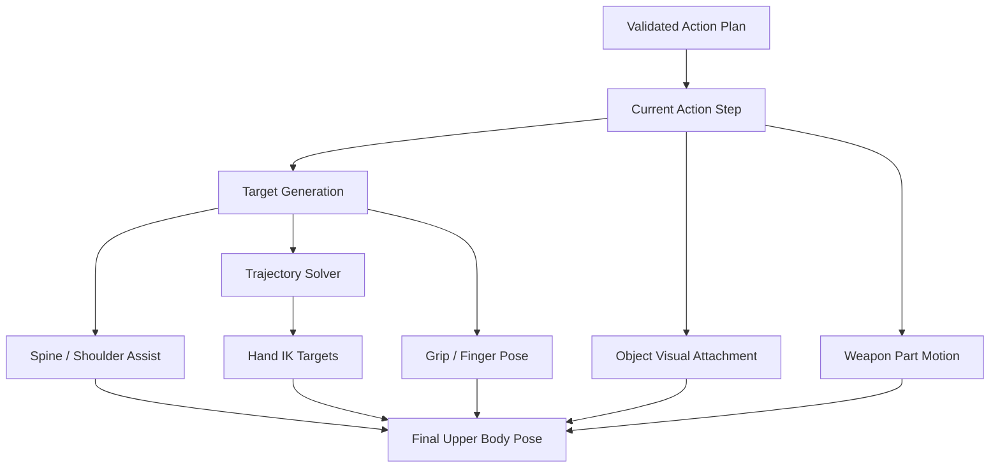

# Weapon Animation Execution

## Purpose

This document defines the engine-agnostic animation execution model for weapon interaction.

It explains how a validated weapon interaction plan becomes visible upper-body motion: hand trajectories, grip phases, weapon pose offsets, object attachment timing, mechanism following, and return-to-hold behavior.

This document does not describe Unreal Engine classes directly. The Unreal Engine implementation is defined in [Weapon Animation and Control Rig for Unreal Engine](./weapon-animation-control-rig-ue.md).

---

## Evidence Boundary

This document uses common findings from human reaching and grasping research as practical animation guidance, not as a claim of exact biomechanical simulation.

In particular:

```text
smooth acceleration/deceleration
bell-shaped velocity-like timing
non-teleporting reach phases
pre-grip/contact/release structure
```

are recommended because they usually produce more human-like motion than constant-speed linear interpolation.

The system is still a game animation system. It is not a medical or biomechanical simulator.

---

## Scope

Weapon animation execution covers:

```text
hand reach trajectories
pre-grip poses
grip/contact phases
object visual attachment
weapon pose offsets
spine/shoulder assistance
elbow pole control
wrist orientation
moving part following
return-to-grip motion
animation interruption and recovery
```

The executor consumes a validated action plan from [Weapon Solvers and Planning](./weapon-solvers-and-planning.md). It must not decide gameplay validity by itself.

---

## Execution Pipeline



---

## Main Rule

Animation execution should not be a constant-speed linear hand teleport between two points.

Every manipulation should be decomposed into phases:

```text
PreparePose
Reach
PreGrip
GripContact
AttachOrConstrain
Manipulate
ReleaseOrDetach
Return
Settle
```

These phases may be short, but they prevent the motion from looking robotic and make object attachment timing explicit.

---

## Hand Trajectory Model

The hand trajectory should use smooth easing and an arced or controlled path.

Minimum MVP trajectory:

```text
StartHandTransform
→ MidControlTransform
→ TargetPreGripTransform
→ TargetGripTransform
```

Recommended path properties:

```text
smooth acceleration
smooth deceleration
no constant-speed linear movement
optional arc height / side offset
wrist orientation blended separately from position
```

The motion should feel like a reach, not a straight robotic slide.

This is an animation approximation. The exact curve can be implemented as a Bezier curve, Hermite curve, authored curve, or per-step animation curve.

---

## Trajectory Phases

### Reach

Moves the hand from its current contact or free pose toward the target area.

```text
Input:
  current hand transform
  target interaction point
  action type
  reach style

Output:
  moving hand IK target
```

### PreGrip

Places the hand near the object or mechanism without yet attaching.

```text
PreGrip = TargetGripTransform offset by approach direction
```

### GripContact

The hand visually contacts the object/mechanism.

At this point visual constraints can begin.

### AttachOrConstrain

The object or mechanism becomes visually constrained to the hand, or the hand becomes constrained to a moving weapon part.

This is not always the gameplay commit point.

### Manipulate

The hand/object/weapon part moves along the defined action path.

Examples:

```text
extract magazine along extract axis
insert magazine along insert axis
pull bolt along operate axis
move pump backward and forward
rotate rock-in magazine around pivot
```

### Return

The hand returns to a grip, next action target, or recovery pose.

### Settle

A short blend that restores stable contact and removes small pose offsets.

---

## Grip Phase Contract

A grip is not a single boolean.

Recommended phases:

```text
NoContact
Approaching
PreGrip
Contact
VisualAttached
GameplayAttached
Manipulating
Released
```

Example magazine pickup:

```text
PreGrip:
  hand aligns with magazine hand-grip point

Contact:
  fingers close around magazine

VisualAttached:
  magazine follows hand visually

GameplayAttached:
  inventory state changes if server commit allows it
```

For multiplayer, visual attachment may be predicted locally, but gameplay attachment must follow authoritative state.

---

## Object Attachment Timing

Visual and gameplay attachment must be separated.

```text
VisualAttachment:
  drives what players see.

GameplayAttachment:
  drives inventory, ammo, firing, and loot state.
```

Examples:

```text
Magazine appears in hand before server commit.
Magazine becomes active only at MagazineLocked commit point.
Dropped magazine becomes lootable only if server spawns a world object.
```

---

## Weapon Pose Offset

Some actions require moving or rotating the weapon to expose an interaction point.

Examples:

```text
lower rifle for bottom magazine
roll shotgun to expose loading port
bring pistol closer to chest
roll bullpup to expose rear magazine well
```

Weapon pose offset should be blended, not snapped.

Recommended fields:

```text
LocalTranslationOffset
LocalRotationOffset
BlendInTime
HoldTime
BlendOutTime
MuzzlePolicy
```

The offset must preserve the stabilization state defined by [Weapon Holding and Stabilization](./weapon-holding.md).

---

## Spine and Shoulder Assist

The hand should not be forced to reach all targets using only the arm.

The executor may add:

```text
upper spine yaw/pitch assist
shoulder forward/backward offset
clavicle raise/lower
weapon roll assist
```

These assists should be driven by reachability cost:

```text
low cost → arm only
medium cost → arm + shoulder
high cost → arm + shoulder + torso + weapon pose offset
invalid → regrip or block
```

---

## Elbow and Wrist Control

Hand IK alone is not enough.

The executor should produce:

```text
HandTargetTransform
ElbowPoleTarget
WristOrientation
FingerPoseId
GripStrength
```

Elbow pole should avoid unnatural arm flips and should be mirrored for left/right shoulder stances.

Wrist orientation should be aligned to the action and grip point, not simply copied from the target socket without constraints.

---

## Two-Hand Constraints

Many weapon actions keep one hand or shoulder stabilizing while the other hand moves.

The executor must preserve active contacts unless the action plan explicitly releases them.

Examples:

```text
right hand and shoulder stabilize while left hand changes magazine
left hand and shoulder stabilize while right hand changes magazine in left-shoulder stance
main grip hand stabilizes pistol while support hand manipulates slide or magazine
```

If a contact is marked active by the plan, animation execution should not drift it away from the contact point.

---

## Moving Part Following

For moving weapon parts, the action should drive the moving part and the hand should follow it.

```text
Action drives BoltBone / SlideBone / PumpBone.
Hand IK target follows socket on moving part.
```

This avoids unstable behavior where the hand appears to physically pull the part while the part lags behind.

---

## Left / Right Shoulder Mirroring

Mirroring must not be a blind negative scale.

The executor should mirror:

```text
preferred hand
elbow pole side
weapon pose offset
body assist direction
return grip
```

But it should preserve authored socket axes and interaction point semantics.

---

## Interruption Execution

If a reload or manipulation is interrupted, the animation executor should not instantly snap back.

It should execute a recovery phase chosen by the planner:

```text
complete critical current motion
release or drop held object
return main hand first
restore minimum stable hold
blend weapon pose back to valid state
```

The recovery target is a valid hold pose, not necessarily a completed reload.

---

## Visual LOD

Animation execution should support visual LOD.

Suggested levels:

```text
LOD0:
  full hand IK, elbow poles, fingers, object interpolation, weapon part motion

LOD1:
  hand IK and weapon part motion, simplified fingers

LOD2:
  coarse upper-body pose and key object attachment states

LOD3:
  no detailed procedural hands, only replicated reload state and simple pose
```

Gameplay state must not depend on visual LOD.

---

## Debug Requirements

Debug should show:

```text
current action phase
hand target transform
pre-grip transform
grip/contact state
visual attachment state
gameplay attachment state
elbow pole target
spine assist amount
weapon pose offset
moving part alpha
return target
interrupt recovery target
```

---

## Final Formula

```text
Animation execution =
  validated action step
  + smooth reach trajectory
  + explicit grip/contact phases
  + object visual constraints
  + weapon pose offsets
  + IK/spine/shoulder assistance
  + return to valid hold pose.
```

The executor makes the plan visible. It does not decide whether the plan is valid.
