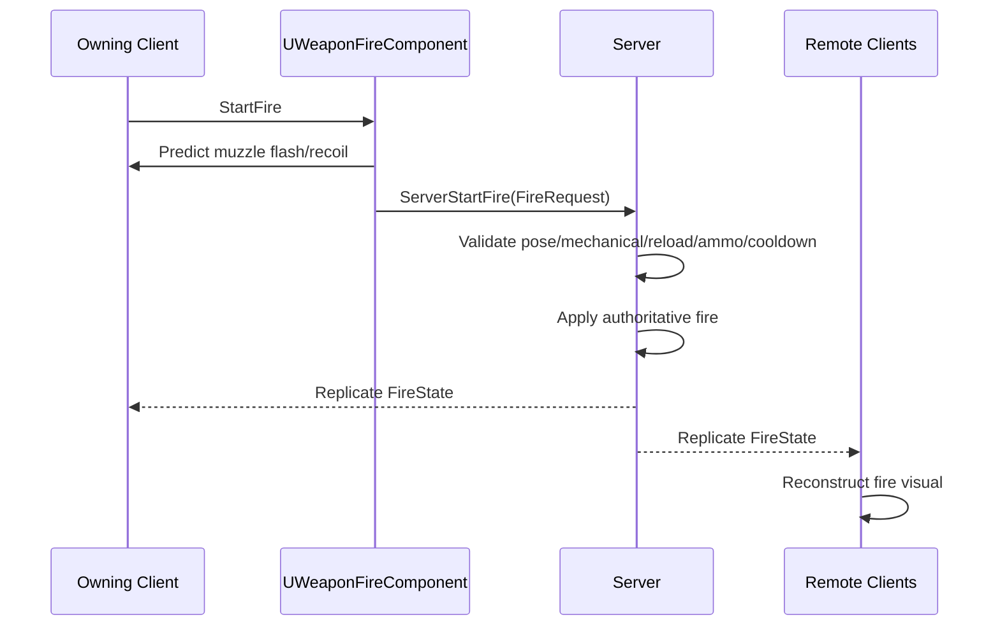

# Weapon Holding and Aiming Implementation for Unreal Engine

## Purpose

This document defines the Unreal Engine implementation contract for normal weapon-in-hands behavior:

```text
holding
low ready
high ready
hip fire
point aim
aim down sights
pose transitions
fire state
pose/aim/fire replication
AnimInstance and Control Rig integration
```

Reload-specific runtime implementation is defined in [Weapon Runtime Implementation for Unreal Engine](./weapon-runtime-implementation-ue.md). Pose states are defined in [Weapon Pose State Model](./weapon-pose-state-model.md). Aim/fire concepts are defined in [Weapon Aim and Fire Control](./weapon-aim-and-fire-control.md).

---

## Runtime Components

Recommended character-owned components:

```text
UWeaponPoseComponent
UWeaponAimComponent
UProceduralWeaponManipulationComponent
```

Recommended weapon-owned components:

```text
UWeaponInteractionComponent
UWeaponReloadComponent
UWeaponFireComponent optional
```

Animation bridge:

```text
UWeaponAnimInstance
Control Rig / IK Rig
```

---

## Pose State Enum

```cpp
UENUM(BlueprintType)
enum class EWeaponPoseState : uint8
{
    Unarmed,
    Holstered,
    RelaxedCarry,
    LowReady,
    HighReady,
    HipFire,
    PointAim,
    AimDownSights,
    Reloading,
    ManipulatingMechanism,
    SprintingWithWeapon,
    InCoverReady,
    InCoverAim,
    Blocked
};
```

---

## Replicated Pose State

```cpp
USTRUCT(BlueprintType)
struct FReplicatedWeaponPoseState
{
    GENERATED_BODY()

    UPROPERTY(BlueprintReadOnly)
    EWeaponPoseState CurrentPose = EWeaponPoseState::Unarmed;

    UPROPERTY(BlueprintReadOnly)
    EWeaponPoseState DesiredPose = EWeaponPoseState::Unarmed;

    UPROPERTY(BlueprintReadOnly)
    EWeaponPoseState PreviousPose = EWeaponPoseState::Unarmed;

    UPROPERTY(BlueprintReadOnly)
    EShoulderSide ShoulderSide = EShoulderSide::Right;

    UPROPERTY(BlueprintReadOnly)
    float PoseStartServerTime = 0.f;

    UPROPERTY(BlueprintReadOnly)
    float PoseBlendDuration = 0.15f;

    UPROPERTY(BlueprintReadOnly)
    uint8 PoseRevision = 0;
};
```

Replicate pose state, not per-frame IK.

---

## Aim State

```cpp
USTRUCT(BlueprintType)
struct FWeaponAimState
{
    GENERATED_BODY()

    UPROPERTY(BlueprintReadOnly)
    bool bIsAiming = false;

    UPROPERTY(BlueprintReadOnly)
    EWeaponPoseState AimPose = EWeaponPoseState::HipFire;

    UPROPERTY(BlueprintReadOnly)
    FVector_NetQuantize AimOrigin;

    UPROPERTY(BlueprintReadOnly)
    FVector_NetQuantizeNormal AimDirection;

    UPROPERTY(BlueprintReadOnly)
    float AimAlpha = 0.f;

    UPROPERTY(BlueprintReadOnly)
    float SightAlignmentErrorDegrees = 0.f;
};
```

For owning client, aim direction may update from camera/controller every frame locally. Replication should remain compact and policy-driven.

---

## Fire State

```cpp
USTRUCT(BlueprintType)
struct FReplicatedWeaponFireState
{
    GENERATED_BODY()

    UPROPERTY(BlueprintReadOnly)
    bool bIsFiring = false;

    UPROPERTY(BlueprintReadOnly)
    uint16 FireSequenceId = 0;

    UPROPERTY(BlueprintReadOnly)
    float LastFireServerTime = 0.f;

    UPROPERTY(BlueprintReadOnly)
    FGameplayTag FireMode;

    UPROPERTY(BlueprintReadOnly)
    FVector_NetQuantizeNormal LastFireDirection;

    UPROPERTY(BlueprintReadOnly)
    uint8 FireRevision = 0;
};
```

Fire state is for event reconstruction. Damage/projectiles remain server-authoritative.

---

## UWeaponPoseComponent

```cpp
UCLASS(ClassGroup=(Weapon), meta=(BlueprintSpawnableComponent))
class UWeaponPoseComponent : public UActorComponent
{
    GENERATED_BODY()

public:
    UPROPERTY(ReplicatedUsing=OnRep_PoseState, BlueprintReadOnly)
    FReplicatedWeaponPoseState PoseState;

    UFUNCTION(BlueprintCallable)
    void RequestPose(EWeaponPoseState DesiredPose);

    UFUNCTION(Server, Reliable)
    void ServerRequestPose(EWeaponPoseState DesiredPose);

    UFUNCTION(BlueprintCallable)
    bool CanEnterPose(EWeaponPoseState DesiredPose, FGameplayTagContainer& OutRejectedReasons) const;

protected:
    UFUNCTION()
    void OnRep_PoseState();

    void StartPoseTransition(EWeaponPoseState NewPose, float ServerTime);
    void FinishPoseTransition();
};
```

`RequestPose` may start local visual prediction for owner. Server state is authoritative.

---

## UWeaponAimComponent

```cpp
UCLASS(ClassGroup=(Weapon), meta=(BlueprintSpawnableComponent))
class UWeaponAimComponent : public UActorComponent
{
    GENERATED_BODY()

public:
    UPROPERTY(BlueprintReadOnly)
    FWeaponAimState LocalAimState;

    void UpdateAimFromController(float DeltaTime);

    bool ComputeSightAlignmentError(float& OutDegrees) const;

    FVector GetDesiredAimDirection() const;
    FVector GetMuzzleDirection() const;
    FVector GetAimOrigin() const;
};
```

This component can be local-only for high-frequency aim updates. Server fire validation receives aim data through fire requests.

---

## UWeaponFireComponent

```cpp
UCLASS(ClassGroup=(Weapon), meta=(BlueprintSpawnableComponent))
class UWeaponFireComponent : public UActorComponent
{
    GENERATED_BODY()

public:
    UPROPERTY(ReplicatedUsing=OnRep_FireState, BlueprintReadOnly)
    FReplicatedWeaponFireState FireState;

    UFUNCTION(BlueprintCallable)
    void StartFire();

    UFUNCTION(BlueprintCallable)
    void StopFire();

    UFUNCTION(Server, Reliable)
    void ServerStartFire(FWeaponFireRequest Request);

    UFUNCTION(Server, Reliable)
    void ServerStopFire(uint16 ClientFireSequenceId);

protected:
    UFUNCTION()
    void OnRep_FireState();

    bool CanFire(const FWeaponFireRequest& Request, FGameplayTagContainer& OutRejectedReasons) const;
    void ApplyServerFire(const FWeaponFireRequest& Request);
};
```

Fire component checks pose, reload, mechanical state, ammo, and cooldown.

---

## Fire Request

```cpp
USTRUCT(BlueprintType)
struct FWeaponFireRequest
{
    GENERATED_BODY()

    UPROPERTY(BlueprintReadOnly)
    uint16 ClientFireSequenceId = 0;

    UPROPERTY(BlueprintReadOnly)
    FVector_NetQuantize AimOrigin;

    UPROPERTY(BlueprintReadOnly)
    FVector_NetQuantizeNormal AimDirection;

    UPROPERTY(BlueprintReadOnly)
    EWeaponPoseState PoseAtFire = EWeaponPoseState::HipFire;

    UPROPERTY(BlueprintReadOnly)
    FGameplayTag FireMode;

    UPROPERTY(BlueprintReadOnly)
    float ClientFireTime = 0.f;
};
```

---

## Pose Transition Flow


---

## Fire Flow



---

## AnimInstance Extension

Extend `FWeaponInteractionAnimState` or create sibling state:

```cpp
USTRUCT(BlueprintType)
struct FWeaponPoseAimAnimState
{
    GENERATED_BODY()

    UPROPERTY(BlueprintReadWrite)
    EWeaponPoseState CurrentPose = EWeaponPoseState::Unarmed;

    UPROPERTY(BlueprintReadWrite)
    EWeaponPoseState DesiredPose = EWeaponPoseState::Unarmed;

    UPROPERTY(BlueprintReadWrite)
    float PoseAlpha = 0.f;

    UPROPERTY(BlueprintReadWrite)
    bool bIsAiming = false;

    UPROPERTY(BlueprintReadWrite)
    FVector AimDirectionWorld = FVector::ForwardVector;

    UPROPERTY(BlueprintReadWrite)
    float AimAlpha = 0.f;

    UPROPERTY(BlueprintReadWrite)
    bool bIsFiring = false;

    UPROPERTY(BlueprintReadWrite)
    float FireVisualAlpha = 0.f;
};
```

AnimInstance receives both:

```text
FWeaponPoseAimAnimState
FWeaponInteractionAnimState
```

Pose/aim state is continuous. Reload/manipulation state is temporary overlay/disruption.

---

## Animation Layering

Recommended order:

```text
1. base locomotion
2. weapon pose state layer: relaxed/low/high/hip/ADS
3. aim offset / aim pose correction
4. reload/manipulation overlay if active
5. Control Rig hand stabilization and manipulation
6. recoil additive
7. final hand/contact correction if needed
```

ADS and hip fire are not reload states. Reload overlays them and then exits back to a valid pose.

---

## Replication Rules

Replicate:

```text
pose state
pose transition timestamps
shoulder side
fire event/state
fire sequence id
last fire server time
compressed fire direction if needed
```

Do not replicate:

```text
hand IK every frame
aim offset every frame for all clients
Control Rig variables every frame
weapon sway/recoil transforms every frame
```

---

## Debug Requirements

Debug should show:

```text
CurrentPose
DesiredPose
PreviousPose
PoseAlpha
ShoulderSide
AimDirection
MuzzleDirection
SightAlignmentError
bIsFiring
FireSequenceId
CanFire result
CanEnterPose result
reload state interaction
```

---

## MVP Scope

MVP should support:

```text
LowReady
HipFire
AimDownSights
Reloading overlay
right/left shoulder
single fire request path
server fire validation
local fire visuals
remote fire visuals
basic aim offset / weapon pose blend
```

---

## Final Formula

```text
UE holding/aiming implementation =
  replicated pose state
  + local aim state
  + server-authoritative fire state
  + AnimInstance pose/aim bridge
  + Control Rig stabilization
  + reload overlay integration.
```
