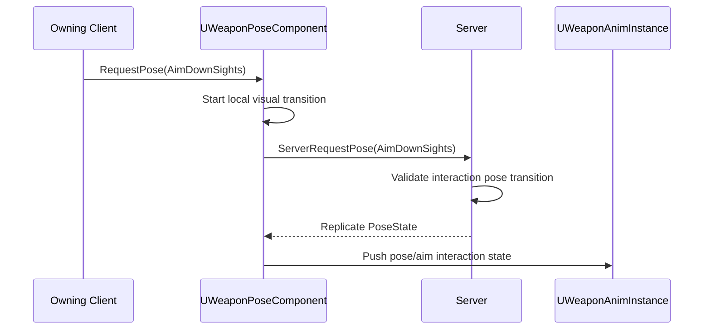
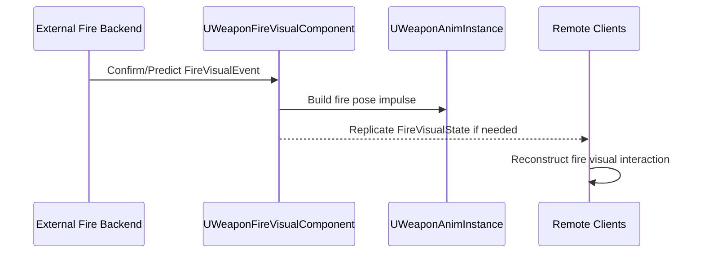

# Weapon Holding and Aiming Implementation for Unreal Engine

## Purpose

This document defines the Unreal Engine implementation contract for normal weapon-in-hands interaction behavior:

```text
holding
low ready
high ready
hip fire
point aim
aim down sights
weapon pose transitions
interaction-facing fire readiness
fire visual state
pose/aim/fire-visual replication
AnimInstance and Control Rig integration
```

Reload-specific runtime implementation is defined in [Weapon Runtime Implementation for Unreal Engine](./weapon-runtime-implementation-ue.md). Pose states are defined in [Weapon Pose State Model](./weapon-pose-state-model.md). Aim/fire interaction boundaries are defined in [Weapon Aim and Fire Control](./weapon-aim-and-fire-control.md). Scope boundaries are defined in [Weapon Interaction Boundaries](./weapon-interaction-boundaries.md).

This document does not implement the full fire backend, projectile simulation, damage, ammo economy, camera system, locomotion speed, or body orientation solver.

---

## Runtime Components

Recommended character-owned interaction components:

```text
UWeaponPoseComponent
UWeaponAimComponent
UProceduralWeaponManipulationComponent
```

Recommended weapon-owned interaction components:

```text
UWeaponInteractionComponent
UWeaponReloadComponent
UWeaponFireVisualComponent optional
```

External systems may provide:

```text
fire backend
inventory/ammo backend
camera/controller aim source
locomotion/body orientation state
obstruction query provider
```

Animation bridge:

```text
UWeaponAnimInstance
Control Rig / IK Rig
```

---

## Pose State Enum

```cpp
UENUM(BlueprintType)
enum class EWeaponPoseState : uint8
{
    Unarmed,
    Holstered,
    RelaxedCarry,
    LowReady,
    HighReady,
    HipFire,
    PointAim,
    AimDownSights,
    Reloading,
    ManipulatingMechanism,
    SprintingWithWeapon,
    InCoverReady,
    InCoverAim,
    Blocked
};
```

These are weapon/hand/contact pose states. They do not define locomotion speed or body orientation.

---

## Replicated Pose State

```cpp
USTRUCT(BlueprintType)
struct FReplicatedWeaponPoseState
{
    GENERATED_BODY()

    UPROPERTY(BlueprintReadOnly)
    EWeaponPoseState CurrentPose = EWeaponPoseState::Unarmed;

    UPROPERTY(BlueprintReadOnly)
    EWeaponPoseState DesiredPose = EWeaponPoseState::Unarmed;

    UPROPERTY(BlueprintReadOnly)
    EWeaponPoseState PreviousPose = EWeaponPoseState::Unarmed;

    UPROPERTY(BlueprintReadOnly)
    EShoulderSide ShoulderSide = EShoulderSide::Right;

    UPROPERTY(BlueprintReadOnly)
    float PoseStartServerTime = 0.f;

    UPROPERTY(BlueprintReadOnly)
    float PoseBlendDuration = 0.15f;

    UPROPERTY(BlueprintReadOnly)
    uint8 PoseRevision = 0;
};
```

Replicate pose state, not per-frame IK.

---

## Interaction Aim State

```cpp
USTRUCT(BlueprintType)
struct FWeaponAimInteractionState
{
    GENERATED_BODY()

    UPROPERTY(BlueprintReadOnly)
    bool bHasAimIntent = false;

    UPROPERTY(BlueprintReadOnly)
    EWeaponPoseState AimPose = EWeaponPoseState::HipFire;

    UPROPERTY(BlueprintReadOnly)
    FVector_NetQuantize AimOrigin;

    UPROPERTY(BlueprintReadOnly)
    FVector_NetQuantizeNormal AimDirection;

    UPROPERTY(BlueprintReadOnly)
    float AimAlpha = 0.f;

    UPROPERTY(BlueprintReadOnly)
    float SightAlignmentErrorDegrees = 0.f;
};
```

Aim direction is usually provided by external camera/controller/AI intent systems. This component consumes aim intent to build weapon interaction pose targets.

---

## Fire Visual State

```cpp
USTRUCT(BlueprintType)
struct FReplicatedWeaponFireVisualState
{
    GENERATED_BODY()

    UPROPERTY(BlueprintReadOnly)
    bool bIsFiringVisual = false;

    UPROPERTY(BlueprintReadOnly)
    uint16 FireSequenceId = 0;

    UPROPERTY(BlueprintReadOnly)
    float LastFireVisualServerTime = 0.f;

    UPROPERTY(BlueprintReadOnly)
    FGameplayTag FireMode;

    UPROPERTY(BlueprintReadOnly)
    FVector_NetQuantizeNormal LastFireVisualDirection;

    UPROPERTY(BlueprintReadOnly)
    uint8 FireVisualRevision = 0;
};
```

This state reconstructs fire visuals for interaction/animation. It does not own damage, projectile authority, ammo consumption, or backend fire acceptance.

---

## UWeaponPoseComponent

```cpp
UCLASS(ClassGroup=(Weapon), meta=(BlueprintSpawnableComponent))
class UWeaponPoseComponent : public UActorComponent
{
    GENERATED_BODY()

public:
    UPROPERTY(ReplicatedUsing=OnRep_PoseState, BlueprintReadOnly)
    FReplicatedWeaponPoseState PoseState;

    UFUNCTION(BlueprintCallable)
    void RequestPose(EWeaponPoseState DesiredPose);

    UFUNCTION(Server, Reliable)
    void ServerRequestPose(EWeaponPoseState DesiredPose);

    UFUNCTION(BlueprintCallable)
    bool CanEnterPose(EWeaponPoseState DesiredPose, FGameplayTagContainer& OutRejectedReasons) const;

protected:
    UFUNCTION()
    void OnRep_PoseState();

    void StartPoseTransition(EWeaponPoseState NewPose, float ServerTime);
    void FinishPoseTransition();
};
```

`RequestPose` may start local visual prediction for owner. Server replicated pose state remains authoritative for remote reconstruction.

---

## UWeaponAimComponent

```cpp
UCLASS(ClassGroup=(Weapon), meta=(BlueprintSpawnableComponent))
class UWeaponAimComponent : public UActorComponent
{
    GENERATED_BODY()

public:
    UPROPERTY(BlueprintReadOnly)
    FWeaponAimInteractionState LocalAimInteractionState;

    void UpdateFromExternalAimIntent(const FWeaponExternalAimIntent& AimIntent, float DeltaTime);

    bool ComputeSightAlignmentError(float& OutDegrees) const;

    FVector GetDesiredAimDirection() const;
    FVector GetMuzzleDirection() const;
    FVector GetAimOrigin() const;
};
```

This component is interaction-facing. It does not own the camera/controller/AI system that creates aim intent.

---

## UWeaponFireVisualComponent

```cpp
UCLASS(ClassGroup=(Weapon), meta=(BlueprintSpawnableComponent))
class UWeaponFireVisualComponent : public UActorComponent
{
    GENERATED_BODY()

public:
    UPROPERTY(ReplicatedUsing=OnRep_FireVisualState, BlueprintReadOnly)
    FReplicatedWeaponFireVisualState FireVisualState;

    UFUNCTION(BlueprintCallable)
    void PredictLocalFireVisual(const FWeaponFireVisualEvent& Event);

    UFUNCTION(BlueprintCallable)
    void ApplyConfirmedFireVisual(const FWeaponFireVisualEvent& Event);

protected:
    UFUNCTION()
    void OnRep_FireVisualState();

    void BuildFirePoseImpulse(const FWeaponFireVisualEvent& Event);
};
```

External fire backend confirms or rejects fire. This component only visualizes confirmed/predicted fire interaction events.

---

## External Fire Readiness Request

```cpp
USTRUCT(BlueprintType)
struct FWeaponInteractionFireReadinessRequest
{
    GENERATED_BODY()

    UPROPERTY(BlueprintReadOnly)
    EWeaponPoseState PoseAtRequest = EWeaponPoseState::HipFire;

    UPROPERTY(BlueprintReadOnly)
    FVector_NetQuantize AimOrigin;

    UPROPERTY(BlueprintReadOnly)
    FVector_NetQuantizeNormal AimDirection;

    UPROPERTY(BlueprintReadOnly)
    EWeaponInteractionPhase InteractionPhase = EWeaponInteractionPhase::None;

    UPROPERTY(BlueprintReadOnly)
    bool bHandsOccupied = false;

    UPROPERTY(BlueprintReadOnly)
    bool bStableEnoughForFire = false;
};
```

This request may be sent to an external fire backend. The backend decides final fire acceptance.

---

## Pose Transition Flow



---

## Fire Visual Flow



---

## AnimInstance Extension

Extend `FWeaponInteractionAnimState` or create sibling state:

```cpp
USTRUCT(BlueprintType)
struct FWeaponPoseAimAnimState
{
    GENERATED_BODY()

    UPROPERTY(BlueprintReadWrite)
    EWeaponPoseState CurrentPose = EWeaponPoseState::Unarmed;

    UPROPERTY(BlueprintReadWrite)
    EWeaponPoseState DesiredPose = EWeaponPoseState::Unarmed;

    UPROPERTY(BlueprintReadWrite)
    float PoseAlpha = 0.f;

    UPROPERTY(BlueprintReadWrite)
    bool bHasAimIntent = false;

    UPROPERTY(BlueprintReadWrite)
    FVector AimDirectionWorld = FVector::ForwardVector;

    UPROPERTY(BlueprintReadWrite)
    float AimAlpha = 0.f;

    UPROPERTY(BlueprintReadWrite)
    bool bIsFiringVisual = false;

    UPROPERTY(BlueprintReadWrite)
    float FireVisualAlpha = 0.f;
};
```

AnimInstance receives both:

```text
FWeaponPoseAimAnimState
FWeaponInteractionAnimState
```

Pose/aim state is continuous. Reload/manipulation state is temporary overlay/disruption.

---

## Animation Layering

Recommended order:

```text
1. base locomotion pose from external locomotion system
2. weapon pose state layer: relaxed/low/high/hip/ADS
3. interaction-facing aim pose correction
4. reload/manipulation overlay if active
5. Control Rig hand stabilization and manipulation
6. fire visual pose impulse if active
7. final hand/contact correction if needed
```

ADS and hip fire are not reload states. Reload overlays them and then exits back to a valid weapon pose.

---

## Replication Rules

Replicate for interaction reconstruction:

```text
pose state
pose transition timestamps
shoulder side
fire visual event/state
fire visual sequence id
last fire visual server time
compressed fire visual direction if needed
```

Do not replicate:

```text
hand IK every frame
aim offset every frame for all clients
Control Rig variables every frame
weapon sway/recoil transforms every frame
projectile simulation state owned by another system
camera state owned by another system
```

---

## Debug Requirements

Debug should show interaction-facing state:

```text
CurrentPose
DesiredPose
PreviousPose
PoseAlpha
ShoulderSide
AimDirection
MuzzleDirection
SightAlignmentError
bIsFiringVisual
FireVisualSequenceId
InteractionFireReadiness
CanEnterPose result
reload state interaction
```

---

## MVP Scope

MVP should support:

```text
LowReady
HipFire
AimDownSights
Reloading overlay
right/left shoulder
external fire readiness request
local fire visual response
remote fire visual response
basic interaction-facing aim pose blend
```

---

## Final Formula

```text
UE holding/aiming interaction implementation =
  replicated weapon pose state
  + external aim intent consumption
  + interaction fire readiness request
  + fire visual state
  + AnimInstance pose/aim bridge
  + Control Rig stabilization
  + reload overlay integration.
```
