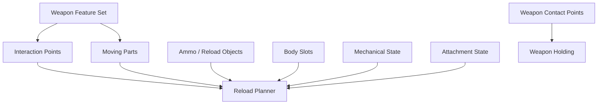

# Weapon Interaction Data Model

## Purpose

This document defines the engine-agnostic data model for weapon interaction.

It does not describe Unreal Engine classes directly. It defines the concepts that any implementation must represent.

The Unreal Engine implementation documents map these concepts to DataAssets, components, sockets, bones, replicated structs, and editor tools.

---

## Core Concepts

Weapon interaction is built from these data groups:

```text
Weapon Feature Set
Weapon Contact Points
Weapon Interaction Points
Weapon Moving Parts
Ammo / Reload Objects
Body Slots
Weapon Mechanical State
Reload Object Attachment State
```



---

## Weapon Feature Set

The feature set declares which reload and manipulation systems are available for a weapon.

```text
HasMagazine
HasDetachableMagazine
HasInternalMagazine
HasSingleRoundChamber
HasBolt
HasChargingHandle
HasSlide
HasPump
HasBreakAction
HasStock
SupportsShoulderContact
SupportsBipod
SupportsSling
```

The feature set must be used for validation and planner branching.

Example:

```text
HasDetachableMagazine = true
→ weapon must define MagazineWell interaction point
→ reload planner may use ExtractMagazine and InsertMagazine
```

Example:

```text
HasPump = true
→ weapon must define Pump moving part
→ reload planner may use PumpAction
```

---

## Contact Points

Contact points are used to hold and stabilize the weapon.

They are not the same thing as reload interaction points.

Required contact point types:

```text
MainGrip
SupportGrip
StockShoulder
```

Optional contact point types:

```text
TwoHandPistolSupport
CheekContact
SlingContact
BipodContact
SurfaceContact
BodyClampContact
```

Each contact point needs:

```text
Name
LocalTransform
ContactType
AllowedHands
StabilityContribution
DefaultRole
```

Example:

```text
MainGrip:
  AllowedHands = Left or Right
  StabilityContribution = high
  DefaultRole = TriggerHand

StockShoulder:
  AllowedHands = none
  StabilityContribution = high if weapon has stock
  DefaultRole = ShoulderContact
```

---

## Interaction Points

Interaction points are used by hands or objects during manipulation.

Examples:

```text
MagazineWell
MagazineRelease
Bolt
ChargingHandle
Slide
Pump
ShellInsert
Chamber
EjectionPort
BreakAction
Lever
Muzzle
Custom
```

Each interaction point needs:

```text
Name
LocalTransform
InteractionPointType
AccessRegion
HandPolicy
RequiredStability
LocalInsertAxis
LocalExtractAxis
LocalOperateAxis
ApproachDistance
InsertDistance
OperateDistance
LockDistance
LinkedMovingPart optional
```

A point must describe both spatial and semantic meaning.

```text
LocalTransform says where it is.
Axes say how action moves.
AccessRegion and HandPolicy say who can use it.
RequiredStability says what must keep weapon stable.
```

---

## Access Region

Access region describes which side of the weapon the point is naturally operated from.

```text
Left
Right
Top
Bottom
Front
Rear
TopLeft
TopRight
BottomLeft
BottomRight
RearBottom
Custom
```

Default rule:

```text
Right access → prefer right hand
Left access → prefer left hand
Top/Bottom + right shoulder → prefer left hand
Top/Bottom + left shoulder → prefer right hand
```

This rule is only a preference. Final selection is made by the hand assignment solver.

---

## Hand Policy

Hand policy defines the intended hand-selection rule.

```text
SameSide
OppositeShoulderSide
ExplicitLeft
ExplicitRight
NonTriggerHand
AnyReachable
RequiresRegrip
Custom
```

Examples:

```text
Right-side bolt:
  AccessRegion = Right
  HandPolicy = SameSide

Bottom magazine:
  AccessRegion = Bottom
  HandPolicy = OppositeShoulderSide

Pistol slide:
  AccessRegion = Top/Rear
  HandPolicy = NonTriggerHand
```

---

## Stability Requirement

Stability requirement defines what must hold the weapon while an interaction happens.

```text
None
OneHand
OneHandPlusShoulder
TwoHandBeforeAction
ShoulderRequired
SurfaceSupported
BipodSupported
Custom
```

Example:

```text
Rifle right-side bolt:
  RequiredStability = OneHandPlusShoulder

Pistol slide:
  RequiredStability = TriggerHandMustHold / custom equivalent
```

The exact implementation may use enum values, gameplay tags, or rule objects.

---

## Axis Convention

All directed manipulation uses local axes.

Recommended convention:

```text
+X = primary action axis
+Y = side axis
+Z = outward/up reference axis
```

Magazine well:

```text
+X = insert direction
-X = extract direction unless overridden
+Z = magazine outward reference
```

Bolt or charging handle:

```text
+X = pull/open direction
-X = return/close direction unless overridden
```

Pump:

```text
+X = pump back direction
-X = pump forward direction unless overridden
```

This makes angled, side, top, bottom, and custom magazine wells work without special weapon classes.

---

## Moving Parts

Moving parts are weapon components that move relative to the weapon body.

Examples:

```text
Bolt
ChargingHandle
Slide
Pump
Lever
BreakActionHinge
FoldingStock
```

Each moving part needs:

```text
Name
LocalTransform or Bone/Part Reference
MovementAxis
MovementDistance
FollowPoint
ReturnsAutomatically
MotionCurve
MechanicalStateAffected
```

Rule:

```text
Action drives the moving part.
Hand target follows the moving part follow point.
```

This is more stable than trying to make the hand physically pull the part.

---

## Ammo and Reload Objects

Reload objects are manipulated by hands and attached to weapon, body, or world.

Examples:

```text
Magazine
Round
ShotgunShell
Battery
EnergyCell
Clip
SpeedLoader
```

Each object needs:

```text
ObjectType
CompatibilityTags
HandGripPoint
InsertTipPoint
LockPoint optional
Capacity optional
CurrentAmmo optional
VisualMesh reference optional
```

Magazine example:

```text
HandGripPoint = where hand holds magazine
InsertTipPoint = part that first enters magazine well
LockPoint = optional final lock/contact point
```

Round example:

```text
HandGripPoint = where fingers hold round
InsertTipPoint = bullet/shell front or correct insertion end
```

---

## Body Slots

Body slots are inventory/contact locations on the character.

Examples:

```text
ChestMagazinePouch
BeltMagazinePouch
LeftShellCarrier
RightShellCarrier
BackpackAmmoSlot
```

Each body slot needs:

```text
Name
LocalTransform or BodySocket
SupportedObjectTypes
AccessRegion
HandPolicy
Priority
CanStow
CanFetch
```

The reload planner should choose a compatible object from a reachable body slot.

---

## Attachment State

Reload objects must have explicit attachment states.

```text
AttachedToWeapon
AttachedToHand
AttachedToBodySlot
DroppedInWorld
Inserted
Consumed
HiddenVisualOnly
```

Example magazine transitions:

```text
Weapon → Hand → BodySlot
Weapon → Hand → World
BodySlot → Hand → Weapon
```

Example shell transition:

```text
BodySlot → Hand → WeaponInternalMagazine → Consumed/Inserted
```

---

## Weapon Mechanical State

Mechanical state represents gameplay-relevant weapon internals.

It is not animation-only.

Common fields:

```text
MagazineInserted
MagazineLocked
RoundChambered
BoltOpen
NeedsCycle
AmmoInMagazine
AmmoInChamber
InternalAmmoCount
PumpPosition
BreakActionOpen
```

Why it is needed:

```text
magazine can be inserted but not locked
bolt can be open
chamber can be empty while magazine is full
shotgun tube can be partially loaded
pump can be halfway through a cycle
```

---

## Data Validation Rules

A weapon data model must be validated before runtime use.

Examples:

```text
If HasDetachableMagazine:
  MagazineWell point must exist.
  InsertAxis must be non-zero.
  ExtractAxis must be non-zero.
  Compatible magazine object must exist.

If HasStock:
  StockShoulder contact must exist.

If HasPump:
  Pump moving part must exist.
  Pump interaction point must reference it.

If HasBolt:
  Bolt interaction point must exist.
  OperateAxis must be non-zero.
```

Validation errors should block production use of the profile.

---

## Final Formula

```text
Weapon interaction data =
  feature flags
  + holding contacts
  + interaction points
  + directed axes
  + moving parts
  + reload objects
  + body slots
  + mechanical state.
```

This data is engine-independent. UE implementation maps it to DataAssets, sockets, bones, replicated structs, and editor tools.
