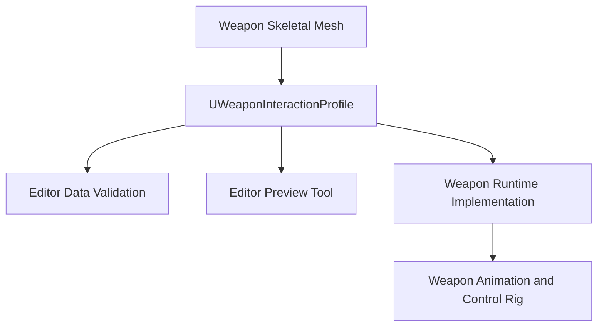
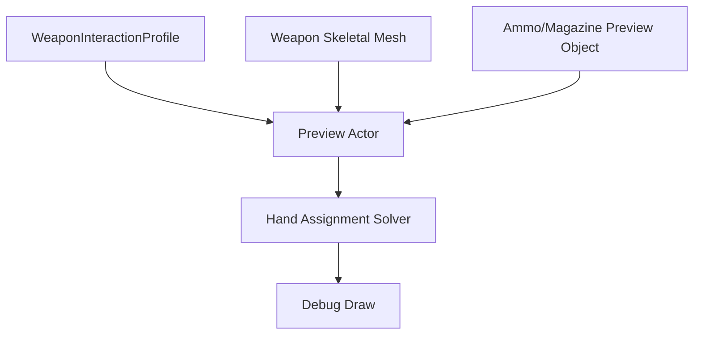

# Weapon Interaction Profile for Unreal Engine

## Purpose

This document maps [Weapon Interaction Data Model](./weapon-interaction-data-model.md) into Unreal Engine 5.7 authoring assets.

It defines the `UWeaponInteractionProfile` DataAsset, its authored structs, socket/bone authoring rules, validation, preview tooling, and editor workflow.

It does not define runtime replication, RPCs, executor loops, or `OnRep` behavior. Those are defined in [Weapon Runtime Implementation for Unreal Engine](./weapon-runtime-implementation-ue.md).

It does not define AnimInstance or Control Rig execution. That is defined in [Weapon Animation and Control Rig for Unreal Engine](./weapon-animation-control-rig-ue.md).

---

## System Position



Core rule:

```text
The profile describes authored weapon interaction semantics.
Runtime components consume it.
The profile itself does not execute reloads or replicate state.
```

---

## Asset Structure

Recommended weapon asset structure:

```text
WeaponActor / WeaponItemActor
  SkeletalMeshComponent WeaponMesh
  UWeaponInteractionComponent
  UWeaponReloadComponent optional
```

The weapon skeletal mesh contains:

```text
bones for moving parts
sockets for static interaction points
sockets on moving bones for moving interaction points
```

Examples:

```text
WeaponRoot
MainGripSocket
SupportGripSocket
StockShoulderSocket
MagazineWellSocket
MuzzleSocket

BoltBone
  BoltGrabSocket

SlideBone
  SlideGripSocket

PumpBone
  PumpGripSocket
```

---

## Data Assets

Recommended weapon interaction authoring assets:

```text
UWeaponInteractionProfile
UReloadSequenceProfile
UAmmoObjectProfile
UBodySlotProfile
UWeaponReloadPolicy
```

This document focuses on `UWeaponInteractionProfile`.

---

## UWeaponInteractionProfile

```cpp
UCLASS(BlueprintType)
class UWeaponInteractionProfile : public UDataAsset
{
    GENERATED_BODY()

public:
    UPROPERTY(EditAnywhere, BlueprintReadOnly, Category="Weapon")
    FGameplayTag WeaponType;

    UPROPERTY(EditAnywhere, BlueprintReadOnly, Category="Features")
    FWeaponFeatureSet Features;

    UPROPERTY(EditAnywhere, BlueprintReadOnly, Category="Contacts")
    FWeaponGripContactSet GripContacts;

    UPROPERTY(EditAnywhere, BlueprintReadOnly, Category="Interaction")
    TArray<FWeaponInteractionPoint> InteractionPoints;

    UPROPERTY(EditAnywhere, BlueprintReadOnly, Category="Moving Parts")
    TArray<FWeaponMovingPartDefinition> MovingParts;

    UPROPERTY(EditAnywhere, BlueprintReadOnly, Category="Reload")
    TObjectPtr<UReloadSequenceProfile> DefaultReloadSequence;

    UPROPERTY(EditAnywhere, BlueprintReadOnly, Category="Reload")
    TObjectPtr<UWeaponReloadPolicy> ReloadPolicy;

#if WITH_EDITOR
    virtual EDataValidationResult IsDataValid(FDataValidationContext& Context) const override;
#endif
};
```

The profile should be authored as gameplay data, not as a visual-only animation asset.

---

## Feature Set

`FWeaponFeatureSet` is the UE representation of the feature set defined in [Weapon Interaction Data Model](./weapon-interaction-data-model.md).

```cpp
USTRUCT(BlueprintType)
struct FWeaponFeatureSet
{
    GENERATED_BODY()

    UPROPERTY(EditAnywhere, BlueprintReadOnly)
    bool bHasMagazine = false;

    UPROPERTY(EditAnywhere, BlueprintReadOnly)
    bool bHasDetachableMagazine = false;

    UPROPERTY(EditAnywhere, BlueprintReadOnly)
    bool bHasInternalMagazine = false;

    UPROPERTY(EditAnywhere, BlueprintReadOnly)
    bool bHasSingleRoundChamber = false;

    UPROPERTY(EditAnywhere, BlueprintReadOnly)
    bool bHasBolt = false;

    UPROPERTY(EditAnywhere, BlueprintReadOnly)
    bool bHasChargingHandle = false;

    UPROPERTY(EditAnywhere, BlueprintReadOnly)
    bool bHasSlide = false;

    UPROPERTY(EditAnywhere, BlueprintReadOnly)
    bool bHasPump = false;

    UPROPERTY(EditAnywhere, BlueprintReadOnly)
    bool bHasBreakAction = false;

    UPROPERTY(EditAnywhere, BlueprintReadOnly)
    bool bHasStock = false;

    UPROPERTY(EditAnywhere, BlueprintReadOnly)
    bool bSupportsShoulderContact = false;
};
```

The feature set drives validation and planner branching, but the planner itself is implemented in [Weapon Runtime Implementation for Unreal Engine](./weapon-runtime-implementation-ue.md).

---

## Grip Contacts

```cpp
USTRUCT(BlueprintType)
struct FWeaponGripContactSet
{
    GENERATED_BODY()

    UPROPERTY(EditAnywhere, BlueprintReadOnly)
    FName MainGripSocket;

    UPROPERTY(EditAnywhere, BlueprintReadOnly)
    FName SupportGripSocket;

    UPROPERTY(EditAnywhere, BlueprintReadOnly)
    FName StockShoulderSocket;

    UPROPERTY(EditAnywhere, BlueprintReadOnly)
    FName TwoHandPistolSupportSocket;

    UPROPERTY(EditAnywhere, BlueprintReadOnly)
    FName SlingContactSocket;

    UPROPERTY(EditAnywhere, BlueprintReadOnly)
    FName BipodContactSocket;
};
```

These sockets define default holding contacts. They are consumed by the hold and stability logic described in [Weapon Holding and Stabilization](./weapon-holding.md).

---

## Interaction Point Struct

```cpp
USTRUCT(BlueprintType)
struct FWeaponInteractionPoint
{
    GENERATED_BODY()

    UPROPERTY(EditAnywhere, BlueprintReadOnly)
    FName Name;

    UPROPERTY(EditAnywhere, BlueprintReadOnly)
    FName SocketName;

    UPROPERTY(EditAnywhere, BlueprintReadOnly)
    EWeaponInteractionPointType Type = EWeaponInteractionPointType::Custom;

    UPROPERTY(EditAnywhere, BlueprintReadOnly)
    EAccessRegion AccessRegion = EAccessRegion::Custom;

    UPROPERTY(EditAnywhere, BlueprintReadOnly)
    EHandPolicy HandPolicy = EHandPolicy::AnyReachable;

    UPROPERTY(EditAnywhere, BlueprintReadOnly)
    EStabilityRequirement RequiredStability = EStabilityRequirement::OneHand;

    UPROPERTY(EditAnywhere, BlueprintReadOnly)
    FVector LocalInsertAxis = FVector::ForwardVector;

    UPROPERTY(EditAnywhere, BlueprintReadOnly)
    FVector LocalExtractAxis = -FVector::ForwardVector;

    UPROPERTY(EditAnywhere, BlueprintReadOnly)
    FVector LocalOperateAxis = FVector::ForwardVector;

    UPROPERTY(EditAnywhere, BlueprintReadOnly)
    float ApproachDistance = 15.f;

    UPROPERTY(EditAnywhere, BlueprintReadOnly)
    float InsertDistance = 12.f;

    UPROPERTY(EditAnywhere, BlueprintReadOnly)
    float OperateDistance = 8.f;

    UPROPERTY(EditAnywhere, BlueprintReadOnly)
    float LockDistance = 2.f;

    UPROPERTY(EditAnywhere, BlueprintReadOnly)
    bool bAllowMirroringByShoulderSide = true;

    UPROPERTY(EditAnywhere, BlueprintReadOnly)
    bool bRequiresMovingPart = false;

    UPROPERTY(EditAnywhere, BlueprintReadOnly, meta=(EditCondition="bRequiresMovingPart"))
    FName MovingPartName;
};
```

The meaning of access regions, hand policies, stability requirements, and local axes is defined in [Weapon Interaction Data Model](./weapon-interaction-data-model.md). This UE struct is the authored representation.

---

## Moving Part Definition

```cpp
USTRUCT(BlueprintType)
struct FWeaponMovingPartDefinition
{
    GENERATED_BODY()

    UPROPERTY(EditAnywhere, BlueprintReadOnly)
    FName Name;

    UPROPERTY(EditAnywhere, BlueprintReadOnly)
    FName BoneName;

    UPROPERTY(EditAnywhere, BlueprintReadOnly)
    FName FollowSocketName;

    UPROPERTY(EditAnywhere, BlueprintReadOnly)
    FVector LocalMoveAxis = FVector::ForwardVector;

    UPROPERTY(EditAnywhere, BlueprintReadOnly)
    float MoveDistance = 8.f;

    UPROPERTY(EditAnywhere, BlueprintReadOnly)
    bool bReturnsAutomatically = true;

    UPROPERTY(EditAnywhere, BlueprintReadOnly)
    FRuntimeFloatCurve MotionCurve;
};
```

Examples:

```text
BoltBone
SlideBone
PumpBone
BreakActionBone
LeverBone
```

Moving part execution is handled by runtime and animation layers, not by the profile asset itself.

---

## Axis Convention

The UE profile uses the axis convention defined in [Weapon Interaction Data Model](./weapon-interaction-data-model.md):

```text
+X = primary action axis
+Y = side axis
+Z = outward/up reference axis
```

Examples:

```text
MagazineWell +X = insert direction
MagazineWell -X = extract direction unless overridden
Bolt +X = pull/open direction
Pump +X = pump back direction
```

Socket rotation is therefore gameplay-critical. A visually correct socket with incorrect local axes is invalid.

---

## Editor Validation

Use `IsDataValid` on `UWeaponInteractionProfile`.

Validation should check:

```text
required sockets exist on the assigned skeletal mesh
axis vectors are non-zero
feature flags match available interaction points
moving part bones exist
moving part follow sockets exist
required ammo object profiles exist
reload sequence references valid interaction points
```

Example validation logic:

```cpp
#if WITH_EDITOR
EDataValidationResult UWeaponInteractionProfile::IsDataValid(
    FDataValidationContext& Context) const
{
    EDataValidationResult Result = EDataValidationResult::Valid;

    if (Features.bHasDetachableMagazine)
    {
        const FWeaponInteractionPoint* MagWell = FindPointByType(EWeaponInteractionPointType::MagazineWell);
        if (!MagWell)
        {
            Context.AddError(FText::FromString("Detachable magazine weapon requires MagazineWell point."));
            Result = EDataValidationResult::Invalid;
        }
        else if (MagWell->LocalInsertAxis.IsNearlyZero())
        {
            Context.AddError(FText::FromString("MagazineWell LocalInsertAxis cannot be zero."));
            Result = EDataValidationResult::Invalid;
        }
    }

    if (Features.bHasStock && GripContacts.StockShoulderSocket.IsNone())
    {
        Context.AddError(FText::FromString("Weapon with stock requires StockShoulderSocket."));
        Result = EDataValidationResult::Invalid;
    }

    return Result;
}
#endif
```

---

## Editor Preview Tool

A preview tool is strongly recommended. Without it, socket axis mistakes will be hard to debug.

Preview should show:

```text
all interaction point transforms
local +X/+Y/+Z axes
insert/extract/operate directions
pre-insert and final insert poses
selected hand for right shoulder
selected hand for left shoulder
rejected hand reasons
weapon reload pose offsets
magazine/round object alignment
```

Suggested editor utility:

```text
WeaponInteractionProfilePreviewActor
Editor Utility Widget: WBP_WeaponInteractionProfilePreview
```

Preview flow:



---

## Authoring Workflow

```text
1. Add required bones for moving weapon parts.
2. Add sockets for grips, stock, muzzle, magazine well, bolt, slide, pump, shell insert.
3. Rotate sockets so their local axes match the project convention.
4. Create UWeaponInteractionProfile.
5. Assign feature flags.
6. Add interaction point entries referencing sockets.
7. Add moving part definitions for bolt/slide/pump if needed.
8. Assign reload sequence and ammo object profiles.
9. Run Data Validation.
10. Open Preview Tool.
11. Test right-shoulder and left-shoulder interaction plans.
12. Fix socket rotations and access regions until debug preview is correct.
```

---

## What This Document Does Not Own

This document does not own:

```text
runtime component implementation
server RPCs
replicated reload instance
mechanical state replication
reload executor loop
OnRep behavior
AnimInstance fields
Control Rig solve order
```

Those are defined in:

- [Weapon Runtime Implementation for Unreal Engine](./weapon-runtime-implementation-ue.md)
- [Weapon Animation and Control Rig for Unreal Engine](./weapon-animation-control-rig-ue.md)

---

## Final Formula

```text
UE weapon interaction profile =
  skeletal mesh sockets/bones
  + authored semantic DataAsset
  + axis convention
  + validation
  + preview tooling.
```

Runtime, networking, and animation consume the profile; they are not defined by the profile document.
