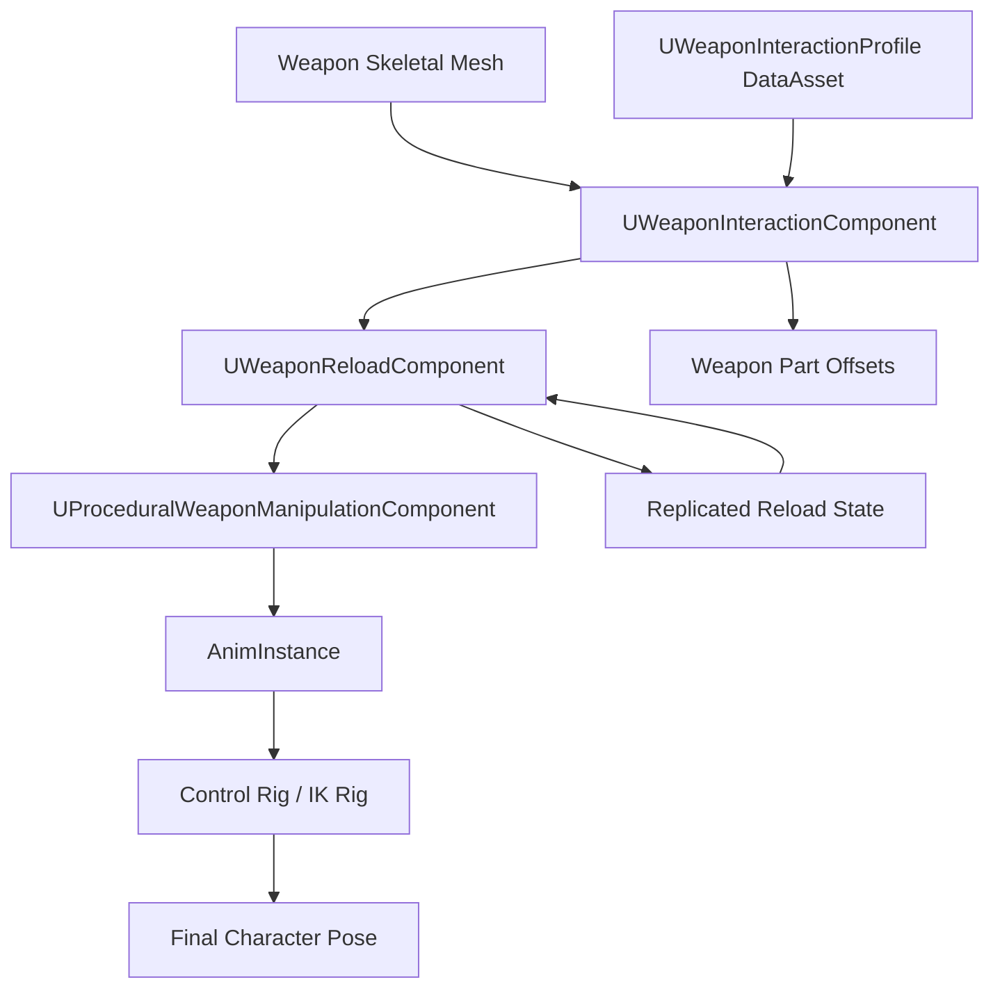
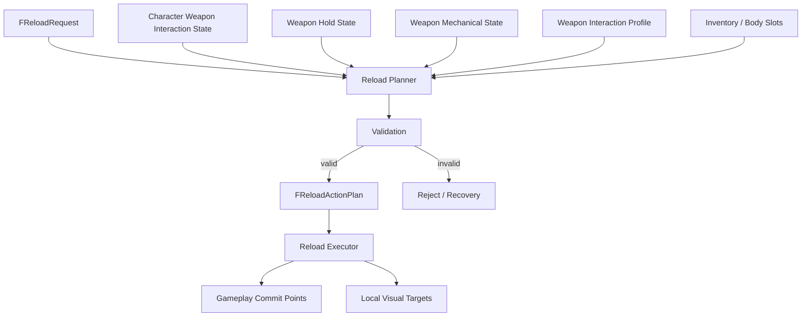
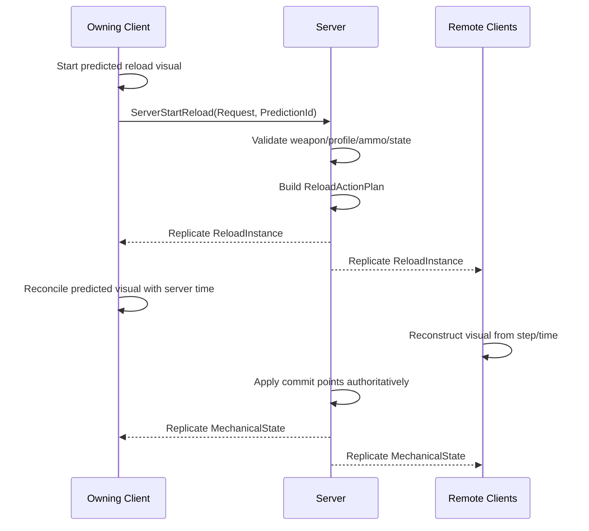
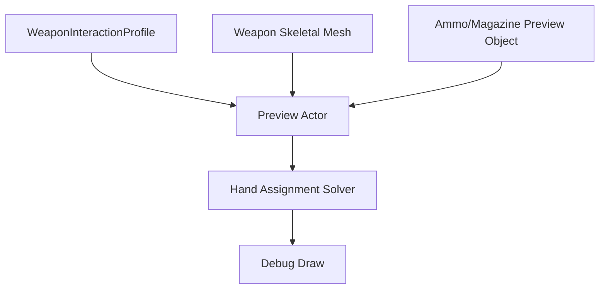

# Weapon Interaction Profile for Unreal Engine

## Purpose

This document defines the Unreal Engine implementation contract for weapon interaction profiles.

The goal is to make procedural weapon holding and reloading practical to implement in UE 5.7, not only conceptually correct.

The profile must describe where weapon interaction points are, what each point means, which local axes are used, which weapon features exist, which moving parts exist, which hands can access each point, which stabilization contacts are required, how the profile is validated in editor, how runtime components consume it, and how multiplayer replication refers to it.

---

## System Overview



Core rule:

```text
DataAsset describes weapon interaction semantics.
Runtime components resolve and execute interaction state.
AnimBP and Control Rig only consume already resolved targets.
```

---

## Asset Structure

Recommended weapon asset structure:

```text
WeaponActor / WeaponItemActor
  SkeletalMeshComponent WeaponMesh
  UWeaponInteractionComponent
  UWeaponReloadComponent optional
```

The weapon skeletal mesh contains bones for moving parts, sockets for static interaction points, and sockets on moving bones for moving interaction points.

Examples:

```text
WeaponRoot
MainGripSocket
SupportGripSocket
StockShoulderSocket
MagazineWellSocket
MuzzleSocket

BoltBone
  BoltGrabSocket

SlideBone
  SlideGripSocket

PumpBone
  PumpGripSocket
```

---

## Data Assets

Recommended data assets:

```text
UWeaponInteractionProfile
UReloadSequenceProfile
UAmmoObjectProfile
UBodySlotProfile
UWeaponReloadPolicy
```

The most important one is `UWeaponInteractionProfile`.

---

## UWeaponInteractionProfile

```cpp
UCLASS(BlueprintType)
class UWeaponInteractionProfile : public UDataAsset
{
    GENERATED_BODY()

public:
    UPROPERTY(EditAnywhere, BlueprintReadOnly, Category="Weapon")
    FGameplayTag WeaponType;

    UPROPERTY(EditAnywhere, BlueprintReadOnly, Category="Features")
    FWeaponFeatureSet Features;

    UPROPERTY(EditAnywhere, BlueprintReadOnly, Category="Contacts")
    FWeaponGripContactSet GripContacts;

    UPROPERTY(EditAnywhere, BlueprintReadOnly, Category="Interaction")
    TArray<FWeaponInteractionPoint> InteractionPoints;

    UPROPERTY(EditAnywhere, BlueprintReadOnly, Category="Moving Parts")
    TArray<FWeaponMovingPartDefinition> MovingParts;

    UPROPERTY(EditAnywhere, BlueprintReadOnly, Category="Reload")
    TObjectPtr<UReloadSequenceProfile> DefaultReloadSequence;

    UPROPERTY(EditAnywhere, BlueprintReadOnly, Category="Reload")
    TObjectPtr<UWeaponReloadPolicy> ReloadPolicy;

#if WITH_EDITOR
    virtual EDataValidationResult IsDataValid(FDataValidationContext& Context) const override;
#endif
};
```

---

## Feature Set

```cpp
USTRUCT(BlueprintType)
struct FWeaponFeatureSet
{
    GENERATED_BODY()

    UPROPERTY(EditAnywhere, BlueprintReadOnly)
    bool bHasMagazine = false;

    UPROPERTY(EditAnywhere, BlueprintReadOnly)
    bool bHasDetachableMagazine = false;

    UPROPERTY(EditAnywhere, BlueprintReadOnly)
    bool bHasInternalMagazine = false;

    UPROPERTY(EditAnywhere, BlueprintReadOnly)
    bool bHasSingleRoundChamber = false;

    UPROPERTY(EditAnywhere, BlueprintReadOnly)
    bool bHasBolt = false;

    UPROPERTY(EditAnywhere, BlueprintReadOnly)
    bool bHasChargingHandle = false;

    UPROPERTY(EditAnywhere, BlueprintReadOnly)
    bool bHasSlide = false;

    UPROPERTY(EditAnywhere, BlueprintReadOnly)
    bool bHasPump = false;

    UPROPERTY(EditAnywhere, BlueprintReadOnly)
    bool bHasBreakAction = false;

    UPROPERTY(EditAnywhere, BlueprintReadOnly)
    bool bHasStock = false;

    UPROPERTY(EditAnywhere, BlueprintReadOnly)
    bool bSupportsShoulderContact = false;
};
```

The feature set controls validation and reload planner branching.

---

## Interaction Point Struct

```cpp
USTRUCT(BlueprintType)
struct FWeaponInteractionPoint
{
    GENERATED_BODY()

    UPROPERTY(EditAnywhere, BlueprintReadOnly)
    FName Name;

    UPROPERTY(EditAnywhere, BlueprintReadOnly)
    FName SocketName;

    UPROPERTY(EditAnywhere, BlueprintReadOnly)
    EWeaponInteractionPointType Type = EWeaponInteractionPointType::Custom;

    UPROPERTY(EditAnywhere, BlueprintReadOnly)
    EAccessRegion AccessRegion = EAccessRegion::Custom;

    UPROPERTY(EditAnywhere, BlueprintReadOnly)
    EHandPolicy HandPolicy = EHandPolicy::AnyReachable;

    UPROPERTY(EditAnywhere, BlueprintReadOnly)
    EStabilityRequirement RequiredStability = EStabilityRequirement::OneHand;

    UPROPERTY(EditAnywhere, BlueprintReadOnly)
    FVector LocalInsertAxis = FVector::ForwardVector;

    UPROPERTY(EditAnywhere, BlueprintReadOnly)
    FVector LocalExtractAxis = -FVector::ForwardVector;

    UPROPERTY(EditAnywhere, BlueprintReadOnly)
    FVector LocalOperateAxis = FVector::ForwardVector;

    UPROPERTY(EditAnywhere, BlueprintReadOnly)
    float ApproachDistance = 15.f;

    UPROPERTY(EditAnywhere, BlueprintReadOnly)
    float InsertDistance = 12.f;

    UPROPERTY(EditAnywhere, BlueprintReadOnly)
    float OperateDistance = 8.f;

    UPROPERTY(EditAnywhere, BlueprintReadOnly)
    float LockDistance = 2.f;

    UPROPERTY(EditAnywhere, BlueprintReadOnly)
    bool bAllowMirroringByShoulderSide = true;
};
```

---

## Axis Convention

Every interaction point uses local axes.

```text
+X = primary action axis
+Y = side axis
+Z = outward/up reference axis
```

For a magazine well:

```text
+X = insert direction
-X = extract direction unless overridden
+Z = magazine outward direction
```

For a bolt:

```text
+X = pull/open direction
-X = return/close direction unless overridden
```

This convention makes angled magazines and unusual weapons work through socket rotation instead of special code.

---

## Runtime Component: UWeaponInteractionComponent

```cpp
UCLASS(ClassGroup=(Weapon), meta=(BlueprintSpawnableComponent))
class UWeaponInteractionComponent : public UActorComponent
{
    GENERATED_BODY()

public:
    UPROPERTY(EditDefaultsOnly, BlueprintReadOnly, Category="Profile")
    TObjectPtr<UWeaponInteractionProfile> InteractionProfile;

    UPROPERTY(Transient)
    TObjectPtr<USkeletalMeshComponent> WeaponMesh;

    virtual void BeginPlay() override;

    bool GetInteractionPoint(FName Name, FWeaponInteractionPoint& OutPoint) const;
    bool GetInteractionPointTransform(FName Name, FTransform& OutWorldTransform) const;

    FVector GetPointAxisWorld(const FWeaponInteractionPoint& Point, FVector LocalAxis) const;

    bool ValidateRuntimeProfile(FText& OutError) const;
};
```

Axis helper:

```cpp
FVector UWeaponInteractionComponent::GetPointAxisWorld(
    const FWeaponInteractionPoint& Point,
    FVector LocalAxis) const
{
    FTransform SocketTransform;
    if (!GetInteractionPointTransform(Point.Name, SocketTransform))
    {
        return FVector::ZeroVector;
    }

    return SocketTransform.TransformVectorNoScale(LocalAxis).GetSafeNormal();
}
```

---

## Planner Data Flow



---

## Multiplayer Data Flow



Network rule:

```text
Replicate reload state, step index, timestamps, object state, and mechanical state.
Do not replicate hand IK targets every frame.
```

---

## Runtime Component: UWeaponReloadComponent

```cpp
UCLASS(ClassGroup=(Weapon), meta=(BlueprintSpawnableComponent))
class UWeaponReloadComponent : public UActorComponent
{
    GENERATED_BODY()

public:
    UPROPERTY(ReplicatedUsing=OnRep_ReloadInstance)
    FReplicatedReloadInstance ReloadInstance;

    UPROPERTY(ReplicatedUsing=OnRep_MechanicalState)
    FReplicatedWeaponMechanicalState MechanicalState;

    UFUNCTION(Server, Reliable)
    void ServerStartReload(FReloadRequest Request);

    UFUNCTION(Server, Reliable)
    void ServerInterruptReload(FGameplayTag Reason);

protected:
    UFUNCTION()
    void OnRep_ReloadInstance();

    UFUNCTION()
    void OnRep_MechanicalState();

    bool BuildReloadPlan(const FReloadRequest& Request, FReloadActionPlan& OutPlan);
    void AdvanceAuthoritativeReload(float ServerTime);
    void ApplyCommitPoint(FGameplayTag CommitPoint);
};
```

The reload component owns gameplay reload state and replication, not the AnimBP.

---

## Replicated Reload Instance

```cpp
USTRUCT(BlueprintType)
struct FReplicatedReloadInstance
{
    GENERATED_BODY()

    UPROPERTY()
    bool bIsReloading = false;

    UPROPERTY()
    FGameplayTag ReloadSequenceId;

    UPROPERTY()
    FGameplayTag CurrentStepId;

    UPROPERTY()
    uint8 StepIndex = 0;

    UPROPERTY()
    float StepStartServerTime = 0.f;

    UPROPERTY()
    float StepDuration = 0.f;

    UPROPERTY()
    EHand ResolvedHand = EHand::None;

    UPROPERTY()
    EReloadObjectType ObjectType;

    UPROPERTY()
    EReloadObjectVisualState ObjectVisualState;

    UPROPERTY()
    TObjectPtr<AActor> ReloadObjectActor;

    UPROPERTY()
    FGameplayTag CommitPoint;

    UPROPERTY()
    uint8 ReloadRevision = 0;
};
```

Client phase:

```cpp
float Alpha = (ServerTimeNow - ReloadInstance.StepStartServerTime)
            / ReloadInstance.StepDuration;
Alpha = FMath::Clamp(Alpha, 0.f, 1.f);
```

---

## Editor Validation

Use `IsDataValid` on `UWeaponInteractionProfile`.

Validation should check:

```text
required sockets exist on the assigned skeletal mesh
axis vectors are non-zero
feature flags match available interaction points
moving part bones exist
moving part follow sockets exist
required ammo object profiles exist
reload sequence references valid interaction points
```

Example validation logic:

```cpp
#if WITH_EDITOR
EDataValidationResult UWeaponInteractionProfile::IsDataValid(
    FDataValidationContext& Context) const
{
    EDataValidationResult Result = EDataValidationResult::Valid;

    if (Features.bHasDetachableMagazine)
    {
        const FWeaponInteractionPoint* MagWell = FindPointByType(EWeaponInteractionPointType::MagazineWell);
        if (!MagWell)
        {
            Context.AddError(FText::FromString("Detachable magazine weapon requires MagazineWell point."));
            Result = EDataValidationResult::Invalid;
        }
        else if (MagWell->LocalInsertAxis.IsNearlyZero())
        {
            Context.AddError(FText::FromString("MagazineWell LocalInsertAxis cannot be zero."));
            Result = EDataValidationResult::Invalid;
        }
    }

    if (Features.bHasStock && GripContacts.StockShoulderSocket.IsNone())
    {
        Context.AddError(FText::FromString("Weapon with stock requires StockShoulderSocket."));
        Result = EDataValidationResult::Invalid;
    }

    return Result;
}
#endif
```

---

## Editor Preview Tool

A preview tool is strongly recommended. Without it, socket axis mistakes will be hard to debug.

Preview should show:

```text
all interaction point transforms
local +X/+Y/+Z axes
insert/extract/operate directions
pre-insert and final insert poses
selected hand for right shoulder
selected hand for left shoulder
rejected hand reasons
weapon reload pose offsets
magazine/round object alignment
```

Suggested editor utility:

```text
WeaponInteractionProfilePreviewActor
Editor Utility Widget: WBP_WeaponInteractionProfilePreview
```

Preview flow:



---

## Authoring Workflow

```text
1. Add required bones for moving weapon parts.
2. Add sockets for grips, stock, muzzle, magazine well, bolt, slide, pump, shell insert.
3. Rotate sockets so their local axes match the project convention.
4. Create UWeaponInteractionProfile.
5. Assign feature flags.
6. Add interaction point entries referencing sockets.
7. Add moving part definitions for bolt/slide/pump if needed.
8. Assign reload sequence and ammo object profiles.
9. Run Data Validation.
10. Open Preview Tool.
11. Test right-shoulder and left-shoulder interaction plans.
12. Fix socket rotations and access regions until debug preview is correct.
```

---

## Minimal MVP Implementation

Minimum viable UE implementation:

```text
1. UWeaponInteractionProfile DataAsset.
2. UWeaponInteractionComponent on weapon actor.
3. UWeaponReloadComponent with replicated ReloadInstance and MechanicalState.
4. UProceduralWeaponManipulationComponent on character.
5. Magazine object with HandGripSocket and InsertTipSocket.
6. Weapon sockets: MainGrip, SupportGrip, Stock optional, MagazineWell, Bolt optional, Muzzle.
7. Straight-axis insert/extract using socket +X.
8. Hand assignment using access region + shoulder side + stability check.
9. Data validation for required sockets and axes.
10. Debug draw for socket axes and insert path.
11. Remote clients reconstruct visual phase from server time.
```

---

## Final Formula

```text
UE weapon interaction profile =
  skeletal mesh sockets/bones
  + UWeaponInteractionProfile semantic data
  + validation
  + runtime interaction component
  + reload planner/executor
  + replicated reload/mechanical state
  + local Control Rig visualization.
```

The profile must be authored like gameplay data, not like a purely visual animation asset.
