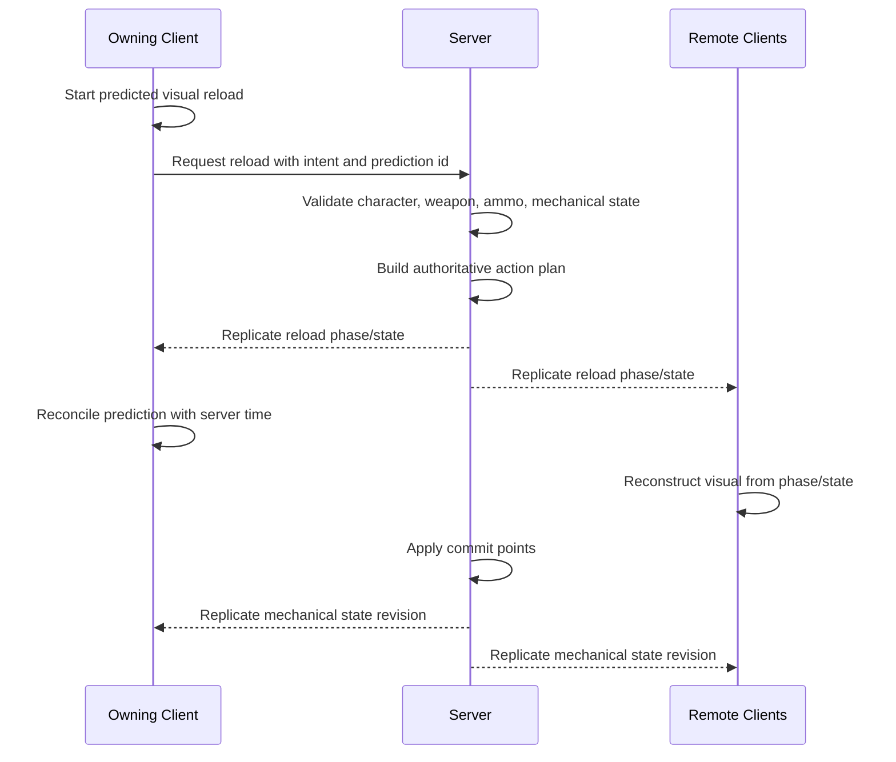

# Weapon Interaction Networking

## Purpose

This document defines the engine-agnostic multiplayer model for weapon interaction.

The goal is to make procedural weapon holding and reloading safe for multiplayer without replicating expensive animation data.

Core rule:

```text
Replicate gameplay state and phase.
Do not replicate procedural IK every frame.
```

---

## Ownership Boundary

This document owns the multiplayer concepts:

```text
server authority
client prediction
remote-client reconstruction
replicated phase model
mechanical state replication concept
commit point authority
interrupt/recovery replication concept
what should not be replicated
```

It does not own concrete Unreal Engine structs, RPC declarations, `OnRep` handlers, or `GetLifetimeReplicatedProps` implementation.

The canonical UE implementation is defined in [Weapon Runtime Implementation for Unreal Engine](./weapon-runtime-implementation-ue.md).

Animation reconstruction is defined in [Weapon Animation Execution](./weapon-animation-execution.md) and [Weapon Animation and Control Rig for Unreal Engine](./weapon-animation-control-rig-ue.md).

---

## Authority Model

Server authority:

```text
reload start validation
reload intent
weapon mechanical state
ammo and inventory state
magazine/round gameplay attachment state
commit points
interrupt and recovery
fire permission
spawned dropped objects if lootable
```

Client visual authority:

```text
hand IK targets
spine offsets
weapon pose interpolation
magazine/round visual movement
bolt/slide/pump visual movement
finger pose
minor timing smoothing
```

The client may predict visuals, but it must not authoritatively change ammo, inventory, magazine lock, chamber state, or firing eligibility.

---

## Multiplayer Flow



---

## Replicated Conceptual State

The replicated state should be compact and deterministic enough for visual reconstruction.

Conceptually replicated fields:

```text
IsReloading
ReloadSequenceId
CurrentStepId
StepIndex
StepStartServerTime
StepDuration
InteractionPhase
ResolvedHand
ReloadObjectType
ObjectVisualState
GameplayObjectId optional
CommitPoint
ReloadRevision
MechanicalState
MechanicalStateRevision
```

The canonical UE structs that represent this concept are defined in [Weapon Runtime Implementation for Unreal Engine](./weapon-runtime-implementation-ue.md).

Clients reconstruct current visual phase:

```text
Alpha = (LocalServerTimeEstimate - StepStartServerTime) / StepDuration
```

---

## Mechanical State Concept

Mechanical state must be replicated because ammo count alone is not enough.

Conceptual fields:

```text
MagazineInserted
MagazineLocked
RoundChambered
BoltOpen
NeedsCycle
AmmoInMagazine
AmmoInChamber
InternalAmmoCount
PumpPosition
BreakActionOpen
StateRevision
```

Examples:

```text
Magazine locked but chamber empty.
Bolt open with round not chambered.
Shotgun tube partially loaded.
Pump back but not forward.
```

The exact UE struct is defined in [Weapon Runtime Implementation for Unreal Engine](./weapon-runtime-implementation-ue.md).

---

## Prediction

Owning client should predict visual start immediately after local input.

Prediction flow:

```text
1. Player presses reload.
2. Owning client starts predicted visual reload.
3. Owning client sends request to server.
4. Server validates.
5. If accepted, client reconciles with server phase.
6. If rejected, client cancels visual and recovers to valid hold pose.
```

Common rejection reasons:

```text
no ammo
weapon is already busy
character state disallows reload
mechanical state changed
weapon profile invalid
server inventory differs from predicted inventory
```

---

## Remote Client Reconstruction

Remote clients should not replay reloads from the beginning if they receive state late.

They should:

```text
read current step
compute alpha from server time
set visual object attachment state
seek procedural visual to current phase
continue local interpolation
```

This supports relevancy changes and late packet arrival.

UE-side reconstruction is implemented by [Weapon Runtime Implementation for Unreal Engine](./weapon-runtime-implementation-ue.md) and visualized through [Weapon Animation and Control Rig for Unreal Engine](./weapon-animation-control-rig-ue.md).

---

## Object Replication

Separate gameplay objects from visual objects.

```text
Gameplay magazine / round:
  server-owned inventory or loot state.

Visual magazine / round:
  client-side representation animated by procedural system.
```

If an object can become lootable, the server must spawn a replicated world object.

If an object is purely cosmetic, clients may spawn local visual-only objects.

---

## Commit Points

Commit points are authoritative state transitions.

Examples:

```text
MagazineDetached
MagazineLocked
RoundInserted
BoltOpened
BoltClosed
PumpBack
PumpForward
ReloadCompleted
```

A cosmetic event may play sound/effects, but gameplay state must come from the server commit.

UE commit point mutation is implemented in [Weapon Runtime Implementation for Unreal Engine](./weapon-runtime-implementation-ue.md).

---

## Firing During Reload

The server must decide whether firing is allowed during reload.

Policies:

```text
CannotFireDuringReload
CanFireAfterCommit
CanFireWithPenaltyAfterCommit
CanFireOnlyWhenStableHoldRestored
```

The server checks:

```text
mechanical state
reload state
current step
hold stability
weapon policy
```

---

## Interrupts

Interruptions are server-authoritative.

Interrupt causes:

```text
player starts sprinting
player switches weapon
player fires if policy allows cancel
player is staggered
player falls
server detects invalid state
```

Replicated interrupt concept:

```text
InterruptReason
RecoveryPolicy
RecoveryStartServerTime
RecoveryStepId
ReloadRevision
```

Clients reconstruct recovery visually from the replicated recovery state.

UE interrupt implementation is defined in [Weapon Runtime Implementation for Unreal Engine](./weapon-runtime-implementation-ue.md).

---

## What Not To Replicate

Do not replicate:

```text
hand IK targets every frame
elbow positions
finger curls
Control Rig variables every tick
magazine transform every frame
bolt transform every frame
spine offsets every frame
```

These are visual outputs. They should be reconstructed locally.

---

## Debug Requirements

Network debug should show:

```text
local prediction id
server accepted/rejected state
current server phase
client visual phase
phase error
reload revision
mechanical state revision
object visual state
commit points received
interrupt/recovery state
```

---

## Final Formula

```text
Networked weapon interaction =
  server-authoritative gameplay state
  + replicated phase/timestamps
  + replicated mechanical state concept
  + client-side procedural visual reconstruction
  + owning-client prediction and reconciliation.
```

Concrete UE replication code belongs to [Weapon Runtime Implementation for Unreal Engine](./weapon-runtime-implementation-ue.md).
