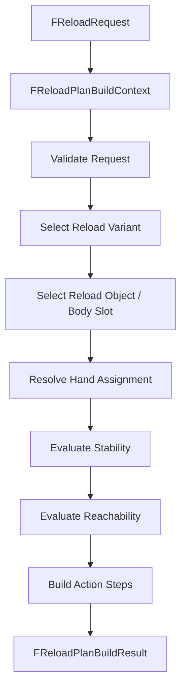

# Weapon Reload Planner for Unreal Engine

## Purpose

This document defines the Unreal Engine implementation contract for building reload action plans.

It maps the engine-agnostic planner described in [Weapon Solvers and Planning](./weapon-solvers-and-planning.md) into concrete UE 5.7 C++ structs, functions, planner stages, and build results.

Runtime execution and replication are defined in [Weapon Runtime Implementation for Unreal Engine](./weapon-runtime-implementation-ue.md). Reload sequence authoring is defined in [Weapon Reload Sequence Profile for Unreal Engine](./weapon-reload-sequence-profile-ue.md).

---

## Planner Ownership

The reload planner owns:

```text
request validation
reload variant selection
body slot/object selection
hand assignment requests
stability/reachability evaluation requests
step list construction
commit point placement
recovery policy selection
rejection reasons
```

The reload planner does not own:

```text
per-frame execution
replication
Control Rig targets
AnimInstance data
weapon socket authoring
inventory authority mutations outside commit points
```

---

## Main Flow



---

## Build Context

```cpp
USTRUCT()
struct FReloadPlanBuildContext
{
    GENERATED_BODY()

    UPROPERTY()
    EReloadIntent Intent = EReloadIntent::FullReload;

    UPROPERTY()
    TObjectPtr<ACharacter> Character = nullptr;

    UPROPERTY()
    TObjectPtr<AActor> WeaponActor = nullptr;

    UPROPERTY()
    TObjectPtr<UWeaponInteractionComponent> InteractionComponent = nullptr;

    UPROPERTY()
    TObjectPtr<UInventoryComponent> InventoryComponent = nullptr;

    UPROPERTY()
    FCharacterWeaponInteractionState CharacterState;

    UPROPERTY()
    FWeaponHoldState HoldState;

    UPROPERTY()
    FReplicatedWeaponMechanicalState MechanicalState;

    UPROPERTY()
    uint8 ClientPredictionId = 0;
};
```

The context is built by `UWeaponReloadComponent` before calling the planner.

---

## Build Result

```cpp
USTRUCT()
struct FReloadPlanBuildResult
{
    GENERATED_BODY()

    UPROPERTY()
    bool bSuccess = false;

    UPROPERTY()
    FReloadActionPlan Plan;

    UPROPERTY()
    FText FailureReason;

    UPROPERTY()
    TArray<FGameplayTag> RejectionTags;

    UPROPERTY()
    uint8 ClientPredictionId = 0;
};
```

Failure must be explicit. Do not return an empty plan without a reason.

---

## Planner Class

```cpp
UCLASS()
class UWeaponReloadPlanner : public UObject
{
    GENERATED_BODY()

public:
    FReloadPlanBuildResult BuildReloadPlan(const FReloadPlanBuildContext& Context);

private:
    bool ValidateCommonRequest(const FReloadPlanBuildContext& Context, FReloadPlanBuildResult& Result) const;

    bool BuildMagazineReloadPlan(const FReloadPlanBuildContext& Context, FReloadActionPlan& OutPlan) const;
    bool BuildTacticalReloadPlan(const FReloadPlanBuildContext& Context, FReloadActionPlan& OutPlan) const;
    bool BuildEmergencyReloadPlan(const FReloadPlanBuildContext& Context, FReloadActionPlan& OutPlan) const;
    bool BuildLoadOnePlan(const FReloadPlanBuildContext& Context, FReloadActionPlan& OutPlan) const;
    bool BuildCycleOnlyPlan(const FReloadPlanBuildContext& Context, FReloadActionPlan& OutPlan) const;

    bool AppendPreparePoseStep(const FReloadPlanBuildContext& Context, FReloadActionPlan& Plan) const;
    bool AppendRemoveMagazineSteps(const FReloadPlanBuildContext& Context, FReloadActionPlan& Plan) const;
    bool AppendFetchMagazineSteps(const FReloadPlanBuildContext& Context, FReloadActionPlan& Plan) const;
    bool AppendInsertMagazineSteps(const FReloadPlanBuildContext& Context, FReloadActionPlan& Plan) const;
    bool AppendOperateMechanismSteps(const FReloadPlanBuildContext& Context, FReloadActionPlan& Plan) const;
    bool AppendReturnToHoldSteps(const FReloadPlanBuildContext& Context, FReloadActionPlan& Plan) const;
};
```

`UWeaponReloadComponent` may own one planner instance or use a subsystem/factory, but the planner should stay stateless where possible.

---

## Common Validation

Before building any plan, validate:

```text
weapon actor exists
interaction component exists
interaction profile exists
profile runtime validation passed
character is not in a blocked movement state
weapon is not already busy
requested intent is allowed by weapon policy
mechanical state allows the requested intent
compatible ammo/reload object exists if needed
```

Typical rejection tags:

```text
Weapon.Reload.Reject.NoWeapon
Weapon.Reload.Reject.NoProfile
Weapon.Reload.Reject.InvalidProfile
Weapon.Reload.Reject.Busy
Weapon.Reload.Reject.NoAmmo
Weapon.Reload.Reject.InvalidMechanicalState
Weapon.Reload.Reject.CharacterStateBlocked
Weapon.Reload.Reject.NoReachableBodySlot
Weapon.Reload.Reject.NoStableHandAssignment
```

---

## Hand Assignment Candidate

```cpp
USTRUCT()
struct FHandAssignmentCandidate
{
    GENERATED_BODY()

    UPROPERTY()
    EHand Hand = EHand::None;

    UPROPERTY()
    float Cost = 0.f;

    UPROPERTY()
    bool bRequiresRegrip = false;

    UPROPERTY()
    bool bRequiresWeaponPoseAdjustment = false;

    UPROPERTY()
    TArray<FGameplayTag> RejectedReasons;
};
```

The planner should ask the hand/stability/reachability solvers for candidates instead of hard-coding right-hand/left-hand assumptions.

---

## Magazine Reload Plan

Minimum detachable magazine plan:

```text
PrepareWeaponPose
Resolve hand assignment for magazine well
ReleaseGrip or Regrip if required
Reach old magazine
Grip old magazine
Detach magazine from weapon
Extract magazine along extract axis
Drop or stow old magazine
Fetch new magazine from selected body slot
Align magazine insert tip to pre-insert pose
Insert magazine along insert axis
Lock magazine
Commit MagazineLocked
Release magazine visual constraint
Return hand to grip
RestoreWeaponPose
```

The exact steps can be compressed for MVP, but commit points must remain explicit.

---

## Emergency Reload

Emergency reload should prefer speed:

```text
old magazine → drop
new magazine → fastest reachable compatible slot
mechanism operation → only if required by mechanical state
```

The planner should not stow the old magazine unless the policy explicitly requires it.

---

## Tactical Reload

Tactical reload should preserve the old magazine:

```text
old magazine → stow in reachable compatible body slot
new magazine → fetch from compatible body slot
```

If no stow slot is reachable, fallback policy decides:

```text
reject tactical reload
convert to emergency reload if allowed
drop old magazine if policy allows
```

---

## Cycle Only

Cycle-only plan operates a mechanism without changing magazine object state.

Required data:

```text
mechanism interaction point
operate axis
operate distance
required stability
linked moving part optional
```

Typical steps:

```text
PrepareWeaponPose if needed
Resolve hand assignment
Reach mechanism
Grip mechanism
OperateMovingPart back/open
Commit BoltOpened or equivalent
OperateMovingPart forward/close
Commit BoltClosed or equivalent
Return hand to grip
RestoreWeaponPose
```

---

## Step Construction Helpers

Step helpers should avoid duplicated step-building code.

Example helper:

```cpp
static FReloadActionStep MakeMoveAlongAxisStep(
    FGameplayTag StepId,
    EHand Hand,
    FName TargetPoint,
    FVector LocalAxis,
    float Distance,
    float Duration,
    FGameplayTag CommitPoint = FGameplayTag())
{
    FReloadActionStep Step;
    Step.StepId = StepId;
    Step.Type = EReloadActionType::MoveAlongAxis;
    Step.Phase = EWeaponInteractionPhase::Manipulate;
    Step.ResolvedHand = Hand;
    Step.TargetPointName = TargetPoint;
    Step.LocalAxis = LocalAxis;
    Step.Distance = Distance;
    Step.Duration = Duration;
    Step.CommitPoint = CommitPoint;
    return Step;
}
```

---

## Fallback Order

The UE planner should use the fallback order from [Weapon Solvers and Planning](./weapon-solvers-and-planning.md):

```text
1. preferred hand
2. preferred hand with regrip
3. preferred hand with weapon pose adjustment
4. alternate hand
5. alternate hand with pose adjustment
6. alternate body slot/object
7. slower supported-pose variant
8. reject with reason
```

Do not silently switch to a weird-looking hand assignment without recording why.

---

## Integration With Runtime Component

`UWeaponReloadComponent::BuildReloadPlan` should:

```text
1. collect context
2. call UWeaponReloadPlanner::BuildReloadPlan
3. reject if result failed
4. store ActivePlan on server
5. start authoritative plan
6. replicate ReloadInstance
```

The owning client may run a local visual-only predicted planner, but the server plan wins.

---

## Debug Output

Planner debug should include:

```text
reload intent
selected reload variant
selected body slot
selected reload object
preferred hand
resolved hand
candidate hand costs
rejected hand reasons
stability score
reachability cost
fallback path used
final step list
commit points
failure reason
```

---

## Final Formula

```text
UE reload planner =
  validated request/context
  + profile data
  + current hold/mechanical/inventory state
  + hand/stability/reachability evaluation
  + fallback rules
  → explicit FReloadActionPlan or explicit rejection.
```
