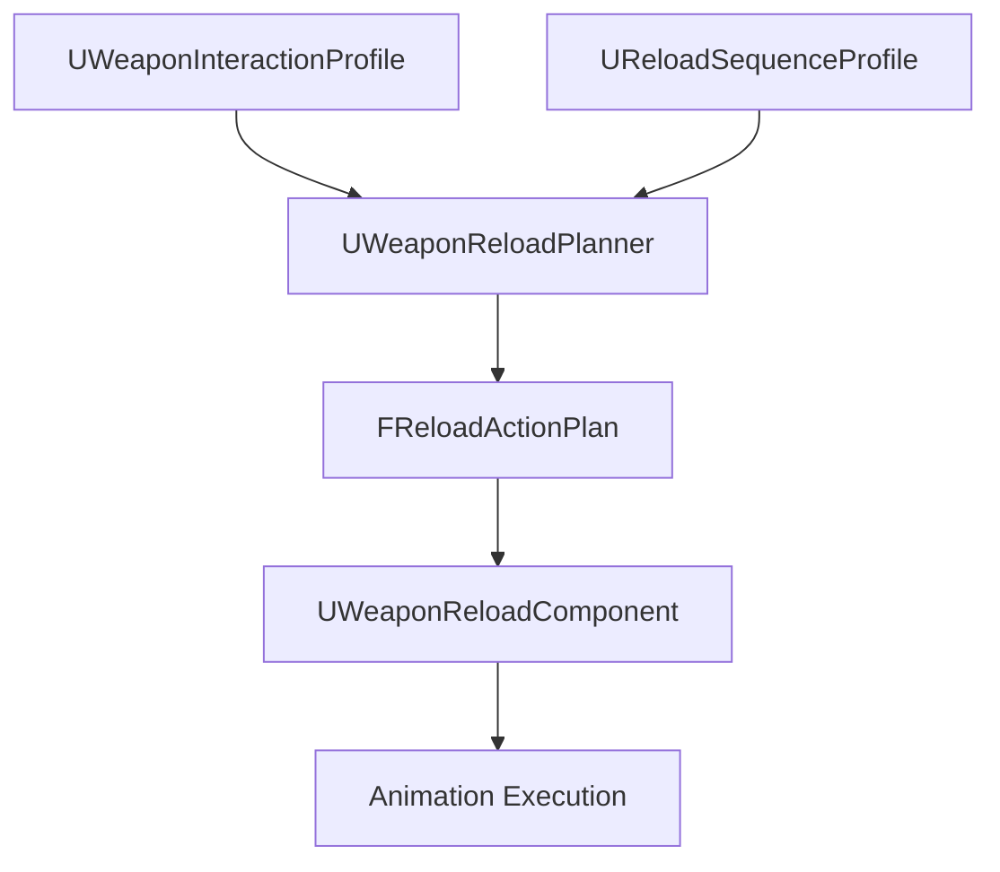

# Weapon Reload Sequence Profile for Unreal Engine

## Purpose

This document defines the Unreal Engine DataAsset contract for authored reload sequences.

The reload planner in [Weapon Reload Planner for Unreal Engine](./weapon-reload-planner-ue.md) builds runtime `FReloadActionPlan` instances. This document defines the authored sequence data used by the planner: step definitions, phase timings, visual policies, commit policies, and prediction policy.

Runtime execution is defined in [Weapon Runtime Implementation for Unreal Engine](./weapon-runtime-implementation-ue.md).

---

## Ownership Boundary

This document owns authored reload sequence data.

It does not own:

```text
profile socket authoring
hand assignment solving
runtime plan execution
replication
Control Rig execution
inventory mutation
```

---

## Data Flow



---

## UReloadSequenceProfile

```cpp
UCLASS(BlueprintType)
class UReloadSequenceProfile : public UDataAsset
{
    GENERATED_BODY()

public:
    UPROPERTY(EditAnywhere, BlueprintReadOnly, Category="Sequence")
    FGameplayTag SequenceId;

    UPROPERTY(EditAnywhere, BlueprintReadOnly, Category="Sequence")
    EReloadIntent SupportedIntent = EReloadIntent::FullReload;

    UPROPERTY(EditAnywhere, BlueprintReadOnly, Category="Sequence")
    TArray<FReloadActionStepDefinition> StepDefinitions;

    UPROPERTY(EditAnywhere, BlueprintReadOnly, Category="Prediction")
    bool bAllowOwnerPrediction = true;

    UPROPERTY(EditAnywhere, BlueprintReadOnly, Category="Prediction")
    float MaxPredictionCorrectionTime = 0.15f;

    UPROPERTY(EditAnywhere, BlueprintReadOnly, Category="Recovery")
    FGameplayTag DefaultRecoveryPolicy;

#if WITH_EDITOR
    virtual EDataValidationResult IsDataValid(FDataValidationContext& Context) const override;
#endif
};
```

One weapon may reference multiple sequence profiles:

```text
EmergencyReload
TacticalReload
LoadOne
CycleOnly
Unload
```

The weapon profile selects defaults. The planner chooses the valid sequence at runtime.

---

## Step Definition

```cpp
USTRUCT(BlueprintType)
struct FReloadActionStepDefinition
{
    GENERATED_BODY()

    UPROPERTY(EditAnywhere, BlueprintReadOnly)
    FGameplayTag StepId;

    UPROPERTY(EditAnywhere, BlueprintReadOnly)
    EReloadActionType StepType = EReloadActionType::ReachSocket;

    UPROPERTY(EditAnywhere, BlueprintReadOnly)
    EWeaponInteractionPhase Phase = EWeaponInteractionPhase::Reach;

    UPROPERTY(EditAnywhere, BlueprintReadOnly)
    FName TargetInteractionPoint;

    UPROPERTY(EditAnywhere, BlueprintReadOnly)
    FName ReturnInteractionPoint;

    UPROPERTY(EditAnywhere, BlueprintReadOnly)
    FVector LocalAxis = FVector::ForwardVector;

    UPROPERTY(EditAnywhere, BlueprintReadOnly)
    float Distance = 0.f;

    UPROPERTY(EditAnywhere, BlueprintReadOnly)
    FReloadPhaseTiming Timing;

    UPROPERTY(EditAnywhere, BlueprintReadOnly)
    FReloadStepVisualPolicy VisualPolicy;

    UPROPERTY(EditAnywhere, BlueprintReadOnly)
    FReloadStepCommitPolicy CommitPolicy;

    UPROPERTY(EditAnywhere, BlueprintReadOnly)
    FGameplayTag RecoveryPolicy;
};
```

This is authored data. The runtime `FReloadActionStep` is built from it after hand assignment and validation.

---

## Phase Timing

```cpp
USTRUCT(BlueprintType)
struct FReloadPhaseTiming
{
    GENERATED_BODY()

    UPROPERTY(EditAnywhere, BlueprintReadOnly)
    float Duration = 0.2f;

    UPROPERTY(EditAnywhere, BlueprintReadOnly)
    float ReachEndAlpha = 0.35f;

    UPROPERTY(EditAnywhere, BlueprintReadOnly)
    float GripAlpha = 0.5f;

    UPROPERTY(EditAnywhere, BlueprintReadOnly)
    float ManipulationEndAlpha = 0.8f;

    UPROPERTY(EditAnywhere, BlueprintReadOnly)
    TObjectPtr<UCurveFloat> PositionCurve;

    UPROPERTY(EditAnywhere, BlueprintReadOnly)
    TObjectPtr<UCurveFloat> RotationCurve;
};
```

Rules:

```text
Duration must be > 0.
ReachEndAlpha <= GripAlpha <= ManipulationEndAlpha.
Curves are optional; if missing, runtime uses default smooth easing.
```

---

## Visual Policy

```cpp
USTRUCT(BlueprintType)
struct FReloadStepVisualPolicy
{
    GENERATED_BODY()

    UPROPERTY(EditAnywhere, BlueprintReadOnly)
    EReloadObjectVisualState StartObjectState = EReloadObjectVisualState::Hidden;

    UPROPERTY(EditAnywhere, BlueprintReadOnly)
    EReloadObjectVisualState EndObjectState = EReloadObjectVisualState::Hidden;

    UPROPERTY(EditAnywhere, BlueprintReadOnly)
    bool bAttachObjectAtGripAlpha = false;

    UPROPERTY(EditAnywhere, BlueprintReadOnly)
    bool bDetachObjectAtEnd = false;

    UPROPERTY(EditAnywhere, BlueprintReadOnly)
    bool bDriveMovingPart = false;

    UPROPERTY(EditAnywhere, BlueprintReadOnly, meta=(EditCondition="bDriveMovingPart"))
    FName MovingPartName;

    UPROPERTY(EditAnywhere, BlueprintReadOnly, meta=(EditCondition="bDriveMovingPart"))
    float MovingPartStartAlpha = 0.f;

    UPROPERTY(EditAnywhere, BlueprintReadOnly, meta=(EditCondition="bDriveMovingPart"))
    float MovingPartEndAlpha = 1.f;
};
```

Visual policy affects only visual state. Gameplay state changes belong to commit policy.

---

## Commit Policy

```cpp
USTRUCT(BlueprintType)
struct FReloadStepCommitPolicy
{
    GENERATED_BODY()

    UPROPERTY(EditAnywhere, BlueprintReadOnly)
    bool bHasCommitPoint = false;

    UPROPERTY(EditAnywhere, BlueprintReadOnly, meta=(EditCondition="bHasCommitPoint"))
    FGameplayTag CommitPoint;

    UPROPERTY(EditAnywhere, BlueprintReadOnly, meta=(EditCondition="bHasCommitPoint"))
    float CommitAlpha = 1.f;

    UPROPERTY(EditAnywhere, BlueprintReadOnly)
    bool bCanInterruptBeforeCommit = true;

    UPROPERTY(EditAnywhere, BlueprintReadOnly)
    bool bCanInterruptAfterCommit = true;
};
```

Commit policy defines when the server applies gameplay state.

Examples:

```text
MagazineDetached at extraction start or end
MagazineLocked at lock step commit alpha
RoundInserted at shell seated alpha
BoltClosed at mechanism forward complete
```

---

## Planner Use

The planner should use sequence profiles as templates:

```text
1. choose sequence profile for reload intent
2. validate sequence against weapon profile
3. resolve hands/body slots/objects for each step
4. convert authored step definitions into runtime FReloadActionStep
5. insert additional regrip/pose/recovery steps if required
```

The planner may skip or insert steps based on current mechanical state.

Examples:

```text
skip RemoveMagazine if no magazine is inserted
skip CycleOnly if round is already chambered and policy allows
insert OperateBolt if weapon requires cycling after magazine lock
```

---

## Validation Rules

`UReloadSequenceProfile::IsDataValid` should check:

```text
SequenceId is valid
StepDefinitions is not empty
all StepIds are unique
all durations > 0
phase alpha values are ordered
commit alpha is in range 0..1
referenced interaction points exist in compatible weapon profile during preview validation
referenced moving parts exist if bDriveMovingPart is true
commit point tags are valid
```

Some validation requires both the sequence and a weapon profile. That should be handled by the profile preview/validation tool.

---

## Example: Detachable Magazine Sequence

```text
Step 1: PrepareWeaponPose
Step 2: Reach old magazine
Step 3: Grip old magazine
Step 4: Extract magazine
  CommitPoint = MagazineDetached
Step 5: Drop or stow old magazine
Step 6: Fetch new magazine
Step 7: Align magazine
Step 8: Insert magazine
Step 9: Lock magazine
  CommitPoint = MagazineLocked
Step 10: Return hand to grip
Step 11: Restore weapon pose
```

The planner resolves which hand performs the steps and may insert regrip steps.

---

## Example: Pump Action Sequence

```text
Step 1: Stabilize hold
Step 2: Keep pump hand constrained to PumpGrip
Step 3: Move pump back
  CommitPoint = PumpBack
Step 4: Move pump forward
  CommitPoint = PumpForward
Step 5: Return or keep pump hand as support grip
```

---

## Final Formula

```text
Reload sequence profile =
  authored step template
  + timing
  + visual policy
  + commit policy
  + recovery policy.
```

The profile is authored data. The planner converts it into a validated runtime plan.
