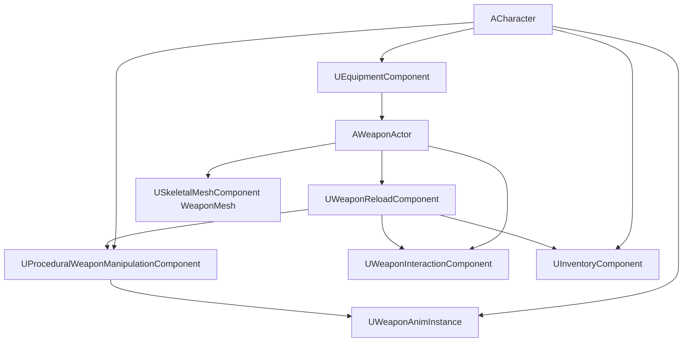
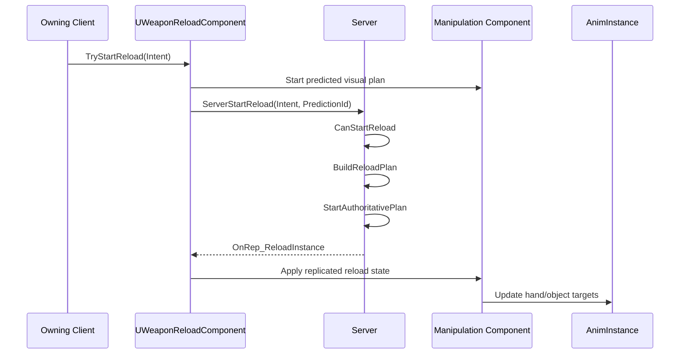

# Weapon Runtime Implementation for Unreal Engine

## Purpose

This document defines a near-implementation-level Unreal Engine 5.7 runtime architecture for weapon interaction.

It uses the core logic from:

- [Weapon Interaction Data Model](./weapon-interaction-data-model.md)
- [Weapon Holding and Stabilization](./weapon-holding.md)
- [Weapon Solvers and Planning](./weapon-solvers-and-planning.md)
- [Weapon Animation Execution](./weapon-animation-execution.md)
- [Procedural Weapon Reloading](./procedural-reload.md)
- [Weapon Interaction Networking](./weapon-networking.md)

Unlike the engine-agnostic documents, this document describes concrete UE components, structs, replication, RPCs, update order, executor loop, and file layout.

---

## UE 5.7 API Basis

This implementation is written against Unreal Engine 5.7 C++ API patterns.

Verified UE 5.7 API concepts used by this document:

```text
UActorComponent
UCLASS
USTRUCT
UENUM
UPROPERTY
UFUNCTION
BlueprintType
BlueprintReadOnly
BlueprintCallable
Server RPC functions
Reliable RPC specifier
ReplicatedUsing
GetLifetimeReplicatedProps
DOREPLIFETIME
TObjectPtr
FGameplayTag
FTransform
FTransform::TransformVectorNoScale
AGameStateBase::GetServerWorldTimeSeconds
UAnimInstance
UDataAsset
IsDataValid
FDataValidationContext
EDataValidationResult
```

Project-specific symbols used by this document:

```text
AWeaponActor
UEquipmentComponent
UInventoryComponent
UProceduralWeaponManipulationComponent
UWeaponInteractionComponent
UWeaponReloadComponent
UWeaponAnimInstance
UWeaponInteractionProfile
FWeaponHandIKTarget
FWeaponPoseOffsetAnimState
native gameplay tag names such as TAG_Weapon_Reload_Commit_MagazineLocked
```

These project-specific symbols are part of this weapon interaction implementation and must be created by the project. They are not built-in Unreal Engine classes.

---

## Runtime Ownership



Recommended ownership:

```text
ACharacter:
  owns current equipped weapon reference
  owns movement/stance/shoulder state
  owns manipulation component
  owns inventory/body slots

AWeaponActor:
  owns weapon mesh
  owns interaction profile component
  owns reload component
  owns replicated mechanical state

AnimInstance:
  receives visual targets only
  does not validate gameplay
```

---

## Source Layout

Recommended project layout:

```text
Source/Game/Weapons/
  Public/Interaction/
    WeaponInteractionTypes.h
    WeaponInteractionProfile.h
    WeaponInteractionComponent.h
    WeaponReloadTypes.h
    WeaponReloadComponent.h
    WeaponReloadPlanner.h
    WeaponReloadExecutor.h
    ProceduralWeaponManipulationComponent.h
    WeaponAnimInstance.h

  Private/Interaction/
    WeaponInteractionProfile.cpp
    WeaponInteractionComponent.cpp
    WeaponReloadComponent.cpp
    WeaponReloadPlanner.cpp
    WeaponReloadExecutor.cpp
    ProceduralWeaponManipulationComponent.cpp
    WeaponAnimInstance.cpp

Source/GameEditor/Weapons/
  Private/
    WeaponInteractionProfileDetails.cpp
    WeaponInteractionProfilePreviewActor.cpp
    WeaponInteractionValidation.cpp
```

---

## Required Includes

Typical includes for the runtime component layer:

```cpp
#include "CoreMinimal.h"
#include "Components/ActorComponent.h"
#include "GameFramework/Character.h"
#include "GameFramework/GameStateBase.h"
#include "Net/UnrealNetwork.h"
#include "GameplayTagContainer.h"
#include "Animation/AnimInstance.h"
#include "Engine/DataAsset.h"
```

Profile/editor validation code also needs editor-only validation includes in the editor module or behind `#if WITH_EDITOR`.

---

## Core Enums

```cpp
UENUM(BlueprintType)
enum class EHand : uint8
{
    None,
    Left,
    Right
};

UENUM(BlueprintType)
enum class EWeaponInteractionPhase : uint8
{
    None,
    PreparePose,
    Reach,
    PreGrip,
    GripContact,
    VisualAttach,
    Manipulate,
    GameplayCommit,
    Release,
    Return,
    Settle,
    Recovery
};

UENUM(BlueprintType)
enum class EReloadIntent : uint8
{
    FullReload,
    TacticalReload,
    EmergencyReload,
    LoadOne,
    CycleOnly,
    Unload
};

UENUM(BlueprintType)
enum class EReloadActionType : uint8
{
    PrepareWeaponPose,
    Regrip,
    ReleaseGrip,
    ReachSocket,
    GripObject,
    DetachObject,
    MoveAlongAxis,
    AttachObject,
    DropObject,
    FetchObject,
    AlignObject,
    InsertObject,
    LockObject,
    OperateMovingPart,
    CommitMechanicalState,
    ReturnHand,
    RestorePose,
    Recovery
};

UENUM(BlueprintType)
enum class EReloadObjectVisualState : uint8
{
    Hidden,
    InWeapon,
    InLeftHand,
    InRightHand,
    InBodySlot,
    DroppedWorld
};
```

---

## Replicated Mechanical State

```cpp
USTRUCT(BlueprintType)
struct FReplicatedWeaponMechanicalState
{
    GENERATED_BODY()

    UPROPERTY(BlueprintReadOnly)
    bool bMagazineInserted = false;

    UPROPERTY(BlueprintReadOnly)
    bool bMagazineLocked = false;

    UPROPERTY(BlueprintReadOnly)
    bool bRoundChambered = false;

    UPROPERTY(BlueprintReadOnly)
    bool bBoltOpen = false;

    UPROPERTY(BlueprintReadOnly)
    bool bNeedsCycle = false;

    UPROPERTY(BlueprintReadOnly)
    int32 AmmoInMagazine = 0;

    UPROPERTY(BlueprintReadOnly)
    int32 AmmoInChamber = 0;

    UPROPERTY(BlueprintReadOnly)
    int32 InternalAmmoCount = 0;

    UPROPERTY(BlueprintReadOnly)
    uint8 StateRevision = 0;
};
```

Rules:

```text
Only server mutates this state.
Clients use OnRep for visuals/UI.
StateRevision increments after every authoritative commit point.
```

---

## Replicated Reload Instance

```cpp
USTRUCT(BlueprintType)
struct FReplicatedReloadInstance
{
    GENERATED_BODY()

    UPROPERTY(BlueprintReadOnly)
    bool bIsReloading = false;

    UPROPERTY(BlueprintReadOnly)
    FGameplayTag ReloadSequenceId;

    UPROPERTY(BlueprintReadOnly)
    FGameplayTag CurrentStepId;

    UPROPERTY(BlueprintReadOnly)
    uint8 StepIndex = 0;

    UPROPERTY(BlueprintReadOnly)
    float StepStartServerTime = 0.f;

    UPROPERTY(BlueprintReadOnly)
    float StepDuration = 0.f;

    UPROPERTY(BlueprintReadOnly)
    EWeaponInteractionPhase Phase = EWeaponInteractionPhase::None;

    UPROPERTY(BlueprintReadOnly)
    EHand ResolvedHand = EHand::None;

    UPROPERTY(BlueprintReadOnly)
    EReloadObjectVisualState ObjectVisualState = EReloadObjectVisualState::Hidden;

    UPROPERTY(BlueprintReadOnly)
    TObjectPtr<AActor> ReloadObjectActor = nullptr;

    UPROPERTY(BlueprintReadOnly)
    FGameplayTag CommitPoint;

    UPROPERTY(BlueprintReadOnly)
    uint8 ReloadRevision = 0;
};
```

Rules:

```text
ReloadInstance is replicated to all relevant clients.
It is phase/timing state, not IK state.
ReloadRevision increments on every step change or interruption.
```

---

## Reload Action Step

```cpp
USTRUCT(BlueprintType)
struct FReloadActionStep
{
    GENERATED_BODY()

    UPROPERTY(EditAnywhere, BlueprintReadOnly)
    FGameplayTag StepId;

    UPROPERTY(EditAnywhere, BlueprintReadOnly)
    EReloadActionType Type = EReloadActionType::ReachSocket;

    UPROPERTY(EditAnywhere, BlueprintReadOnly)
    EWeaponInteractionPhase Phase = EWeaponInteractionPhase::Reach;

    UPROPERTY(EditAnywhere, BlueprintReadOnly)
    EHand ResolvedHand = EHand::None;

    UPROPERTY(EditAnywhere, BlueprintReadOnly)
    FName TargetPointName;

    UPROPERTY(EditAnywhere, BlueprintReadOnly)
    FName ReturnPointName;

    UPROPERTY(EditAnywhere, BlueprintReadOnly)
    FVector LocalAxis = FVector::ForwardVector;

    UPROPERTY(EditAnywhere, BlueprintReadOnly)
    float Distance = 0.f;

    UPROPERTY(EditAnywhere, BlueprintReadOnly)
    float Duration = 0.2f;

    UPROPERTY(EditAnywhere, BlueprintReadOnly)
    bool bCanInterrupt = true;

    UPROPERTY(EditAnywhere, BlueprintReadOnly)
    FGameplayTag CommitPoint;
};
```

Runtime-only action plans may store pointers to selected magazine/round/body slot objects, but replicated state should stay compact.

---

## Reload Action Plan

```cpp
USTRUCT()
struct FReloadActionPlan
{
    GENERATED_BODY()

    UPROPERTY()
    FGameplayTag SequenceId;

    UPROPERTY()
    TArray<FReloadActionStep> Steps;

    UPROPERTY()
    int32 CurrentStepIndex = INDEX_NONE;

    bool IsValid() const
    {
        return Steps.Num() > 0;
    }
};
```

The plan is built on server. The owning client may build a predicted visual plan locally, but server state is authoritative.

---

## UWeaponInteractionComponent

```cpp
UCLASS(ClassGroup=(Weapon), meta=(BlueprintSpawnableComponent))
class UWeaponInteractionComponent : public UActorComponent
{
    GENERATED_BODY()

public:
    UPROPERTY(EditDefaultsOnly, BlueprintReadOnly, Category="Weapon")
    TObjectPtr<UWeaponInteractionProfile> InteractionProfile;

    UPROPERTY(BlueprintReadOnly, Category="Weapon")
    TObjectPtr<USkeletalMeshComponent> WeaponMesh;

    virtual void BeginPlay() override;

    bool CacheWeaponMesh();

    bool GetInteractionPoint(FName PointName, FWeaponInteractionPoint& OutPoint) const;

    bool GetInteractionPointTransform(
        FName PointName,
        FTransform& OutTransform,
        ERelativeTransformSpace Space = RTS_World) const;

    FVector GetAxisWorld(FName PointName, FVector LocalAxis) const;

    bool ValidateRuntimeProfile(FText& OutError) const;
};
```

Implementation notes:

```text
Cache WeaponMesh in BeginPlay.
Validate profile on server and in editor builds.
Do not search sockets every tick if profile can cache socket names.
Expose debug draw for socket axes.
```

---

## UWeaponReloadComponent

```cpp
UCLASS(ClassGroup=(Weapon), meta=(BlueprintSpawnableComponent))
class UWeaponReloadComponent : public UActorComponent
{
    GENERATED_BODY()

public:
    UWeaponReloadComponent();

    UPROPERTY(ReplicatedUsing=OnRep_ReloadInstance, BlueprintReadOnly)
    FReplicatedReloadInstance ReloadInstance;

    UPROPERTY(ReplicatedUsing=OnRep_MechanicalState, BlueprintReadOnly)
    FReplicatedWeaponMechanicalState MechanicalState;

    UFUNCTION(BlueprintCallable)
    void TryStartReload(EReloadIntent Intent);

    UFUNCTION(Server, Reliable)
    void ServerStartReload(EReloadIntent Intent, uint8 ClientPredictionId);

    UFUNCTION(Server, Reliable)
    void ServerInterruptReload(FGameplayTag Reason);

    virtual void GetLifetimeReplicatedProps(TArray<FLifetimeProperty>& OutLifetimeProps) const override;

protected:
    UPROPERTY()
    FReloadActionPlan ActivePlan;

    UPROPERTY()
    float ServerStepStartTime = 0.f;

    UFUNCTION()
    void OnRep_ReloadInstance();

    UFUNCTION()
    void OnRep_MechanicalState();

    bool BuildReloadPlan(EReloadIntent Intent, FReloadActionPlan& OutPlan);
    bool CanStartReload(EReloadIntent Intent, FText& OutReason) const;

    void StartAuthoritativePlan(const FReloadActionPlan& Plan);
    void AdvanceAuthoritativeReload(float ServerTime);
    void StartStep(int32 StepIndex, float ServerTime);
    void FinishStep(int32 StepIndex, float ServerTime);
    void ApplyCommitPoint(FGameplayTag CommitPoint);
    void FinishReload();
};
```

Replication setup:

```cpp
void UWeaponReloadComponent::GetLifetimeReplicatedProps(
    TArray<FLifetimeProperty>& OutLifetimeProps) const
{
    Super::GetLifetimeReplicatedProps(OutLifetimeProps);

    DOREPLIFETIME(UWeaponReloadComponent, ReloadInstance);
    DOREPLIFETIME(UWeaponReloadComponent, MechanicalState);
}
```

---

## Reload Start Flow



---

## Server Tick / Executor Loop

The server does not tick IK. It advances authoritative reload steps.

```cpp
void UWeaponReloadComponent::AdvanceAuthoritativeReload(float ServerTime)
{
    if (!GetOwner()->HasAuthority())
    {
        return;
    }

    if (!ReloadInstance.bIsReloading || !ActivePlan.IsValid())
    {
        return;
    }

    const FReloadActionStep& Step = ActivePlan.Steps[ReloadInstance.StepIndex];
    const float Elapsed = ServerTime - ReloadInstance.StepStartServerTime;

    if (Elapsed >= Step.Duration)
    {
        FinishStep(ReloadInstance.StepIndex, ServerTime);
    }
}
```

`FinishStep` should:

```text
apply commit point if this step has one
advance to next step
update ReloadInstance
increment ReloadRevision
finish reload if no steps remain
```

---

## Commit Point Implementation

```cpp
void UWeaponReloadComponent::ApplyCommitPoint(FGameplayTag CommitPoint)
{
    if (!GetOwner()->HasAuthority())
    {
        return;
    }

    if (CommitPoint.MatchesTagExact(TAG_Weapon_Reload_Commit_MagazineLocked))
    {
        MechanicalState.bMagazineInserted = true;
        MechanicalState.bMagazineLocked = true;
        MechanicalState.StateRevision++;
    }
    else if (CommitPoint.MatchesTagExact(TAG_Weapon_Reload_Commit_RoundChambered))
    {
        MechanicalState.bRoundChambered = true;
        MechanicalState.AmmoInChamber = 1;
        MechanicalState.StateRevision++;
    }
    else if (CommitPoint.MatchesTagExact(TAG_Weapon_Reload_Commit_BoltOpened))
    {
        MechanicalState.bBoltOpen = true;
        MechanicalState.StateRevision++;
    }
    else if (CommitPoint.MatchesTagExact(TAG_Weapon_Reload_Commit_BoltClosed))
    {
        MechanicalState.bBoltOpen = false;
        MechanicalState.bNeedsCycle = false;
        MechanicalState.StateRevision++;
    }
}
```

The concrete tags should be declared once in a gameplay tag header or native gameplay tags file.

---

## OnRep Reload Handling

```cpp
void UWeaponReloadComponent::OnRep_ReloadInstance()
{
    ACharacter* OwningCharacter = GetOwningCharacter();
    if (!OwningCharacter)
    {
        return;
    }

    UProceduralWeaponManipulationComponent* Manip =
        OwningCharacter->FindComponentByClass<UProceduralWeaponManipulationComponent>();

    if (!Manip)
    {
        return;
    }

    Manip->ApplyReloadVisualState(ReloadInstance);
}
```

Remote clients reconstruct phase from server time:

```cpp
float UWeaponReloadComponent::GetCurrentStepAlpha() const
{
    const AGameStateBase* GS = GetWorld()->GetGameState();
    const float ServerTime = GS ? GS->GetServerWorldTimeSeconds() : GetWorld()->GetTimeSeconds();

    if (ReloadInstance.StepDuration <= KINDA_SMALL_NUMBER)
    {
        return 1.f;
    }

    return FMath::Clamp(
        (ServerTime - ReloadInstance.StepStartServerTime) / ReloadInstance.StepDuration,
        0.f,
        1.f);
}
```

---

## UProceduralWeaponManipulationComponent

```cpp
UCLASS(ClassGroup=(Character), meta=(BlueprintSpawnableComponent))
class UProceduralWeaponManipulationComponent : public UActorComponent
{
    GENERATED_BODY()

public:
    virtual void TickComponent(
        float DeltaTime,
        ELevelTick TickType,
        FActorComponentTickFunction* ThisTickFunction) override;

    void ApplyReloadVisualState(const FReplicatedReloadInstance& ReloadState);

    void SetHandTarget(EHand Hand, const FWeaponHandIKTarget& Target);
    void SetWeaponPoseOffset(const FWeaponPoseOffsetAnimState& Offset);

    FWeaponHandIKTarget BuildHandTargetForReloadStep(
        const FReplicatedReloadInstance& ReloadState,
        float StepAlpha) const;

    void PushToAnimInstance();

private:
    FWeaponHandIKTarget LeftHandTarget;
    FWeaponHandIKTarget RightHandTarget;
    FWeaponPoseOffsetAnimState WeaponPoseOffset;
};
```

Update rule:

```text
Manipulation component builds visual targets from replicated/predicted state.
AnimInstance only receives targets.
Control Rig solves pose.
```

---

## Visual Target Generation

MVP target generation per step:

```cpp
FTransform BuildPreGripTransform(
    const FTransform& TargetTransform,
    const FVector& ApproachAxis,
    float ApproachDistance)
{
    FTransform Result = TargetTransform;
    Result.AddToTranslation(-ApproachAxis.GetSafeNormal() * ApproachDistance);
    return Result;
}
```

Step alpha should drive phase blending:

```text
0.00 - 0.35: Reach to PreGrip
0.35 - 0.50: Move PreGrip to GripContact
0.50 - 0.80: Manipulate / MoveAlongAxis
0.80 - 1.00: Settle or Return
```

A production implementation may store per-step phase ranges in the reload sequence asset.

---

## Object Visual Attachment Implementation

Recommended visual attachment states:

```cpp
void UProceduralWeaponManipulationComponent::ApplyObjectVisualState(
    EReloadObjectVisualState State,
    AActor* ObjectActor)
{
    if (!ObjectActor)
    {
        return;
    }

    switch (State)
    {
        case EReloadObjectVisualState::InWeapon:
            AttachObjectToWeaponSocket(ObjectActor, TEXT("MagazineWellSocket"));
            break;

        case EReloadObjectVisualState::InLeftHand:
            AttachObjectToCharacterSocket(ObjectActor, TEXT("hand_l_socket"));
            break;

        case EReloadObjectVisualState::InRightHand:
            AttachObjectToCharacterSocket(ObjectActor, TEXT("hand_r_socket"));
            break;

        case EReloadObjectVisualState::DroppedWorld:
            DetachObjectToWorld(ObjectActor);
            break;

        default:
            ObjectActor->SetActorHiddenInGame(true);
            break;
    }
}
```

For real implementation, socket names should come from profile/body slot data, not hard-coded string literals.

---

## Client Prediction

Owning client prediction should be visual-only.

```cpp
void UWeaponReloadComponent::TryStartReload(EReloadIntent Intent)
{
    if (APawn* Pawn = Cast<APawn>(GetOwner()->GetInstigator()))
    {
        if (Pawn->IsLocallyControlled())
        {
            StartPredictedVisualReload(Intent);
        }
    }

    ServerStartReload(Intent, ++LocalPredictionId);
}
```

On rejection:

```text
clear predicted visual state
restore valid weapon hold pose
show optional reload failed reason locally
```

The server never trusts predicted ammo or mechanical state.

---

## Interrupt Implementation

Server interrupt flow:

```text
1. Server receives interrupt reason or detects invalid state.
2. Server chooses recovery policy.
3. Server updates ReloadInstance.Phase = Recovery.
4. Server sets recovery step/time.
5. Clients reconstruct recovery visuals.
6. Server clears reload when recovery completes.
```

Interrupt should not simply clear ReloadInstance unless the weapon is already visually and mechanically safe.

---

## Tick Order

Recommended runtime order:

```text
Character movement / stance update
Equipment update
WeaponReloadComponent authoritative step update on server
WeaponReloadComponent OnRep handling on clients
ProceduralWeaponManipulationComponent visual target update
AnimInstance update
Control Rig solve
Weapon mesh moving part update
```

If needed, set tick prerequisites so manipulation updates before animation evaluation.

---

## Debug Commands

Recommended debug commands:

```text
wpn.Reload.Debug 0/1
wpn.Reload.DrawTargets 0/1
wpn.Reload.DrawAxes 0/1
wpn.Reload.ForceInterrupt
wpn.Reload.PrintState
wpn.Reload.ValidateProfile
```

Debug draw should show:

```text
current step id
step alpha
resolved hand
server phase
local visual phase
hand target
elbow pole
object visual state
mechanical state revision
commit point
```

---

## Minimal Implementation Checklist

A minimum working UE version requires:

```text
1. AWeaponActor with WeaponMesh.
2. UWeaponInteractionComponent with UWeaponInteractionProfile.
3. UWeaponReloadComponent with replicated ReloadInstance and MechanicalState.
4. ServerStartReload RPC.
5. BuildReloadPlan for at least detachable magazine reload.
6. Server step executor using server time.
7. Commit points for MagazineDetached and MagazineLocked.
8. OnRep_ReloadInstance driving local visual state.
9. UProceduralWeaponManipulationComponent generating hand IK targets.
10. UWeaponAnimInstance receiving left/right hand target structs.
11. Control Rig solving both hands.
12. Visual magazine actor attaching to weapon/hand sockets.
13. Remote clients reconstructing alpha from GameState server time.
14. Debug draw for sockets, axes, step alpha, and resolved hand.
```

---

## Final Formula

```text
UE runtime implementation =
  replicated gameplay state
  + authoritative server step executor
  + client visual reconstruction
  + manipulation component target generation
  + AnimInstance bridge
  + Control Rig solve
  + editor/profile validation.
```

This document is the concrete runtime implementation target for UE 5.7. Other UE documents describe profile authoring and animation rig details in more depth.
