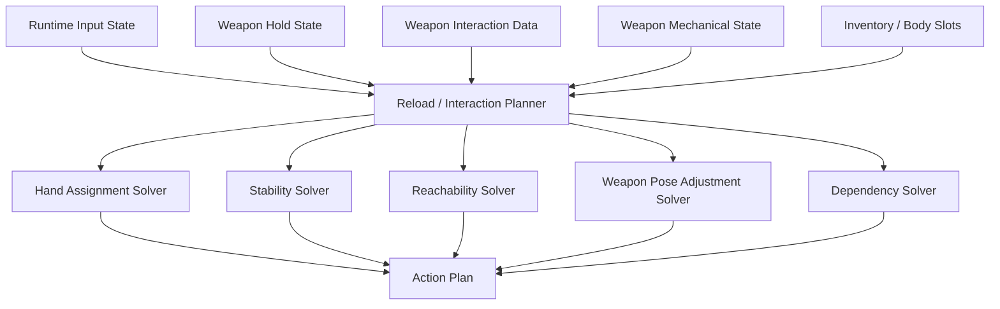

# Weapon Solvers and Planning

## Purpose

This document defines the engine-agnostic solvers and planners used by weapon interaction.

It describes how the system decides:

```text
which hand acts
which contacts stabilize the weapon
whether the action is reachable
whether a regrip is required
whether weapon pose must change
which reload steps are needed
how interruption and recovery are handled
```

This document does not describe a specific engine API. The Unreal Engine implementation documents map these solvers to components, DataAssets, replicated state, Control Rig targets, and editor tools.

---

## Solver Stack



---

## Runtime Inputs

The planner needs:

```text
Character state
Current hand states
Weapon hold state
Weapon interaction data
Weapon mechanical state
Inventory/body slot state
Reload or interaction request
Network role if multiplayer
```

The planner must not rely on animation pose alone. Animation is an output of the plan, not the source of truth.

---

## Hand Assignment Solver

The hand assignment solver chooses the manipulation hand for a target interaction point.

Base preferences:

```text
Right access → prefer right hand
Left access → prefer left hand
Top/Bottom + right shoulder → prefer left hand
Top/Bottom + left shoulder → prefer right hand
```

The preference is not final. The solver must evaluate both hands.

Candidate score:

```text
Cost =
  side mismatch penalty
+ reach distance penalty
+ weapon instability penalty
+ regrip penalty
+ torso twist penalty
+ current hand busy penalty
+ stance constraint penalty
+ held object penalty
```

The selected hand is the lowest-cost valid candidate.

If no candidate is valid, the solver must return a fallback requirement:

```text
RequireRegrip
RequireWeaponPoseAdjustment
RequireDifferentBodySlot
RequireSupportedPose
BlockAction
```

---

## Stability Solver

The stability solver answers:

```text
Can this hand release its current contact?
Will the weapon remain stable during the action?
Which contacts stabilize the weapon?
```

Inputs:

```text
active hand contacts
shoulder contact
sling/bipod/surface contacts
weapon weight class
weapon length class
stock presence
required stability of the action
current character stance
```

Output:

```text
Valid / Invalid
StabilityScore
RequiredContacts
RejectedReasons
```

Examples:

```text
Rifle with stock:
  right hand + right shoulder may stabilize while left hand reloads.

Right-side bolt on right shoulder:
  left hand + right shoulder must stabilize before right hand leaves main grip.

Pistol without stock:
  trigger hand usually cannot release unless opposite hand first grabs the weapon body.
```

---

## Reachability Solver

The reachability solver checks whether a hand can reach a point without impossible arm movement.

MVP inputs:

```text
hand start transform
target transform
character stance
shoulder side
weapon pose offset allowance
max reach distance
max torso twist
max weapon roll
simple obstruction rules
```

Output:

```text
Reachable
Cost
RequiresTorsoTwist
RequiresWeaponRoll
RequiresRegrip
RejectedReasons
```

The MVP does not require full biomechanics. It only needs enough constraints to avoid impossible poses.

---

## Weapon Pose Adjustment Solver

Some actions require moving the weapon into a temporary manipulation pose.

Examples:

```text
lower rifle before magazine change
roll shotgun to expose bottom loading port
move pistol closer to chest for reload
roll bullpup to expose rear magazine well
```

Output:

```text
LocalTranslationOffset
LocalRotationOffset
BlendInTime
BlendOutTime
MuzzlePolicy
```

The adjustment must preserve a valid hold state.

---

## Dependency Solver

The dependency solver prevents invalid step ordering.

Examples:

```text
Cannot insert new magazine until old magazine is removed.
Cannot chamber round while bolt is closed if weapon requires open bolt.
Cannot fire if magazine is inserted but chamber is empty and weapon needs cycle.
Cannot pump forward before pump back.
Cannot return hand to support grip if it still holds a magazine.
```

Dependencies should be represented as rules over mechanical state and attachment state.

---

## Reload Planner

The reload planner converts a request into an action plan.

Input:

```text
ReloadIntent
WeaponInteractionData
WeaponMechanicalState
WeaponHoldState
Inventory/BodySlots
CharacterState
```

Output:

```text
ReloadActionPlan
```

Planner responsibilities:

```text
validate request
choose reload variant
choose ammo/reload object
choose body slot
choose manipulation hand per step
insert regrip steps if needed
insert weapon pose adjustment if needed
insert mechanism steps if needed
set commit points
set interrupt policies
```

---

## Reload Intents

Supported intents:

```text
FullReload
TacticalReload
EmergencyReload
LoadOne
CycleOnly
Unload
ClearMalfunction optional
```

Examples:

```text
EmergencyReload:
  drop old magazine if present
  fetch new magazine
  insert and lock new magazine
  cycle if needed

TacticalReload:
  extract old magazine
  stow old magazine
  fetch new magazine
  insert and lock new magazine

LoadOne:
  fetch one round/shell
  insert one round/shell
  optionally stay in reload loop
```

---

## Action Plan

An action plan is a list of small steps.

Common steps:

```text
PrepareWeaponPose
Regrip
ReleaseGrip
ReachPoint
GripObject
DetachObject
MoveAlongAxis
MoveToBodySlot
DropObject
FetchObject
AlignObject
InsertObject
LockObject
OperateMovingPart
CommitMechanicalState
ReturnHandToGrip
RestoreWeaponPose
```

Each step needs:

```text
StepType
ResolvedHand
TargetPoint
Object
Axis
Distance
Duration
RequiredContacts
CommitPoint optional
CanInterrupt
RecoveryPolicy
```

---

## Fallback Rules

When the preferred action is invalid, the planner should try fallback rules in order.

```text
1. Try preferred hand.
2. Try preferred hand with regrip.
3. Try preferred hand with weapon pose adjustment.
4. Try alternate hand.
5. Try alternate hand with weapon pose adjustment.
6. Try alternate body slot or object.
7. Try slower supported-pose variant.
8. Block action and return reason.
```

This prevents hard-coded weapon-specific exceptions.

---

## Interruption and Recovery Planner

Interruption recovery must restore a valid weapon hold state, not necessarily a complete reload.

Possible interruption states:

```text
old magazine removed
new magazine in hand
round in hand
bolt open
pump halfway
trigger hand away from grip
support hand away from grip
weapon unstable
```

Recovery options:

```text
complete current critical step
stow held object
throw/drop held object
return main hand to grip first
close bolt or reset mechanism
restore weapon pose
```

Recovery should be planned using the same solvers as normal actions.

---

## Planning Output Contract

The output of planning must be deterministic enough for multiplayer reconstruction.

The plan should expose:

```text
SequenceId
StepIds
StepDurations
ResolvedHand per step
Object role per step
Commit points
Recovery policies
Visual attachment states
```

The plan should not expose per-frame IK transforms as authoritative data.

---

## Debug Requirements

Planner debug should show:

```text
selected hand
rejected hand reasons
reachability cost
stability score before/after release
selected body slot
weapon pose adjustment
dependency failures
fallback path used
current action step
commit point status
recovery policy
```

This is required because most weapon interaction bugs are solver/planning bugs, not Control Rig bugs.

---

## Final Formula

```text
Weapon interaction planning =
  request
  + data model
  + current hold state
  + mechanical state
  + inventory/body slots
  + hand/stability/reachability solvers
  → validated action plan.
```

The executor and animation system should only execute a plan that has already been validated.
